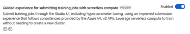

---
lab:
  title: Azure ML の自動機械学習について調べる
---

# Azure ML の自動機械学習について調べる

> **注** このラボを完了するには、管理者アクセス権が与えられている [Azure サブスクリプション](https://azure.microsoft.com/free?azure-portal=true)が必要です。

この演習では、季節と気象の特徴に基づき、自転車レンタル詳細の履歴データセットを使用して、特定の日に予想される自転車レンタルの数を予測するモデルをトレーニングします。

## Azure Machine Learning ワークスペースを作成する  

1. Microsoft 資格情報を使用して、[Azure portal](https://portal.azure.com?azure-portal=true) にサインインします。

1. **[リソースの作成]** を選択して *Machine Learning* を検索し、*Azure Machine Learning* プランを使用して新しい **Azure Machine Learning** リソースを作成します。 次の設定を使用します。
    - **[サブスクリプション]**: *お使いの Azure サブスクリプション*。
    - **リソース グループ**: *リソース グループを作成または選択します。*
    - **ワークスペース名**: *ワークスペースの一意の名前を入力します*。
    - **リージョン**: *地理的に最も近いリージョンを選びます*
    - **ストレージ アカウント**: *ワークスペース用に作成される既定の新しいストレージ アカウントです*。
    - **キー コンテナー**: *ワークスペース用に作成される既定の新しいキー コンテナーです*。
    - **Application Insights**: *ワークスペース用に作成される既定の新しい Application Insights リソースです*。
    - **コンテナー レジストリ**: なし (*コンテナーにモデルを初めてデプロイするときに、自動的に作成されます*)

1. **[Review + create](確認と作成)** を選択し、次に **[作成]** を選択します。 ワークスペースが作成されるまで待ってから (数分かかる場合があります)、デプロイされたリソースに移動します。

1. **[スタジオを起動する]** を選択し (または新しいブラウザー タブを開いて [https://ml.azure.com](https://ml.azure.com?azure-portal=true) に移動し)、Microsoft アカウントを使って Azure Machine Learning スタジオにサインインします。

1. 表示されているメッセージがあれば閉じます。

1. Azure Machine Learning スタジオに、新しく作成したワークスペースが表示されます。 そうでない場合は、左側のメニューで自分の Azure ディレクトリを選択します。 次に、新しい左側のメニューから **[ワークスペース]** を選択します。そこに、ディレクトリに関連付けられているすべてのワークスペースが一覧表示されます。この演習用に作成したものを選択します。

> **注** このモジュールは、Azure Machine Learning ワークスペースを使用する多くのものの 1 つであり、「[Microsoft Azure AI Fundamentals: 機械学習用のビジュアル ツールについて調べる](https://docs.microsoft.com/learn/paths/create-no-code-predictive-models-azure-machine-learning/)」ラーニング パスの他のモジュールも含まれます。 独自の Azure サブスクリプションを使用している場合は、ワークスペースを 1 回作成し、それを他のモジュールで再利用することを検討できます。 ご利用のサブスクリプションに Azure Machine Learning ワークスペースが存在する限り、Azure サブスクリプションはデータ ストレージに対して少額を課金します。そのため、Azure Machine Learning ワークスペースが不要になった場合は、削除することをお勧めします。

## データ資産を作成する

1. Web ブラウザーで、[https://aka.ms/bike-rentals](https://aka.ms/bike-rentals?azure-portal=true) のコンマ区切りデータを表示します。

1. [Azure Machine Learning スタジオ](https://ml.azure.com?azure-portal=true)で、画面の左上にあるメニュー アイコンを選択して左側のペインを展開します。 **[データ]** ページ (**[アセット]** の下)を表示します。 [データ] ページには、Azure ML 内で使用する予定の特定のデータ ファイルまたはテーブルが含まれています。 このページからデータセットを作成することもできます。

1. **[データ]** ページの **[データ資産]** タブで、 **[作成]** を選択します。 次に、次の設定でデータ資産を構成します。
    * **データ型**:
        * **[名前]**: bike-rentals
        * **[説明]**: 自転車レンタルのデータ
        * **データセットの種類**:表形式
    * **データ ソース**: Web ファイルから
    * **Web URL**: 
        * **[Web URL]**: [https://aka.ms/bike-rentals](https://aka.ms/bike-rentals?azure-portal=true)
        * **データ検証のスキップ**: "選択しないでください"**
    * **設定**:
        * **[ファイル形式]**: 区切り記号付き
        * **[区切り記号]**: コンマ
        * **[エンコード]**: UTF-8
        * **[列ヘッダー]**: 最初のファイルにのみヘッダーを付ける
        * **[行のスキップ]**: なし
        * **データセットに複数行のデータを含める**: 選択しない**
    * **[スキーマ]**:
        * **[パス]** 以外のすべての列を含める
        * 自動的に検出された型を確認する
    * **確認**
        * **[作成]** を選択します。

1. データセットが作成されたら、それを開き、**[探索]** ページを表示して、データのサンプルを確認します。 このデータには、自転車レンタルに関する特徴量およびラベルの履歴が含まれています。

> **引用**: *このデータは [Capital Bikeshare](https://www.capitalbikeshare.com/system-data) から派生し、発行データの[ライセンス契約](https://www.capitalbikeshare.com/data-license-agreement)に従って使用されます。*

## サーバーレス コンピューティングを有効にする

1. Azure Machine Learning スタジオで、 **[プレビュー機能の管理]** (大音量のスピーカー アイコン) をクリックします。

![メニューの [プレビュー機能の管理] ボタンのスクリーンショット。](../instructions/media/use-automated-machine-learning/severless-compute-1.png)

1. [Guided experience for submitting training jobs with serverless compute] (サーバーレス コンピューティングを使用してトレーニング ジョブを送信するためのガイド付きエクスペリエンス) 機能を有効にします。



## 自動化された機械学習ジョブを実行する

次の手順に従って、自動機械学習を使用して自転車レンタルを予測する回帰モデルをトレーニングするジョブを実行します。

1. [Azure Machine Learning スタジオ](https://ml.azure.com?azure-portal=true)で、 **[自動 ML]** ページ ( **[作成]** の下) を表示します。

1. 次の設定を使用して、自動 ML ジョブを作成します。
    - **データ アセットの選択**:
        - **[データセット]**: bike-rentals
    - **ジョブの構成**:
        - **[新しい実験名]**: mslearn-bike-rental
        - **[Target column](ターゲット列)**: レンタル "(モデルの予測をトレーニングするラベル)"**
        - **Azure ML コンピューティング クラスターの選択**: "*前に作成したコンピューティング クラスター*"。
    - **タスクと設定の選択**: 
        - **[タスクの種類]**: 回帰 "(モデルが数値を予測します)"** 

    

    タスクの種類の下に、 *[追加の構成を表示する]* と *[特徴エンジニアリング設定を表示する]* があることに注目してください。 ここで、これらの設定を構成します。

    - **[Additional configuration settings](追加の構成設定)**:
        - **プライマリ メトリック**: **[正規化された二乗平均平方根誤差]** を選びます。
        - **最適なモデルの説明**: 選択 — "このオプションを選択すると、自動機械学習によって最適なモデルの特徴の重要度が計算されます。これにより、予測されたラベルの各特徴の影響を判断できます。"**
        - **サポートされているすべてのモデルを使用する**: 選択<u>解除</u>。 *いくつかの特定のアルゴリズムだけを試すように実験を制限します。*
        - **許可されるモデル**: ***[RandomForest]** と **[LightGBM]** を選択します — 通常は、できるだけ多く試してみてください。ただし、モデルを追加すると、ジョブの実行にかかる時間が長くなります。*

        
[追加の構成設定を表示する] の下に [制限] セクションがあることに注目してください。** ** セクションを展開して設定を構成します。
        - **タイムアウト (分)** : 30 — 最大で 30 分後にジョブが終了します。**
        - **メトリック スコアしきい値**: 0.085 — "モデルで、正規化された二乗平均平方根誤差メトリック スコア 0.085 以下を達成した場合にジョブが終了します。"**
        - **[次へ]** をクリックします。
        - **コンピューティング**: ここでは変更する必要はありません
        - **[次へ]** をクリックします。
1. 自動機械学習のジョブの詳細の送信が完了すると、自動的に開始されます。

1. ジョブが完了するまでお待ちください。 しばらく時間がかかる場合があります。コーヒーでも飲んで待ちましょう。

## 最高のモデルを確認する

1. 自動機械学習のジョブの **[概要]** タブで、最適なモデルの概要を確認します。
    

    > **注**: 状態の下に "警告: ユーザーが指定した終了スコアに達しました... " というメッセージが表示されることがあります。 これは予想されている現象です。 次の手順に進んでください。  
1. 最適なモデルの **[アルゴリズム名]** の下のテキストを選び、詳細を表示します。

1. *[正規化された平均平方二乗誤差]* の値の横にある **[View all other metrics](他のすべてのメトリックを表示)** を選択して、回帰モデルに対して考えられる他の評価メトリックの値を確認します。

    ![[モデル] タブで他のすべてのメトリックを表示する方法のスクリーンショット。](media/use-automated-machine-learning/review-run-1.png)

1. **[メトリック]** タブを選択し、**residuals** グラフと **predicted_true** グラフがまだ選択されていない場合は選択します。 
    ![残差グラフと predicted_true グラフが選択されている [メトリック] タブのスクリーンショット。](media/use-automated-machine-learning/review-run-3.png)

    モデルのパフォーマンスを示すグラフを確認します。 1 番目のグラフには "残余" (予測と実際の値の差) がヒストグラムとして表示され、2 番目のグラフでは予測された値と実際の値が比較されます。**

1. **[説明]** タブを選びます。説明 ID を選んでから、 **[特徴量の重要度集約]** を選びます。 このグラフには、次のように、データセット内の各特徴量がラベル予測に与える影響が示されます。

    ![[説明] タブの特徴の重要度グラフのスクリーンショット。](media/use-automated-machine-learning/feature-importance.png)

## 予測サービスをデプロイする

1. [Azure Machine Learning スタジオ](https://ml.azure.com?azure-portal=true)の **[自動 ML]** ページで、自動機械学習ジョブを選択します。

1. **[概要]** タブで最適なモデルのアルゴリズム名を選択します。

    ![[詳細] タブのアルゴリズム名を囲むボックスを含む最適なモデルの概要のスクリーンショット。](media/use-automated-machine-learning/deploy-detail-tab.png)

1. **[モデル]** タブで **[デプロイ]** ボタンを選択し、 **[Web サービス]** オプションを使用して、次の設定でモデルをデプロイします。
    - **[名前]**: predict-rentals
    - **[説明]**: 自転車レンタルの予測
    - **[コンピューティングの種類]**: Azure コンテナー インスタンス
    - **[認証を有効にする]**: オン

1. デプロイが開始するのを待ちます。これには数秒かかることがあります。

1. Azure Machine Learning スタジオの左側のメニューで、 **[エンドポイント]** を選択し、**predict-rentals** リアルタイム エンドポイントを開きます。
1. **デプロイの状態**が **[正常]** に変わるのを待ちます。これには数分かかる場合があります。

## デプロイされたサービスをテストする

これで、デプロイされたサービスをテストできます。

1. **predict-rentals** リアルタイム エンドポイント ページで、 **[テスト]** タブを表示します。

1. **[Input data to test endpoint] (テスト エンドポイントへの入力データ)** ペインで、テンプレート JSON を次の入力データに置き換えます。

    ```JSON
    {
      "Inputs": { 
        "data": [
          {
            "day": 1,
            "mnth": 1,   
            "year": 2022,
            "season": 2,
            "holiday": 0,
            "weekday": 1,
            "workingday": 1,
            "weathersit": 2, 
            "temp": 0.3, 
            "atemp": 0.3,
            "hum": 0.3,
            "windspeed": 0.3 
          }
        ]    
      },   
      "GlobalParameters": 1.0
    }
    ```

1. **[テスト]** ボタンをクリックします。

1. 入力の特徴に基づいて予測されるレンタル数を含むテスト結果を確認します。 テスト ペインによって入力データが取得され、トレーニングしたモデルを使用して予測されたレンタル数が返されました。

    ![[テスト] タブのサンプル データを使用してモデルをテストする例のスクリーンショット。](media/use-automated-machine-learning/workaround-test.png)

これまでに行った内容を振り返ってみましょう。 過去の自転車レンタル データのデータセットを使用してモデルをトレーニングしました。 このモデルでは、季節と気象の "*特徴*" に基づいて、特定の日に予想される自転車のレンタル数を予測しています。 この場合、"*ラベル*" は自転車のレンタル数です。

**[使用する]** タブの資格情報を使用してクライアント アプリケーションに接続する準備ができているサービスをテストしました。ここでラボを終了します。 デプロイしたサービスを引き続き試してみることをお勧めします。

## クリーンアップ

作成した Web サービスは "*Azure コンテナー インスタンス*" にホストされます。 それ以上実験する予定がない場合は、不要な Azure の使用が発生するのを避けるために、エンドポイントを削除する必要があります。 コンピューティング クラスターも削除する必要があります。

1. [Azure Machine Learning Studio](https://ml.azure.com?azure-portal=true) の **[エンドポイント]** タブで、**predict-rentals** エンドポイントを選択します。 次に、**[削除]** を選び、エンドポイントを削除することを確認します。

> **注**: コンピューティングを削除すると、確実にサブスクリプションがコンピューティング リソースに対して課金されなくなります。 ただし、サブスクリプションに Azure Machine Learning ワークスペースが存在する限り、データ ストレージに対して少額が課金されます。 Azure Machine Learning の探索を完了したら、Azure Machine Learning ワークスペースとそれに関連付けられたリソースを削除できます。 ただし、このシリーズの他のいずれかのラボを完了する予定がある場合は、作成し直す必要があります。
>
> ワークスペースを削除するには:
> 1. [Azure portal](https://portal.azure.com?azure-portal=true) の **[リソース グループ]** ページで、Azure Machine Learning ワークスペースの作成時に指定したリソース グループを開きます。
> 2. **[リソース グループの削除]** をクリックし、リソース グループ名を入力して削除することを確認し、**[削除]** を選択します。
