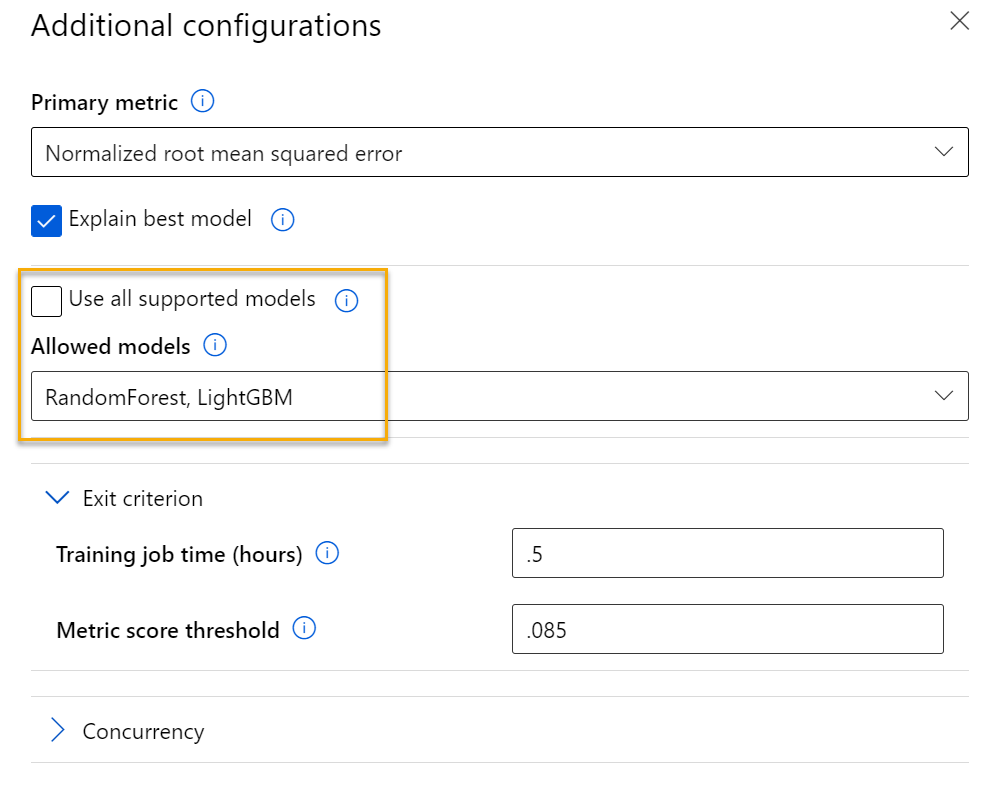

---
lab:
  title: Azure Machine Learning で自動機械学習を使用する
ms.openlocfilehash: 556cd843b0cfd802c6002a8ebab7289770a2a480
ms.sourcegitcommit: b3c7eccbe099234cfb6bde0a93b141d185da965b
ms.translationtype: HT
ms.contentlocale: ja-JP
ms.lasthandoff: 08/26/2022
ms.locfileid: "147694257"
---
## <a name="use-automated-machine-learning-in-azure-machine-learning"></a>Azure Machine Learning で自動機械学習を使用する

> **注** このラボを完了するには、管理者アクセス権が与えられている [Azure サブスクリプション](https://azure.microsoft.com/free?azure-portal=true)が必要です。

この演習では、季節と気象の特徴に基づき、自転車レンタル詳細の履歴データセットを使用して、特定の日に予想される自転車レンタルの数を予測するモデルをトレーニングします。

## <a name="create-an-azure-machine-learning-workspace"></a>Azure Machine Learning ワークスペースを作成する  

1. Microsoft 資格情報を使用して、[Azure portal](https://portal.azure.com?azure-portal=true) にサインインします。

1. **[リソースの作成]** を選択して *Machine Learning* を検索し、*Azure Machine Learning* プランを使用して新しい **Azure Machine Learning** リソースを作成します。 次の設定を使用します。
    - **[サブスクリプション]**: *お使いの Azure サブスクリプション*。
    - **リソース グループ**: *リソース グループを作成または選択します。*
    - **ワークスペース名**: *ワークスペースの一意の名前を入力します*。
    - **リージョン**: *地理的に最も近いリージョンを選びます*
    - **ストレージ アカウント**: *ワークスペース用に作成される既定の新しいストレージ アカウントです*。
    - **キー コンテナー**: *ワークスペース用に作成される既定の新しいキー コンテナーです*。
    - **Application Insights**: *ワークスペース用に作成される既定の新しい Application Insights リソースです*。
    - **コンテナー レジストリ**: なし (*コンテナーにモデルを初めてデプロイするときに、自動的に作成されます*)

1. **[Review + create](確認と作成)** を選択し、次に **[作成]** を選択します。 ワークスペースが作成されるまで待ってから (数分かかる場合があります)、デプロイされたリソースに移動します。

1. **[スタジオを起動する]** を選択し (または新しいブラウザー タブを開いて [https://ml.azure.com](https://ml.azure.com?azure-portal=true) に移動し)、Microsoft アカウントを使って Azure Machine Learning スタジオにサインインします。

1. **[今日の機械学習の目標は何ですか?]** というメッセージが表示されたら、 **[キャンセル]** を選択します。

1. **[スタジオへようこそ!]** というメッセージが表示されたら、 **[X]** を選択します。

1. Azure Machine Learning スタジオの左側のメニューで **[ワークスペース]** を選びます。 作成したワークスペースを選び、新しいウィンドウでワークスペースのインスタンスを開きます。 

> **注** このモジュールは、Azure Machine Learning ワークスペースを使用する多くのものの 1 つであり、「[Microsoft Azure AI Fundamentals: 機械学習用のビジュアル ツールについて調べる](https://docs.microsoft.com/learn/paths/create-no-code-predictive-models-azure-machine-learning/)」ラーニング パスの他のモジュールも含まれます。 独自の Azure サブスクリプションを使用している場合は、ワークスペースを 1 回作成し、それを他のモジュールで再利用することを検討できます。 ご利用のサブスクリプションに Azure Machine Learning ワークスペースが存在する限り、Azure サブスクリプションはデータ ストレージに対して少額を課金します。そのため、Azure Machine Learning ワークスペースが不要になった場合は、削除することをお勧めします。

## <a name="create-compute"></a>コンピューティングを作成する

1. [Azure Machine Learning スタジオ](https://ml.azure.com?azure-portal=true)で、左上にある 3 本線を選んで、インターフェイス内のさまざまなページを表示します。 左側のペインでこれらのページを使って、ワークスペース内のリソースを管理できます。 **[コンピューティング]** ページ ( **[管理]** の下) を表示します。

1. **[コンピューティング]** ページで **[コンピューティング クラスター]** タブを選び、次の設定で新しいコンピューティング クラスターを追加します。 これを使用して機械学習モデルをトレーニングします。
    - **場所**: "*ワークスペースと同じものを選択してください。場所が一覧にない場合は、最も近いものを選択してください*"
    - **仮想マシンのレベル**: 専用
    - **[仮想マシンの種類]**: CPU
    - **仮想マシンのサイズ**:
        - **[すべてのオプションから選択]** を選択します
        - **[Standard_DS11_v2]** を検索して選択します
    - **[次へ]** を選択します
    - **コンピューティング名**: *一意の名前を入力します*
    - **[ノードの最小数]**: 0
    - **[ノードの最大数]**: 2
    - **[スケール ダウンする前のアイドル時間 (秒)]**:120
    - **SSH アクセスの有効化**: 解除します
    - **[作成]** を選択します。

> **注** コンピューティング インスタンスとクラスターは、標準の Azure 仮想マシン イメージに基づいています。 このモジュールでは、コストとパフォーマンスの最適なバランスを実現するために *Standard_DS11_v2* イメージが推奨されます。 サブスクリプションに、このイメージを含まないクォータが存在する場合は、代替イメージを選択します。ただし、大きなイメージはコストを上昇させる可能性があり、小さなイメージはタスクを完了するには十分でない可能性があることに注意してください。 または、Azure 管理者にクォータを拡張するように依頼します。

コンピューティング クラスターの作成には時間がかかります。 待っている間に次のステップに進んでかまいません。

## <a name="create-a-dataset"></a>データセットを作成する

1. Web ブラウザーで、[https://aka.ms/bike-rentals](https://aka.ms/bike-rentals?azure-portal=true) のコンマ区切りデータを表示します。

1. [Azure Machine Learning スタジオ](https://ml.azure.com?azure-portal=true)で、画面の左上にある 3 本線を選択して左側のペインを展開します。 **[データ]** ページ (**[アセット]** の下)を表示します。 [データ] ページには、Azure ML 内で使用する予定の特定のデータ ファイルまたはテーブルが含まれています。 このページからデータセットを作成することもできます。

1. 次の設定を使用して、**Web ファイル** から新しいデータセットを作成します。
    * **基本情報**:
        * **[Web URL]**: [https://aka.ms/bike-rentals](https://aka.ms/bike-rentals?azure-portal=true)
        * **[名前]**: bike-rentals
        * **[データセットの種類]**: 表形式
        * **[説明]**: 自転車レンタルのデータ
        * **データ検証のスキップ**: "選択しないでください"
    * **設定とプレビュー**:
        * **[ファイル形式]**: 区切り記号付き
        * **[区切り記号]**: コンマ
        * **[エンコード]**: UTF-8
        * **[列ヘッダー]**: 最初のファイルにのみヘッダーを付ける
        * **[行のスキップ]**: なし
        * **データセットに複数行のデータを含める**: 選択しない
    * **[スキーマ]**:
        * **[パス]** 以外のすべての列を含める
        * 自動的に検出された型を確認する
    * **[詳細の確認]**:
        * 作成後にデータセットをプロファイリングしない

1. データセットが作成されたら、それを開き、**[探索]** ページを表示して、データのサンプルを確認します。 このデータには、自転車レンタルに関する特徴量およびラベルの履歴が含まれています。

> **引用**: *このデータは [Capital Bikeshare](https://www.capitalbikeshare.com/system-data) から派生し、発行データの[ライセンス契約](https://www.capitalbikeshare.com/data-license-agreement)に従って使用されます。*

## <a name="run-an-automated-machine-learning-job"></a>自動化された機械学習ジョブを実行する

次の手順に従って、自動機械学習を使用して自転車レンタルを予測する回帰モデルをトレーニングするジョブを実行します。

1. [Azure Machine Learning Studio](https://ml.azure.com?azure-portal=true) で、**[自動 ML]** ページ (**[作成者]** の下) を表示します。

1. 次の設定を使用して、自動 ML 実行を作成します。
    - **データ アセットの選択**:
        - **[データセット]**: bike-rentals
    - **ジョブの構成**:
        - **[新しい実験名]**: mslearn-bike-rental
        - **[Target column](ターゲット列)**: レンタル "(モデルの予測をトレーニングするラベル)"
        - **Azure ML コンピューティング クラスターの選択**: "*前に作成したコンピューティング クラスター*"。
    - **タスクと設定の選択**: 
        - **[タスクの種類]**: 回帰 "(モデルが数値を予測します)" 

    

    タスクの種類の下に、 *[追加の構成を表示する]* と *[特徴エンジニアリング設定を表示する]* があることに注目してください。 ここで、これらの設定を構成します。

    - **[Additional configuration settings](追加の構成設定)**:
        - **プライマリ メトリック**: **[正規化された二乗平均平方根誤差]** を選びます。
        - **最適なモデルの説明**: 選択 — "このオプションを選択すると、自動機械学習によって最適なモデルの特徴の重要度が計算されます。これにより、予測されたラベルの各特徴の影響を判断できます。"
        - **サポートされているすべてのモデルを使用する**: 選択 <u>解除</u>。 *いくつかの特定のアルゴリズムだけを試すように実験を制限します。*
        - **許可されるモデル**: ***[RandomForest]** と **[LightGBM]** を選択します — 通常は、できるだけ多く試してみてください。ただし、モデルを追加すると、ジョブの実行にかかる時間が長くなります。*

        
        - **[Exit criterion]\(終了条件\)**:
            - **トレーニング ジョブ時間 (時間単位)** : 0.5 — "最大で 30 分後に実験が終了します。"
            - **メトリック スコアしきい値**: 0.085 — "モデルで、正規化された二乗平均平方根誤差メトリック スコア 0.085 以下を達成した場合にジョブが終了します。"
        - **[同時実行]**: "変更しないでください"
    - **[Featurization settings](特徴量化設定)**:
        - **[特徴量化を有効にする]**: 選択 — "トレーニングの前に特徴を自動的に前処理します。"

    次の [選択] ウィンドウに進むには、**[次へ]** をクリックします。

    - **検証とテストの種類を選択**
        - **検証の種類**: 自動
        - **テスト データ資産 (プレビュー)** : テスト データ資産は必要ありません

1. 自動機械学習の実行の詳細の送信が完了すると、自動的に開始されます。 実行状態が *[準備中]* から *[実行中]* に変わるまで待ちます。

1. 実行状態が "*[実行中]*" に変わったら、**[モデル]** タブを表示し、トレーニング アルゴリズムと前処理手順の各組み合わせが試行され、生成されたモデルのパフォーマンスが評価されることを確認します。 このページは定期的に自動更新されますが、 **[更新]** を選択することもできます。 トレーニングを開始する前にクラスター ノードを初期化する必要があるため、モデルの表示が開始されるまで 10 分ほどかかることがあります。

1. ジョブが完了するまでお待ちください。 しばらく時間がかかる場合があります。コーヒーでも飲んで待ちましょう。

## <a name="review-the-best-model"></a>最高のモデルを確認する

1. 自動機械学習の実行の **[概要]** タブで、最適なモデルの概要を確認します。
    

1. 最適なモデルの **[アルゴリズム名]** の下のテキストを選び、詳細を表示します。

1. *[正規化された平均平方二乗誤差]* の値の横にある **[View all other metrics](他のすべてのメトリックを表示)** を選択して、回帰モデルに対して考えられる他の評価メトリックの値を確認します。

    ![[モデル] タブで他のすべてのメトリックを表示する方法のスクリーンショット。](media/use-automated-machine-learning/review-run-1.png)

1. **[メトリック]** タブを選択し、**residuals** グラフと **predicted_true** グラフがまだ選択されていない場合は選択します。 
    ![残差グラフと predicted_true グラフが選択されている [メトリック] タブのスクリーンショット。](media/use-automated-machine-learning/review-run-3.png)

    モデルのパフォーマンスを示すグラフを確認します。 1 番目のグラフには "残余" (予測と実際の値の差) がヒストグラムとして表示され、2 番目のグラフでは予測された値と実際の値が比較されます。

1. **[説明]** タブを選びます。説明 ID を選んでから、 **[特徴量の重要度集約]** を選びます。 このグラフには、次のように、データセット内の各特徴量がラベル予測に与える影響が示されます。

    ![[説明] タブの特徴の重要度グラフのスクリーンショット。](media/use-automated-machine-learning/feature-importance.png)

## <a name="deploy-a-predictive-service"></a>予測サービスをデプロイする

1. [Azure Machine Learning スタジオ](https://ml.azure.com?azure-portal=true)の **[自動 ML]** ページで、自動機械学習ジョブの実行を選択します。

1. **[概要]** タブで最適なモデルのアルゴリズム名を選択します。

    ![[詳細] タブのアルゴリズム名を囲むボックスを含む最適なモデルの概要のスクリーンショット。](media/use-automated-machine-learning/deploy-detail-tab.png)

1. **[モデル]** タブで **[デプロイ]** ボタンを選択し、 **[Web サービスへのデプロイ]** オプションを使用して、次の設定でモデルをデプロイします。
    - **[名前]**: predict-rentals
    - **[説明]**: 自転車レンタルの予測
    - **[コンピューティングの種類]**: Azure コンテナー インスタンス
    - **[認証を有効にする]**: オン

1. デプロイが開始するのを待ちます。これには数秒かかることがあります。 次に、**[モデルの概要]** セクションで、**predict-rentals** サービスの **デプロイ状態** を確認します (**[実行中]** になっています)。 この状態が **[成功]** に変わるまで待ちます。これには時間がかかる場合があります。 **[更新]** を定期的に選ぶことが必要な場合があります。

1. Azure Machine Learning スタジオの左側のメニューで、**[エンドポイント]** を選びます。
    ![左側のメニューの [エンドポイント] の場所のスクリーンショット。](media/use-automated-machine-learning/find-endpoints.png)

## <a name="test-the-deployed-service"></a>デプロイされたサービスをテストする

これで、デプロイされたサービスをテストできます。

1. **[エンドポイント]** ページで、**predict-rentals** リアルタイム エンドポイントを開きます。

1. **predict-rentals** エンドポイントが開いたら、**[テスト]** タブを表示します。

1. **[リアルタイム エンドポイントをテストするデータを入力する]** ペインで、テンプレート JSON を次の入力データに置き換えます。

    ```JSON
    {
      "Inputs": { 
        "data": [
          {
            "day": 1,
            "mnth": 1,   
            "year": 2022,
            "season": 2,
            "holiday": 0,
            "weekday": 1,
            "workingday": 1,
            "weathersit": 2, 
            "temp": 0.3, 
            "atemp": 0.3,
            "hum": 0.3,
            "windspeed": 0.3 
          }
        ]    
      },   
      "GlobalParameters": 1.0
    }
    ```

1. **[テスト]** ボタンをクリックします。

1. 入力の特徴に基づいて予測されるレンタル数を含むテスト結果を確認します。 テスト ペインによって入力データが取得され、トレーニングしたモデルを使用して予測されたレンタル数が返されました。

    ![[テスト] タブのサンプル データを使用してモデルをテストする例のスクリーンショット。](media/use-automated-machine-learning/workaround-test.png)

これまでに行った内容を振り返ってみましょう。 過去の自転車レンタル データのデータセットを使用してモデルをトレーニングしました。 このモデルでは、季節と気象の "*特徴*" に基づいて、特定の日に予想される自転車のレンタル数を予測しています。 この場合、"*ラベル*" は自転車のレンタル数です。

**[使用する]** タブの資格情報を使用してクライアント アプリケーションに接続する準備ができているサービスをテストしました。ここでラボを終了します。 デプロイしたサービスを引き続き試してみることをお勧めします。

## <a name="clean-up"></a>クリーンアップ

作成した Web サービスは "*Azure コンテナー インスタンス*" にホストされます。 それ以上実験する予定がない場合は、不要な Azure の使用が発生するのを避けるために、エンドポイントを削除する必要があります。 また、再び必要になるまでコンピューティング インスタンスを停止する必要もあります。

1. [Azure Machine Learning Studio](https://ml.azure.com?azure-portal=true) の **[エンドポイント]** タブで、**predict-rentals** エンドポイントを選択します。 次に、**[削除]** を選び、エンドポイントを削除することを確認します。
2. **[コンピューティング]** ページの **[Compute Instances](コンピューティング インスタンス)** タブで、コンピューティング インスタンスを選択し、**[停止]** を選択します。

>[!NOTE]
> コンピューティングを停止すると、サブスクリプションがコンピューティング リソースに対して課金されなくなります。 ただし、サブスクリプションに Azure Machine Learning ワークスペースが存在する限り、データ ストレージに対して少額が課金されます。 Azure Machine Learning の探索を完了したら、Azure Machine Learning ワークスペースとそれに関連付けられたリソースを削除できます。 ただし、このシリーズの他のいずれかのラボを完了する予定がある場合は、作成し直す必要があります。
>
> ワークスペースを削除するには:
> 1. [Azure portal](https://portal.azure.com?azure-portal=true) の **[リソース グループ]** ページで、Azure Machine Learning ワークスペースの作成時に指定したリソース グループを開きます。
> 2. **[リソース グループの削除]** をクリックし、リソース グループ名を入力して削除することを確認し、**[削除]** を選択します。