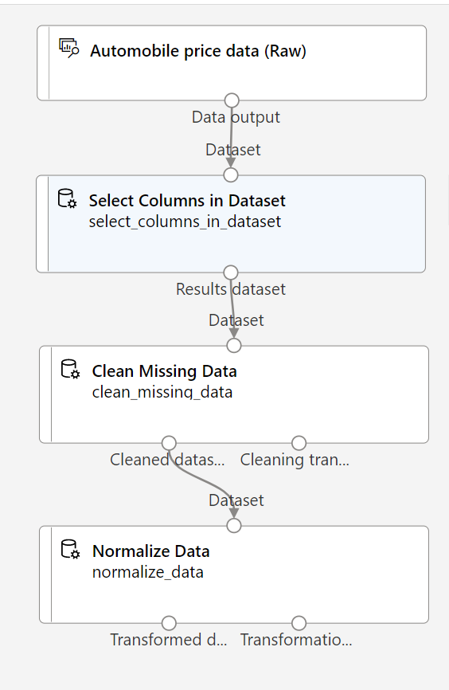

---
lab:
  title: Azure Machine Learning デザイナーを使用して回帰を調べる
---

# <a name="explore-regression-with-azure-machine-learning-designer"></a>Azure Machine Learning デザイナーを使用して回帰を調べる

> **注** このラボを完了するには、管理者アクセス権が与えられている [Azure サブスクリプション](https://azure.microsoft.com/free?azure-portal=true)が必要です。

この演習では、特性に基づいて自動車の価格を予測する回帰モデルをトレーニングします。

## <a name="create-an-azure-machine-learning-workspace"></a>Azure Machine Learning ワークスペースを作成する  

1. Microsoft 資格情報を使用して、[Azure portal](https://portal.azure.com?azure-portal=true) にサインインします。

1. **[リソースの作成]** を選択して *Machine Learning* を検索し、*Azure Machine Learning* プランを使用して新しい **Azure Machine Learning** リソースを作成します。 次の設定を使用します。
    - **[サブスクリプション]**: *お使いの Azure サブスクリプション*。
    - **リソース グループ**: *リソース グループを作成または選択します。*
    - **ワークスペース名**: *ワークスペースの一意の名前を入力します*。
    - **リージョン**: *地理的に最も近いリージョンを選びます*
    - **ストレージ アカウント**: *ワークスペース用に作成される既定の新しいストレージ アカウントです*。
    - **キー コンテナー**: *ワークスペース用に作成される既定の新しいキー コンテナーです*。
    - **Application Insights**: *ワークスペース用に作成される既定の新しい Application Insights リソースです*。
    - **[コンテナー レジストリ]**: なし (*コンテナーにモデルを初めてデプロイするときに、自動的に作成されます*)

1. **[Review + create](確認と作成)** を選択し、次に **[作成]** を選択します。 ワークスペースが作成されるまで待ってから (数分かかる場合があります)、デプロイされたリソースに移動します。

1. **[スタジオを起動する]** を選択し (または新しいブラウザー タブを開いて [https://ml.azure.com](https://ml.azure.com?azure-portal=true) に移動し)、Microsoft アカウントを使って Azure Machine Learning スタジオにサインインします。

1. Azure Machine Learning スタジオに、新しく作成したワークスペースが表示されます。 そうでない場合は、左側のメニューの **Microsoft** をクリックします。 次に、新しい左側のメニューから **[ワークスペース]** を選択します。ここで、サブスクリプションに関連付けられているすべてのワークスペースが一覧表示されます。 この演習用に作成したものから 1 つを選択します。 

> **注** このモジュールは、Azure Machine Learning ワークスペースを使用する多くのものの 1 つであり、「[Microsoft Azure AI Fundamentals: 機械学習用のビジュアル ツールについて調べる](https://docs.microsoft.com/learn/paths/create-no-code-predictive-models-azure-machine-learning/)」ラーニング パスの他のモジュールも含まれます。 独自の Azure サブスクリプションを使用している場合は、ワークスペースを 1 回作成し、それを他のモジュールで再利用することを検討できます。 ご利用のサブスクリプションに Azure Machine Learning ワークスペースが存在する限り、Azure サブスクリプションはデータ ストレージに対して少額を課金します。そのため、Azure Machine Learning ワークスペースが不要になった場合は、削除することをお勧めします。

## <a name="create-compute"></a>コンピューティングを作成する

1. [Azure Machine Learning スタジオ](https://ml.azure.com?azure-portal=true)で左上にある 3 行を選択して、インターフェイスのさまざまなページを表示します (画面のサイズを最大化する必要がある場合があります)。 左側のペインでこれらのページを使って、ワークスペース内のリソースを管理できます。 **[コンピューティング]** ページ ( **[管理]** の下) を表示します。

1. **[コンピューティング]** ページで **[コンピューティング クラスター]** タブを選び、次の設定で新しいコンピューティング クラスターを追加して機械学習モデルをトレーニングします。
    - **場所**: "*ワークスペースと同じものを選択してください。場所が一覧にない場合は、最も近いものを選択してください*"
    - **仮想マシンのレベル**: 専用
    - **[仮想マシンの種類]**: CPU
    - **仮想マシンのサイズ**:
        - **[すべてのオプションから選択]** を選択します
        - **[Standard_DS11_v2]** を検索して選択します
    - **[次へ]** を選択します
    - **[コンピューティング名]**: "*一意の名前を入力します*"
    - **[ノードの最小数]**: 0
    - **[ノードの最大数]**: 2
    - **[スケール ダウンする前のアイドル時間 (秒)]**:120
    - **SSH アクセスの有効化**: 解除します
    - **[作成]** を選択します。

> **注** コンピューティング インスタンスとクラスターは、標準の Azure 仮想マシン イメージに基づいています。 このモジュールでは、コストとパフォーマンスの最適なバランスを実現するために *Standard_DS11_v2* イメージが推奨されます。 サブスクリプションに、このイメージを含まないクォータが存在する場合は、代替イメージを選択します。ただし、大きなイメージはコストを上昇させる可能性があり、小さなイメージはタスクを完了するには十分でない可能性があることに注意してください。 または、Azure 管理者にクォータを拡張するように依頼します。

コンピューティング クラスターの作成には時間がかかります。 待っている間に次のステップに進んでかまいません。

## <a name="create-a-pipeline-in-designer"></a>デザイナーでパイプラインを作成する 

1. [Azure Machine Learning スタジオ](https://ml.azure.com?azure-portal=true)で、画面の左上にある 3 本線のアイコンを選択して左側のペインを展開します。 **[デザイナー]** ページ ( **[作成者]** の下) を表示し、 **+** を選択して新しいパイプラインを作成します。

1. 画面の右上にある **[設定]** を選択します。 **[設定]** ペインが表示されない場合は、上部のパイプライン名の横にある車輪アイコンを選択します。

1. **[設定]** で、パイプラインを実行するコンピューティング先を指定する必要があります。 **[コンピューティングの種類の選択]** で、**[コンピューティング クラスター]** を選択します。 次に、 **[Azure ML コンピューティング クラスターの選択]** で、前に作成したコンピューティング クラスターを選択します。

1. **[設定]** の **[ドラフトの詳細]** で、ドラフト名 (**Pipeline-Created-on-* date***) を **Auto Price Training** に変更します。

1. **[設定]** ペインの右上の "閉じるアイコン" を選択して、ペインを閉じます。** 

![Azure Machine Learning の [設定] ペインのスクリーンショット。](media/create-regression-model/create-pipeline-help.png)

## <a name="add-and-explore-a-dataset"></a>データセットの追加と探索

Azure Machine Learning には、回帰モデルに使用できるサンプル データセットが含まれています。

1. 左側のパイプライン名の横にある矢印アイコンを選択し、パネルを展開します (まだ開いていない場合)。 既定では、パネルで **[資産ライブラリ]** ペインが開きます。これは、パネルの上部にある本のアイコンで表されます。 ペイン上の資産を検索するための検索バーと、 **[データ]** と **[コンポーネント]** という 2 つのボタンがあります。

    

1. **[コンポーネント]** をクリックします。 **[Automobile price data (Raw)](自動車価格データ (未加工))** データセットを検索してキャンバスに配置します。

1. キャンバス上で **[Automobile price data (Raw)](自動車価格データ (未加工))** データセットを右クリックし (Mac では Ctrl キーを押しながらクリック)、**[データのプレビュー]** をクリックします。

1. データの "*データセットの出力*" スキーマを確認します。さまざまな列の分布をヒストグラムとして表示できることに注目します。

1. **Price** 列が表示されるまで、データセットを右にスクロールします。これは、モデルで予測するラベルです。

1. 左にスクロールして、**[normalized-losses]** 列ヘッダーを選択します。 この列の統計を確認します。 この列には、かなりの数の値が欠損していることに注意してください。 値が欠損していると、**price** ラベルを予測するための列の有用性が制限されるため、トレーニングから除外することが必要な場合があります。

1. **自動車価格データ (生データ) 結果の視覚化** ウィンドウを閉じると、キャンバスに次のようなデータセットが表示されます。

    

## <a name="add-data-transformations"></a>データ変換の追加

通常は、データ変換を適用して、モデリング用のデータを準備します。 自動車の価格データの場合、変換を追加して、データ探索時に特定した問題に対処します。

1. 左側の **[アセット ライブラリ]** ペインで、 **[コンポーネント]** をクリックします。これには、データ変換とモデル トレーニングに使用できるさまざまなモジュールが含まれています。 検索バーを使用して、モジュールを簡単に見つけることもできます。

1. **[データセット内の列の選択]** モジュールを検索して、キャンバスの **[Automobile price data (Raw)](自動車価格データ (未加工))** モジュールの下に配置します。 次に、**[Automobile price data (Raw)](自動車価格データ (生データ))** モジュールの下部にある出力を、次のように **[Select Columns in Dataset](データセット内の列の選択)** モジュールの上部にある入力に接続します。

     モジュールに接続されている Automobile price data データセットのスクリーンショット。](media/create-regression-model/dataset-select-columns.png)

1. **[データセット内の列の選択]** モジュールをダブルクリックして、右側の設定ペインにアクセスします。 **[列の編集]** を選択します。 次に、**[列の選択]** ウィンドウで、**[名前順]** および **[すべて追加]** を選択して、すべての列を追加します。 次に、**[正規化損失]** を削除し、最終的な列の選択は次のようになります。

    ![[normalized_losses] 以外のすべての列のスクリーンショット。](media/create-regression-model/select-columns.png)

1. **[Save](保存)** ボタンをクリックします。

この演習の残りの部分では、次のようなパイプラインを作成する手順を実行します。

![[データの正規化] モジュールを使用した Automobile price data データセットのスクリーンショット。](media/create-regression-model/data-transforms.png)

残りの手順に従います。必要なモジュールを追加して構成するときに、上記の参照用イメージを使用します。

1. **[アセット ライブラリ]** で **[欠損データのクリーニング]** モジュールを検索し、キャンバスの **[データセット内の列の選択]** モジュールの下に配置します。 次に、**[Select Columns in Dataset](データセット内の列の選択)** モジュールからの出力を、**[欠損データのクリーニング]** モジュールの入力に接続します。

1. **[欠損データのクリーニング]** モジュールをダブルクリックし、右側のペインで **[列の編集]** をクリックします。 次に、 **[クリーンする列]** ウィンドウで **[ルールを使用]** を選択し、 **[含める]** リストで **[列名]** を選択し、列名のボックスに、次のように、「**bore**」、「**stroke**」、「**horsepower**」と入力します。

    ![[bore]、[stroke]、および [horsepower] 列が選択されている様子を示すスクリーンショット。](media/create-regression-model/clean-missing-values.png)

1. **[欠損データのクリーニング]** モジュールをまだ選択したままにして、右側のペインで次の構成設定を設定します。
    - **[欠損値の最小比率]**:0.0
    - **[欠損値の最大比率]**: 1.0
    - **[クリーニング モード]**: 行全体の削除

    >**ヒント** **bore**、**stroke**、**horsepower** 列の統計情報を表示すると、欠損値の数が表示されます。 これらの列の欠損値は、**normalized-losses** よりも大幅に少ないため、欠損値の行をトレーニングから除外しても、**price** の予測に役立つ可能性があります。

1. **[アセット ライブラリ]** で、**[Normalize Data](データの正規化)** モジュールを見つけ、キャンバスの **[Clean Missing Data](欠損データのクリーニング)** モジュールの下に配置します。 次に、**[Clean Missing Data](欠損データのクリーニング)** モジュールからの一番左の出力を、**[Normalize Data](データの正規化)** モジュールの入力に接続します。

1. **[データの正規化]** モジュールをダブルクリックして、そのパラメーター ウィンドウを表示します。 変換の方法と変換する列を指定する必要があります。 変換メソッドを **[MinMax]** に設定します。 **[列の編集]** を選択してルールを適用し、次の **[列の名前]** を含めます。
    - **symboling**
    - **wheel-base**
    - **length**
    - **width**
    - **height**
    - **curb-weight**
    - **engine-size**
    - **bore**
    - **stroke**
    - **compression-ratio**
    - **horsepower**
    - **peak-rpm**
    - **city-mpg**
    - **highway-mpg**

    ![[price] 以外のすべての数値列が選択されている様子を示すスクリーンショット。](media/create-regression-model/normalize-rules.png)

    >**ヒント** **stroke**、**peak-rpm**、**city-mpg** 列の値を比較すると、これらはすべて異なるスケールで計測され、**peak-rpm** の値が大きいほどトレーニング アルゴリズムに偏りが生じ、**stroke** などの値が小さい列と比較して、この列への依存が過剰に大きくなる場合があります。 通常、データ科学者は、数値列を "*正規化*" して同様のスケールになるようにすることで、このような偏りの可能性を軽減します。

## <a name="run-the-pipeline"></a>パイプラインを実行する

データ変換を適用するには、パイプラインを実行する必要があります。

1. パイプラインが次の図のようになっていることを確認します。

    

1. **[送信]** を選択し、コンピューティング クラスター上で **mslearn-auto-training** という名前の新しい実験を作成します。

1. 実行が終了するまで待ちます。これには、5 分以上かかることがあります。

    ![デザイナー資産ライブラリと下部の完了したジョブおよび [ジョブの詳細] ボタンのスクリーンショット。](media/create-regression-model/completed-job.png)

    左側のパネルが **[送信済みジョブ]** ペインに変わったことに注目してください。 実行がいつ完了したかは、ジョブの状態が **[完了]** に変わることでわかります。 

1. 実行が完了したら、**[ジョブの詳細]** をクリックします。 新しいタブが開き、完了したコンポーネントに次のようなチェック マークが表示されます。

    

これで、データセットがモデル トレーニング用に準備されました。 [ジョブの詳細] タブを閉じてパイプラインに戻ります。

## <a name="create-training-pipeline"></a>トレーニング パイプラインを作成する

データ変換を使用してデータを準備したら、それを使用して機械学習モデルをトレーニングできます。 次の手順に従って、**Auto Price Training** パイプラインを拡張します。

1. 前のユニットで作成した **Auto Price Training** パイプラインに戻ります (まだ開いていない場合)。

1. 左側の **[アセット ライブラリ]** ペインで、 **[データの分割]** モジュールを見つけてキャンバスの **[データの正規化]** モジュールの下に配置します。 次に、**[Normalize Data](データの正規化)** モジュールの "*変換されたデータセット*" (左側) の出力を、**[Split Data](データの分割)** モジュールの入力に接続します。

    >**ヒント** モジュールを簡単に見つけるには、検索バーを使います。 

1. **[データの分割]** モジュールをダブルクリックし、その設定を次のように構成します。
    * **[Splitting mode](分割モード)**: Split Rows (行を分割)
    * **最初の出力データセット内の行の割合**:0.7
    * **ランダム化分割**: True
    * **[ランダム シード]**: 123
    * **[Stratified split](層化分割)**: False

1. **[アセット ライブラリ]** で、 **[モデルのトレーニング]** モジュールを検索し、キャンバスの **[データの分割]** モジュールの下に配置します。 次に、 **[データの分割]** モジュールの "*結果データセット 1*" (左側) の出力を **[モデルのトレーニング]** モジュールの "*データセット*" (右側) の入力に接続します。

1. トレーニングするモデルでは **price** の値が予測されるため、 **[モデルのトレーニング]** モジュールを選択し、**ラベル列**を **price** に設定するように設定を変更します (大文字と小文字の区別とスペルは正確に一致させます)。

    モデルによって予測される **price** ラベルは数値であるため、"*回帰*" アルゴリズムを使用してモデルをトレーニングする必要があります。

1. **[アセット ライブラリ]** で、 **[線形回帰]** モジュールを検索して、キャンバス上 **[データの分割]** モジュールの左側、 **[モデルのトレーニング]** モジュールの上に配置します。 次に、その出力を、**[モデルのトレーニング]** モジュールの **Untrained model** (左側) の入力に接続します。

    > **注** 回帰モデルのトレーニングに使用できるアルゴリズムは複数あります。 1 つを選択する方法については、「[Azure Machine Learning デザイナーの機械学習アルゴリズム チート シート](https://aka.ms/mlcheatsheet?azure-portal=true)」を参照してください。

    トレーニング済みモデルをテストするには、それを使用して、元のデータを分割するときに確保しておいた検証データセットを "*スコア付け*" する必要があります。つまり、検証データセット内の特徴のラベルを予測します。
 
1. **[アセット ライブラリ]** で、 **[モデルのスコア付け]** モジュールを検索し、キャンバスの **[モデルのトレーニング]** モジュールの下に配置します。 次に、**[モデルのトレーニング]** モジュールの出力を、**[Score Model](モデルのスコア付け)** モジュールの**トレーニング済みモデル** (左側) の入力に接続します。**[データの分割]** モジュールの**結果データセット 2** (右側) の出力を、**[Score Model](モデルのスコア付け)** モジュールの**データセット** (右側) の入力にドラッグします。

1. パイプラインが次の図のようになっていることを確認します。

    

## <a name="run-the-training-pipeline"></a>トレーニング パイプラインを実行する

これで、トレーニング パイプラインを実行してモデルをトレーニングする準備ができました。

1. **[送信]** を選択し、**mslearn-auto-training** という名前の既存の実験を使用してパイプラインを実行します。

1. 実験の実行が完了するまでに 5 分以上かかります。 実験の実行が完了したら、**[ジョブの詳細]** をクリックします。 新しいウィンドウに移動します。

1. 新しいウィンドウで、**[Score Model](モデルのスコアリング)** モジュールを右クリックし、**[データを表示する]**、**[Scored dataset](スコア付けされたデータセット)** の順に選択して結果を表示します。

1. 右にスクロールして、 **[price]** 列 (ラベルの既知の真の値を含む) の横に、予測ラベルの値を含む **Scored Labels** という名前の新しい列があることに注目します。

1. **[モデルのスコア付け結果の視覚化]** ウィンドウを閉じます。

モデルでは **price** ラベルの値が予測されますが、その予測の信頼性はどの程度でしょうか? これを評価するには、モデルを評価する必要があります。

## <a name="evaluate-model"></a>モデルの評価

回帰モデルを評価する 1 つの方法は、予測されたラベルを、トレーニング中に保持していた検証データセット内の実際のラベルと比較することです。 もう 1 つの方法は、複数のモデルのパフォーマンスを比較することです。

1. 作成した **Auto Price Training** パイプラインを開きます。

1. **[アセット ライブラリ]** で、 **[モデルの評価]** モジュールを検索して、キャンバス上の **[モデルのスコア付け]** モジュールの下にドラッグし、 **[モデルのスコア付け]** モジュールの出力を **[モデルの評価]** モジュールの **[スコア付けされたデータセット]** (左) 入力に接続します。

1. パイプラインが次のようになっていることを確認します。

    ![[Score Model (モデルのスコア付け)] モジュールに [Evaluate Model] (モデルの評価) モジュールを追加するスクリーンショット。](media/create-regression-model/evaluate.png)

1. **[送信]** を選択し、**mslearn-auto-training** という名前の既存の実験を使用してパイプラインを実行します。

1. 実験の実行が完了するまで待ちます。

    

1. 実験の実行が完了したら、 **[ジョブの詳細]** を選択すると、別のタブが開きます。 **[モデルの評価]** モジュールを見つけて右クリックします。 **[データのプレビュー]**、**[評価結果]** の順に選択します。

    ![[Evaluate Model] (モデルの評価) モジュールの場所のスクリーンショット。](media/create-regression-model/evaluate-model-help-1.png)

1. *[Evaluation_results]* ウィンドウで、回帰パフォーマンス メトリックを確認します。
    - **平均絶対誤差 (MAE)**
    - **二乗平均平方根誤差 (RMSE)**
    - **相対二乗誤差 (RSE)**
    - **相対絶対誤差 (RAE)**
    - **決定係数 (R<sup>2</sup>)**
1. *[Evaluation_results]* ウィンドウを閉じます。

ニーズに合った評価メトリックでモデルを特定したら、そのモデルを新しいデータで使用する準備を行うことができます。

## <a name="create-and-run-an-inference-pipeline"></a>推論パイプラインの作成と実行

1. Azure Machine Learning スタジオで、画面の左上にある 3 本線を選んで左側のウィンドウを展開します。 **[ジョブ]** (**[資産]** の下) をクリックして、実行したすべてのジョブを表示します。 実験 **[mslearn-auto-training]** を選択し、**[mslearn-auto-training]** パイプラインを選択します。 

    ![左側のメニューにある [ジョブ] のスクリーンショット。 [ジョブ] を選択してからご自分の実験名を選びます。](media/create-regression-model/jobs-tab.png)

1. キャンバスの上にあるメニューを見つけて、**[Create inference pipeline] (推論パイプラインの作成)** をクリックします。 メニューで **[Create inference pipeline] (推論パイプラインの作成)** を見つけるには、画面を完全に展開し、画面の右上隅にある 3 つのドット アイコン **[...]** をクリックする必要がある場合があります。  

    

1. **[Create inference pipeline](推論パイプラインの作成)** ドロップダウン リストで、**[Real-time inference pipeline](リアルタイム推論パイプライン)** をクリックします。 数秒後に、**Auto Price Training-real time inference** (自動車価格トレーニング - リアルタイム推論) という名前の新しいバージョンのパイプラインが開きます。

                  "パイプラインに **[Web サービスの入力]** および **[Web サービスの出力]** モジュールが含まれていない場合は、**[デザイナー]** ページに戻り、**Auto Price Training-real time inference** (自動車価格トレーニング - リアルタイム推論) パイプラインをもう一度開きます。"**

1. 新しいパイプラインの名前を **Predict Auto Price** に変更し、新しいパイプラインを確認します。 これには、新しいデータを送信するための Web サービス入力と、結果を返すための Web サービス出力が含まれています。 変換とトレーニングのいくつかのステップは、このパイプラインに含まれています。 トレーニング済みのモデルは、新しいデータのスコア付けに使用されます。

    次のステップ 5 から 9 では、推論パイプラインに次の変更を加えます。

    

   次の手順でパイプラインを変更するときは、参照用のイメージを使用します。

1. 推論パイプラインでは、新しいデータが元のトレーニング データのスキーマと一致することを前提としているので、トレーニング パイプラインからの **Automobile price data (Raw)** データセットが含まれます。 ただし、この入力データには、モデルによって予測される **price** ラベルが含まれています。これは、価格予測がまだ行われていない新しい自動車データに含めるには非直感的です。 このモジュールを削除して、**[Data Input and Output](データ入力と出力)** セクションの **[Enter Data Manually](データの手動入力)** モジュールで置き換えます。これには、3 つの自動車のラベルのない特徴値を持つ、次の CSV データが含まれます (次のテキスト ブロック全体をコピーして貼り付けます)。

    ```CSV
    symboling,normalized-losses,make,fuel-type,aspiration,num-of-doors,body-style,drive-wheels,engine-location,wheel-base,length,width,height,curb-weight,engine-type,num-of-cylinders,engine-size,fuel-system,bore,stroke,compression-ratio,horsepower,peak-rpm,city-mpg,highway-mpg
    3,NaN,alfa-romero,gas,std,two,convertible,rwd,front,88.6,168.8,64.1,48.8,2548,dohc,four,130,mpfi,3.47,2.68,9,111,5000,21,27
    3,NaN,alfa-romero,gas,std,two,convertible,rwd,front,88.6,168.8,64.1,48.8,2548,dohc,four,130,mpfi,3.47,2.68,9,111,5000,21,27
    1,NaN,alfa-romero,gas,std,two,hatchback,rwd,front,94.5,171.2,65.5,52.4,2823,ohcv,six,152,mpfi,2.68,3.47,9,154,5000,19,26
    ```

1. 新しい **[Enter Data Manually](データの手動入力)** モジュールを、**[Web Service Input](Web サービス入力)** と同じ **[Select Columns in Dataset](データセット内の列の選択)** モジュールの**データセット**入力に接続します。

1. 受信データのスキーマを変更して **[price]** フィールドを除外したので、残りのモジュールでこのフィールドの明示的な使用をすべて削除する必要があります。 **[Select Columns in Dataset](データセット内の列の選択)** モジュールを選択し、[設定] ペインで列を編集して、**[price]** フィールドを削除します。

1. 推論パイプラインには **[Evaluate Mode](モデル評価)** モジュールが含まれていますが、このモジュールは、新しいデータから予測するときには役に立たないため削除します。

1. **[モデルのスコア付け]** モジュールからの出力には、すべての入力の特徴と、予測ラベルが含まれています。 予測のみを含むように出力を変更するには:
    - **[Score Model](モデルのスコア付け)** モジュールと **[Web Service Output](Web サービス出力)** 間の接続を削除します。
    - **[Python 言語]** セクションから **[Python スクリプトの実行]** モジュールを追加し、すべての既定の Python スクリプトを次のコードに置き換えます (これにより **[Scored Labels]** 列のみが選択され、**predicted_price** という名前に変更されます)。

```Python
import pandas as pd

def azureml_main(dataframe1 = None, dataframe2 = None):

    scored_results = dataframe1[['Scored Labels']]
    scored_results.rename(columns={'Scored Labels':'predicted_price'},
                        inplace=True)
    return scored_results
```

    - **[Score Model](モデルのスコア付け)** モジュールからの出力を、**[Python スクリプトの実行]** の**データセット 1** (左端) の入力に接続し、**[Python スクリプトの実行]** モジュールの出力を **[Web Service Output](Web サービス出力)** に接続します。

1. パイプラインが以下の図のようになっていることを確認します。

    

1. コンピューティング クラスター上でパイプラインを **mslearn-auto-inference** という名前の新しい実験として送信します。 実験の実行には時間がかかる場合があります。

1. パイプラインが完了したら、 **[ジョブの詳細]** を選択します。 新しいウィンドウで、 **[Python スクリプトの実行]** モジュールを選択します。 **[データを表示する]**、**[Result dataset](結果のデータセット)** の順に選択して、入力データ内の 3 台の車の予想価格を表示します。

1. 次に、視覚化を閉じます。

推論パイプラインにより、自動車の特徴に基づいて、その価格が予測されます。 これで、クライアント アプリケーションで使用できるように、パイプラインを発行する準備ができました。

## <a name="deploy-model"></a>モデルのデプロイ

リアルタイム推論用の推論パイプラインを作成してテストした後、それをクライアント アプリケーションで使用するためにサービスとして発行できます。

> **注** この演習では、Azure コンテナー インスタンス (ACI) に Web サービスをデプロイします。 この種類のコンピューティングは、動的に作成され、開発とテストに役立ちます。 運用環境では、"*推論クラスター*" を作成する必要があります。これにより、スケーラビリティとセキュリティを向上させる Azure Kubernetes Service (AKS) クラスターが提供されます。

## <a name="deploy-a-service"></a>サービスをデプロイする

1. 前のユニットで作成した **Predict Auto Price** 推論パイプラインを表示します。

1. 左側のペインで **[ジョブの詳細]** を選択すると、新しいタブが開きます。

    

1. 新しいタブで **[デプロイ]** を選択します。

    ![Predict Auto Price (自動車の価格の予測) 推論パイプラインの [デプロイ] ボタンのスクリーンショット。](media/create-regression-model/deploy-screenshot.png)

1. 構成スクリーンで、次の設定を使用して **[新しいリアルタイム エンドポイントをデプロイ]** を選択します。
    -  **[名前]**: predict-auto-price
    -  **説明**: 自動車価格の回帰
    - **[コンピューティングの種類]**: Azure コンテナー インスタンス

1. Web サービスがデプロイされるまで、数分待ちます。 デプロイの状態は、デザイナー インターフェイスの左上に表示されます。

## <a name="test-the-service"></a>サービスをテストする

1. **[エンドポイント]** ページで、**predict-auto-price** リアルタイム エンドポイントを開きます。

    ![左側のペインの [エンドポイント] オプションの場所のスクリーンショット。](media/create-regression-model/endpoints-lab.png)

1. **自動価格予測**エンドポイントを開き、**[テスト]** タブを選択します。これを使用して、新しいデータでモデルをテストします。 **[データを入力してリアルタイム エンドポイントをテストする]** の下の現在のデータを削除します。 次のデータをコピーしてデータ セクションに貼り付けます。  

    ```json
    {
    "Inputs": {
                "WebServiceInput0":
                [
                    {
                        "symboling": 3,
                        "normalized-losses": 1.0,
                        "make": "alfa-romero",
                        "fuel-type": "gas",
                        "aspiration": "std",
                        "num-of-doors": "two",
                        "body-style": "convertible",
                        "drive-wheels": "rwd",
                        "engine-location": "front",
                        "wheel-base": 88.6,
                        "length": 168.8,
                        "width": 64.1,
                        "height": 48.8,
                        "curb-weight": 2548,
                        "engine-type": "dohc",
                        "num-of-cylinders": "four",
                        "engine-size": 130,
                        "fuel-system": "mpfi",
                        "bore": 3.47,
                        "stroke": 2.68,
                        "compression-ratio": 9,
                        "horsepower": 111,
                        "peak-rpm": 5000,
                        "city-mpg": 21,
                        "highway-mpg": 27
                    }
                ]
            },
    "GlobalParameters": {}
    }
    ```

1. **[Test]** を選択します。 画面の右側に、出力 **'predicted_price'** が表示されます。 この出力は、データで指定された特定の入力特徴を持つ車両の予測価格です。 

    ![[テスト] ペインのスクリーンショット。](media/create-regression-model/test-interface.png)

これまでに行った内容を振り返ってみましょう。 自動車データのデータセットをクリーンアップして変換した後、車の "特徴" を使用してモデルをトレーニングしました。** このモデルは、"ラベル" である自動車の価格を予測します。**

**[使用する]** タブの資格情報を使用してクライアント アプリケーションに接続する準備ができているサービスもテストしました。ここでラボを終了します。 デプロイしたサービスを引き続き試してみることをお勧めします。

## <a name="clean-up"></a>クリーンアップ

作成した Web サービスは "*Azure コンテナー インスタンス*" にホストされます。 それ以上実験する予定がない場合は、不要な Azure の使用が発生するのを避けるために、エンドポイントを削除する必要があります。 また、再び必要になるまでコンピューティング インスタンスを停止する必要もあります。

1. [Azure Machine Learning Studio](https://ml.azure.com?azure-portal=true) の **[エンドポイント]** タブで、**predict-auto-price** エンドポイントを選択します。 次に、**[削除]** を選び、エンドポイントを削除することを確認します。

1. **[コンピューティング]** ページの **[コンピューティング クラスター]** タブで、コンピューティング クラスターを選んでから、 **[削除]** を選びます。

>**注**: コンピューティングを停止すると、サブスクリプションがコンピューティング リソースに対して課金されなくなります。 ただし、サブスクリプションに Azure Machine Learning ワークスペースが存在する限り、データ ストレージに対して少額が課金されます。 Azure Machine Learning の探索を完了したら、Azure Machine Learning ワークスペースとそれに関連付けられたリソースを削除できます。 ただし、このシリーズの他のいずれかのラボを完了する予定がある場合は、作成し直す必要があります。
>
> ワークスペースを削除するには:
>
> 1. [Azure portal](https://portal.azure.com?azure-portal=true) の **[リソース グループ]** ページで、Azure Machine Learning ワークスペースの作成時に指定したリソース グループを開きます。
> 1. **[リソース グループの削除]** をクリックし、リソース グループ名を入力して削除することを確認し、**[削除]** を選択します。
