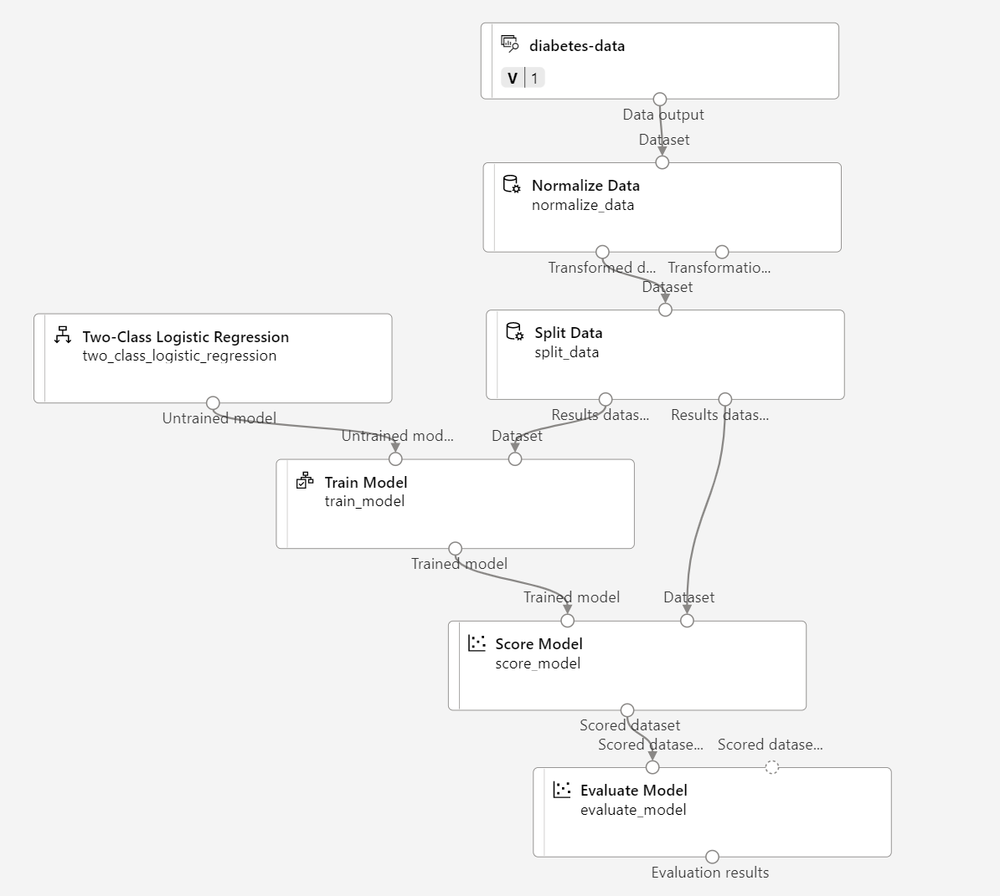

---
lab:
  title: Azure Machine Learning デザイナーを使った分類について調べる
---

# <a name="explore-classification-with-azure-machine-learning-designer"></a>Azure Machine Learning デザイナーを使った分類について調べる

> **注** このラボを完了するには、管理者アクセス権が与えられている [Azure サブスクリプション](https://azure.microsoft.com/free?azure-portal=true)が必要です。

## <a name="create-an-azure-machine-learning-workspace"></a>Azure Machine Learning ワークスペースを作成する  

1. Microsoft 資格情報を使用して、[Azure portal](https://portal.azure.com?azure-portal=true) にサインインします。

1. **[リソースの作成]** を選択して *Machine Learning* を検索し、*Azure Machine Learning* プランを使用して新しい **Azure Machine Learning** リソースを作成します。 次の設定を使用します。
    - **[サブスクリプション]**: *お使いの Azure サブスクリプション*。
    - **リソース グループ**: *リソース グループを作成または選択します。*
    - **ワークスペース名**: *ワークスペースの一意の名前を入力します*。
    - **リージョン**: *地理的に最も近いリージョンを選びます*
    - **ストレージ アカウント**: *ワークスペース用に作成される既定の新しいストレージ アカウントです*。
    - **キー コンテナー**: *ワークスペース用に作成される既定の新しいキー コンテナーです*。
    - **Application Insights**: *ワークスペース用に作成される既定の新しい Application Insights リソースです*。
    - **[コンテナー レジストリ]**: なし (*コンテナーにモデルを初めてデプロイするときに、自動的に作成されます*)

1. **[Review + create](確認と作成)** を選択し、次に **[作成]** を選択します。 ワークスペースが作成されるまで待ってから (数分かかる場合があります)、デプロイされたリソースに移動します。

1. **[スタジオを起動する]** を選択し (または新しいブラウザー タブを開いて [https://ml.azure.com](https://ml.azure.com?azure-portal=true) に移動し)、Microsoft アカウントを使って Azure Machine Learning スタジオにサインインします。

1. Azure Machine Learning スタジオに、新しく作成したワークスペースが表示されます。 そうでない場合は、左側のメニューの **Microsoft** をクリックします。 次に、新しい左側のメニューから **[ワークスペース]** を選択します。ここで、サブスクリプションに関連付けられているすべてのワークスペースが一覧表示されます。 この演習用に作成したものから 1 つを選択します。 

> **注** このモジュールは、Azure Machine Learning ワークスペースを使用する多くのものの 1 つであり、「[Microsoft Azure AI Fundamentals: 機械学習用のビジュアル ツールについて調べる](https://docs.microsoft.com/learn/paths/create-no-code-predictive-models-azure-machine-learning/)」ラーニング パスの他のモジュールも含まれます。 独自の Azure サブスクリプションを使用している場合は、ワークスペースを 1 回作成し、それを他のモジュールで再利用することを検討できます。 ご利用のサブスクリプションに Azure Machine Learning ワークスペースが存在する限り、Azure サブスクリプションはデータ ストレージに対して少額を課金します。そのため、Azure Machine Learning ワークスペースが不要になった場合は、削除することをお勧めします。

## <a name="create-compute"></a>コンピューティングを作成する

1. [Azure Machine Learning スタジオ](https://ml.azure.com?azure-portal=true)で左上にある 3 行を選択して、インターフェイスのさまざまなページを表示します (画面のサイズを最大化する必要がある場合があります)。 左側のペインでこれらのページを使って、ワークスペース内のリソースを管理できます。 **[コンピューティング]** ページ ( **[管理]** の下) を表示します。

1. **[コンピューティング]** ページで **[コンピューティング クラスター]** タブを選び、次の設定で新しいコンピューティング クラスターを追加します。 これを使用して機械学習モデルをトレーニングします。
    - **場所**: "*ワークスペースと同じものを選択してください。場所が一覧にない場合は、最も近いものを選択してください*"
    - **仮想マシンのレベル**: 専用
    - **[仮想マシンの種類]**: CPU
    - **仮想マシンのサイズ**:
        - **[すべてのオプションから選択]** を選択します
        - **[Standard_DS11_v2]** を検索して選択します
    - **[次へ]** を選択します
    - **コンピューティング名**: *一意の名前を入力します*
    - **[ノードの最小数]**: 0
    - **[ノードの最大数]**: 2
    - **[スケール ダウンする前のアイドル時間 (秒)]**:120
    - **SSH アクセスの有効化**: 解除します
    - **[作成]** を選択します。

> **注** コンピューティング インスタンスとクラスターは、標準の Azure 仮想マシン イメージに基づいています。 このモジュールでは、コストとパフォーマンスの最適なバランスを実現するために *Standard_DS11_v2* イメージが推奨されます。 サブスクリプションに、このイメージを含まないクォータが存在する場合は、代替イメージを選択します。ただし、大きなイメージはコストを上昇させる可能性があり、小さなイメージはタスクを完了するには十分でない可能性があることに注意してください。 または、Azure 管理者にクォータを拡張するように依頼します。

コンピューティング クラスターの作成には時間がかかります。 待っている間に次のステップに進んでかまいません。

## <a name="create-a-pipeline-in-designer"></a>デザイナーでパイプラインを作成する

Azure Machine Learning デザイナーの使用を開始するには、最初にパイプラインを作成し、使用するデータセットを追加する必要があります。

1. [Azure Machine Learning スタジオ](https://ml.azure.com?azure-portal=true)で、画面の左上にある 3 本線を選んで左側のペインを展開します。 **[デザイナー]** ページ ( **[作成者]** の下) を表示し、 **+** を選択して新しいパイプラインを作成します。

1. 画面の右上にある **[設定]** を選択します。 **[設定]** ペインが表示されない場合は、上部のパイプライン名の横にある車輪アイコンを選択します。

1. **[設定]** で、パイプラインを実行するコンピューティング先を指定する必要があります。 **[コンピューティングの種類の選択]** で、**[コンピューティング クラスター]** を選択します。 次に、 **[Azure ML コンピューティング クラスターの選択]** で、前に作成したコンピューティング クラスターを選択します。

1. **[設定]** の **[ドラフトの詳細]** で、ドラフト名 (**Pipeline-Created-on-* date***) を **Diabetes Training** に変更します。

1. **[設定]** ペインの右上の [閉じる] アイコンを選択して、ペインを閉じ、 **[保存]** を選択します。

    ![Azure Machine Learning の [設定] ペインのスクリーンショット。](media/create-classification-model/create-pipeline-help.png)

## <a name="create-a-dataset"></a>データセットを作成する

1. [Azure Machine Learning スタジオ](https://ml.azure.com?azure-portal=true)で、画面の左上にある 3 本線を選択して左側のペインを展開します。 **[データ]** ページ (**[アセット]** の下)を表示します。 [データ] ページには、Azure ML 内で使用する予定の特定のデータ ファイルまたはテーブルが含まれています。 このページからデータセットを作成することもできます。

1. **[データ]** ページの **[データ資産]** タブで、 **[作成]** を選択します。 次に、次の設定でデータ資産を構成します。
    * **データ型**:
        * **名前**: diabetes-data
        * **説明**:糖尿病データ
        * **データセットの種類**:表形式
    * **データ ソース**: Web ファイルから
    * **Web URL**: 
        * **Web URL**: https://aka.ms/diabetes-data
        * **データ検証のスキップ**: "選択しないでください"**
    * **設定**:
        * **[ファイル形式]**: 区切り記号付き
        * **[区切り記号]**: コンマ
        * **[エンコード]**: UTF-8
        * **[列ヘッダー]**: 最初のファイルにのみヘッダーを付ける
        * **[行のスキップ]**: なし
        * **データセットに複数行のデータを含める**: 選択しない**
    * **[スキーマ]**:
        * **[パス]** 以外のすべての列を含める
        * 自動的に検出された型を確認する
    * **確認**
        * **[作成]** を選択します。

1. データセットが作成されたら、それを開き、**[探索]** ページを表示して、データのサンプルを確認します。 このデータは、糖尿病を検査した患者の詳細を表します。

### <a name="load-data-to-canvas"></a>データをキャンバスに読み込む

1. 左側のメニューで **[デザイナー]** を選んで、パイプラインに戻ります。 **[デザイナー]** ページで、**Diabetes Training** パイプラインを選びます。

1. その後、プロジェクトで、左側のパイプライン名の横にある矢印アイコンを選び、パネルを展開します (まだ開いていない場合)。 既定では、パネルで **[資産ライブラリ]** ペインが開きます。これは、パネルの上部にある本のアイコンで表されます。 アセットを検索するために、検索バーがあります。 **[データ]** と **[コンポーネント]** の 2 つのボタンに注目してください。

    

1. **[データ]** をクリックします。 **diabetes-data** データセットを検索し、キャンバスに配置します。

1. キャンバス上で **diabetes-data** データセットを右クリック (Mac では Ctrl キーを押しながらクリック) し、**[データのプレビュー]** をクリックします。

1. *[プロファイル]* タブでデータのスキーマを確認します。さまざまな列の分布がヒストグラムとして表示できることに注意してください。

1. 下にスクロールし、**[Diabetic]** 列の列見出しを選択します。**0** と **1** の 2 つの値が含まれていることに注意してください。 これらの値は、モデルによって予測される "*ラベル*" に対して可能な 2 つのクラスを表します。**0** の値は患者には糖尿病がないことを意味し、**1** の値は患者が糖尿病であることを意味します。

1. 上にスクロールし、ラベルの予測に使用される "特徴" を表す他の列を確認します。** これらの列のほとんどは数値ですが、それぞれの特徴に独自のスケールがあることに注意してください。 たとえば、**Age** の値範囲は 21 から 77 ですが、**DiabetesPedigree** の値範囲は 0.078 から 2.3016 です。 機械学習モデルをトレーニングするときに、結果として得られる予測関数が大きい値によって支配され、スケールが小さい特徴の影響が小さくなる可能性があります。 通常、データ科学者は、数値列を "*正規化*" して同様のスケールになるようにすることで、このような偏りの可能性を軽減します。

1. **[diabetes-data の結果の視覚化]** タブを閉じると、キャンバスに次のようなデータセットが表示されます。

    

## <a name="add-transformations"></a>変換の追加

モデルをトレーニングする前に、通常はいくつかの前処理変換をデータに適用する必要があります。

1. 左側の **[アセット ライブラリ]** ペインで、 **[コンポーネント]** をクリックします。これには、データ変換とモデル トレーニングに使用できるさまざまなモジュールが含まれています。 検索バーを使用して、モジュールを簡単に見つけることもできます。

    

1. **[データの正規化]** モジュールを見つけ、キャンバスの **diabetes-data** データセットの下に配置します。 続いて、次のように **diabetes-data** データセットの下部からの出力を **[データの正規化]** モジュールの上部の入力に接続します。

    

1. **[データの正規化]** モジュールをダブルクリックしてその設定を表示して、変換の方法と変換する列の指定が必要であることがわかります。 

1. *[変換メソッド]* を **[MinMax]** に設定し、 *[チェック時に定数列に 0 を使用する]* を **[True]** に設定します。 列を編集し、図に示すように名前を使用して次の列を含めます。
    - **Pregnancies**
    - **PlasmaGlucose**
    - **DiastolicBloodPressure**
    - **TricepsThickness**
    - **SerumInsulin**
    - **BMI**
    - **DiabetesPedigree**
    - **Age**

    

データ変換により、数値列が正規化されて同じスケールに配置されます。これにより、大きな値がモデル トレーニングを左右するのを防ぐことができます。 通常は、トレーニング用のデータの準備には、こうした一括の前処理変換を適用しますが、この演習ではシンプルさを維持します。

## <a name="run-the-pipeline"></a>パイプラインを実行する

データ変換を適用するには、パイプラインを実験として実行する必要があります。

1. **[送信]** を選択し、コンピューティング クラスター上でパイプラインを **mslearn-diabetes-training** という名前の新しい実験として実行します。

1. 実行が完了するまで数分待ちます。

    ![デザイナー資産ライブラリと下部の完了したジョブおよび [ジョブの詳細] ボタンのスクリーンショット。](media/create-classification-model/completed-job.png)

    左側のパネルが **[送信済みジョブ]** ペインに変わったことに注目してください。 実行がいつ完了したかは、ジョブの状態が **[完了]** に変わることでわかります。

## <a name="view-the-transformed-data"></a>変換されたデータを表示する

1. 実行が完了すると、データセットはモデル トレーニング用に準備できています。 **[ジョブの詳細]** をクリックします。 新しいウィンドウに移動します。

1. キャンバス上で **[データの正規化]** モジュールを右クリック (Mac では Ctrl キーを押しながらクリック) し、 **[データのプレビュー]** をクリックします。 **[Transformed dataset] (変換されたデータセット)** を選択します。

1. データを表示します。選択した数値列が共通のスケールに正規化されていることに注意してください。

1. 正規化されたデータ結果の視覚化を閉じます。 前のタブに戻ります。

データ変換を使用してデータを準備したら、それを使用して機械学習モデルをトレーニングできます。

## <a name="add-training-modules"></a>トレーニング モジュールを追加する

データのサブセットを使用してモデルをトレーニングする一方で、トレーニング済みモデルのテストに使用するためにデータの一部を確保しておくことが一般的です。 これにより、モデルで予測されるラベルを、元のデータセット内にある実際の既知のラベルと比較できます。

この演習では、次に示すように、**Diabetes Training** パイプラインを拡張する手順を行います。


次の手順に従います。必要なモジュールを追加して構成するときに、上記の参照用イメージを使用します。

1. まだ開いていない場合は、前のユニットで作成した **Diabetes Training** パイプラインを開きます。

1. 左側の **[アセット ライブラリ]** ペインの **[コンポーネント]** で、 **[データの分割]** モジュールを検索し、キャンバスの **[データの正規化]** モジュールの下に配置します。 次に、**[Normalize Data](データの正規化)** モジュールの "*変換されたデータセット*" (左側) の出力を、**[Split Data](データの分割)** モジュールの入力に接続します。

    >**ヒント** モジュールを簡単に見つけるには、検索バーを使います。

1. **[Split Data](データの分割)** モジュールを選択し、その設定を次のように構成します。
    * **[Splitting mode](分割モード)**: Split Rows (行を分割)
    * **最初の出力データセット内の行の割合**:0.7
    * **ランダム化分割**: True
    * **[ランダム シード]**: 123
    * **[Stratified split](層化分割)**: False

1. **[アセット ライブラリ]** で、 **[モデルのトレーニング]** モジュールを検索し、キャンバスの **[データの分割]** モジュールの下に配置します。 次に、 **[データの分割]** モジュールの "*結果データセット 1*" (左側) の出力を **[モデルのトレーニング]** モジュールの "*データセット*" (右側) の入力に接続します。

1. トレーニングしているモデルでは **Diabetic** の値が予測されるため、**[モデルのトレーニング]** モジュールを選択し、その設定を変更して **ラベル 列**を **Diabetic** に設定します。

    モデルによって予測される **Diabetic** ラベルはクラス (0 または 1) であるため、"*分類*" アルゴリズムを使用してモデルをトレーニングする必要があります。 具体的には、考えられるクラスが 2 つあるので、"*二項分類*" アルゴリズムが必要です。

1. **[アセット ライブラリ]** で、 **[2 クラス ロジスティックの回帰]** モジュールを検索し、キャンバスの **[データの分割]** モジュールの左側、 **[モデルのトレーニング]** モジュールの上に配置します。 次に、その出力を、**[モデルのトレーニング]** モジュールの **Untrained model** (左側) の入力に接続します。

   トレーニング済みモデルをテストするには、それを使用して、元のデータを分割するときに確保しておいた検証データセットを "*スコア付け*" する必要があります。つまり、検証データセット内の特徴のラベルを予測します。

1. **[アセット ライブラリ]** で、 **[モデルのスコア付け]** モジュールを検索し、キャンバスの **[モデルのトレーニング]** モジュールの下に配置します。 次に、**[モデルのトレーニング]** モジュールの出力を、**[Score Model](モデルのスコア付け)** モジュールの**トレーニング済みモデル** (左側) の入力に接続します。**[データの分割]** モジュールの**結果データセット 2** (右側) の出力を、**[Score Model](モデルのスコア付け)** モジュールの**データセット** (右側) の入力に接続します。

## <a name="run-the-training-pipeline"></a>トレーニング パイプラインを実行する

これで、トレーニング パイプラインを実行してモデルをトレーニングする準備ができました。

1. **[送信]** を選択し、**mslearn-diabetes-training** という名前の既存の実験を使用してパイプラインを実行します。

1. 実験の実行が完了するまで待ちます。 これには、5 分以上かかることがあります。

1. 実験の実行が完了したら、 **[ジョブの詳細]** を選択します。 新しいタブに移動します。

1. その新しいタブで、キャンバス上の **[モデルのスコア付け]** モジュールを右クリック (Mac では Ctrl キーを押しながらクリック) し、 **[データのプレビュー]** をクリックします。 **[Scored dataset] (スコア付けされたデータセット)** を選択して結果を表示します。

1. 右にスクロールして、**[Diabetic]** 列 (ラベルの既知の真の値を含む) の横に、予測ラベル値を含む **Scored Labels** という名前の新しい列と、0 から 1 の間の確率値を含む **Scored Probabilities** 列が表示されることに注目します。 これは "*陽性*" 予測の確率を示します。したがって、確率が 0.5 より大きいと ***1*** (糖尿病) の予測ラベルが生成されますが、確率が 0 から 0.5 の間の場合は ***0*** (糖尿病ではない) の予測ラベルが生成されます。

1. **[モデルのスコア付け結果の視覚化]** ウィンドウを閉じます。

モデルでは **Diabetic** ラベルの値が予測されますが、その予測の信頼性はどの程度でしょうか? これを評価するには、モデルを評価する必要があります。

確保されて、モデルのスコア付けに使用した検証データには、ラベルの既知の値が含まれます。 したがって、モデルを検証するために、ラベルの真の値を、検証データセットのスコア付け時に予測されたラベル値と比較できます。 この比較に基づいて、モデルのパフォーマンスを説明するさまざまなメトリックを計算できます。

## <a name="add-an-evaluate-model-module"></a>[Evaluate Mode](モデル評価) モジュールを追加する

1. 作成した **Diabetes Training** パイプラインを開きます。

1. **[アセット ライブラリ]** で、 **[モデルの評価]** モジュールを検索して、キャンバス上の **[モデルのスコア付け]** モジュールの下にドラッグし、 **[モデルのスコア付け]** モジュールの出力を **[モデルの評価]** モジュールの **[スコア付けされたデータセット]** (左) 入力に接続します。

1. パイプラインが次のようになっていることを確認します。

    

1. **[送信]** を選択し、**mslearn-diabetes-training** という名前の既存の実験を使用してパイプラインを実行します。

1. 実験の実行が完了するまで待ちます。

1. 実験の実行が完了したら、 **[ジョブの詳細]** を選択します。 新しいタブに移動します。

1. その新しいタブで、キャンバス上の **[モデルの評価]** モジュールを右クリック (Mac では Ctrl キーを押しながらクリック) し、 **[データのプレビュー]** をクリックします。 **[評価結果]** を選択して、パフォーマンス メトリックを表示します。 これらのメトリックは、検証データに基づいてモデルがどの程度適切に予測されるかをデータ科学者が評価するのに役立ちます。

1. 下にスクロールして、モデルの "混同行列" を表示します。** 可能な各クラスの予測値と実際の値の数を確認します。 

1. 混同行列の左側にあるメトリックを確認します。これには次のものが含まれます。
    - **正確性**: つまり、モデルによって糖尿病が正しく予測された比率です。
    - **精度**: つまり、糖尿病と "モデルによって予測された" 全患者のうち、モデルが正しい割合です。** 
    - **再現率**: つまり、"実際に糖尿病である" 全患者のうち、モデルによって正しく特定された糖尿病の数です。**
    - **F1 スコア**

1. メトリックの一覧の上にある **[しきい値]** スライダーを使います。 しきい値スライダーを動かして、混同行列に対する影響を確認します。 これを一番左 (0) まで移動すると、再現率メトリックは 1 になり、一番右 (1) まで移動すると、再現率メトリックは 0 になります。

1. [しきい値] スライダーの上で、下の他のメトリックと共に示されている **ROC 曲線**と **AUC** メトリックを確認します。 この領域がモデルのパフォーマンスをどのように表しているかを理解するには、ROC チャートの左下から右上までまっすぐな対角線があることを想像してください。 これは、患者ごとに単純に推測したり、コインの裏表で決めた場合に予想されるパフォーマンスを表しています。つまり、半分は正しく、半分は間違っていることが予想されるので、対角線の下の領域は 0.5 の AUC を表します。 モデルの AUC が二項分類モデルのこの値よりも大きい場合、モデルのパフォーマンスはランダムな推測よりも高くなります。

1. **[モデルの評価結果の視覚化]** タブを閉じます。

このモデルのパフォーマンスはそれほど優れているわけではありません。その理由の 1 つは、最小限の特徴エンジニアリングと前処理のみを実行したためです。 **2 クラス デシジョン フォレスト**などの別の分類アルゴリズムを試し、結果を比較することができます。 **[データの分割]** モジュールの出力を複数の **[モデルのトレーニング]** および **[Score Model](モデルのスコア付け)** モジュールに接続できます。また、2 番目の **[Score Model](モデルのスコア付け)** モジュールを **[Evaluate Mode](モデル評価)** モジュールに接続して、並べて比較することができます。 演習の要点は、完全なモデルをトレーニングすることではなく、分類と Azure Machine Learning デザイナーのインターフェイスを紹介することです。

## <a name="create-an-inference-pipeline"></a>推論パイプラインを作成する

1. Azure Machine Learning スタジオで、画面の左上にある 3 本線を選択し、左側のウィンドウを展開します。 **[ジョブ]** (**[アセット]** の下) をクリックして、実行したすべてのジョブを表示します。 実験の **[mslearn-diabetes-training]** を選択し、 **[Diabetes Training]** パイプラインを選択します。

1. キャンバスの上にあるメニューを見つけて、**[Create inference pipeline] (推論パイプラインの作成)** をクリックします。 メニューで **[Create inference pipeline] (推論パイプラインの作成)** を見つけるには、画面を完全に展開し、画面の右上隅にある 3 つのドット アイコン **[...]** をクリックする必要がある場合があります。  

    

1. **[Create inference pipeline](推論パイプラインの作成)** ドロップダウン リストで、**[Real-time inference pipeline](リアルタイム推論パイプライン)** をクリックします。 数秒後に、**Diabetes Training-real time inference** (糖尿病トレーニング - リアルタイム推論) という名前の新しいバージョンのパイプラインが開きます。

1. 右上のメニューで、**[設定]** に移動します。 **[ドラフトの詳細]** で新しいパイプラインの名前を「**Predict Diabetes**」に変更し、新しいパイプラインを確認します。 変換とトレーニングのいくつかのステップは、このパイプラインに含まれています。 トレーニング済みのモデルは、新しいデータのスコア付けに使用されます。 パイプラインには、結果を返す Web サービス出力も含まれています。 

    推論パイプラインに対して次の変更を行います。

    
    
    - 新しいデータを送信するための **[Web サービス入力]** コンポーネントを追加します。
    - **diabetes-data** データセットを、ラベル列 (**Diabetic**) を含まない **[Enter Data Manually](データの手動入力)** モジュールで置き換えます。
    - **[Evaluate Mode](モデル評価)** モジュールを削除します。
    - Web サービス出力の前に **[Python スクリプトの実行]** モジュールを挿入して、患者 ID、予測ラベル値、および確率のみを返すようにします。

1. パイプラインには、カスタム データ セットから作成されたモデルの **[Web サービス入力]** コンポーネントは自動的には含まれません。 アセット ライブラリから **[Web サービス入力]** コンポーネントを検索し、パイプラインの上部に配置します。 **[Web サービス入力]** コンポーネントの出力を、キャンバス上に既に存在する **[変換の適用]** コンポーネントの右側の入力に接続します。

1. 推論パイプラインでは、新しいデータが元のトレーニング データのスキーマと一致することを前提としているので、トレーニング パイプラインからの **diabetes-data** データセットが含まれます。 ただし、この入力データには、モデルによって予測される **Diabetic** ラベルが含まれています。これは、糖尿病予測がまだ行われていない新しい患者データには含まれません。 このモジュールを削除して、**[データの手動入力]** モジュールに置き換えます。これには、3 つの新しい患者観察値のラベルがない特徴値が含まれる次の CSV データが含まれています。

    ```CSV
    PatientID,Pregnancies,PlasmaGlucose,DiastolicBloodPressure,TricepsThickness,SerumInsulin,BMI,DiabetesPedigree,Age
    1882185,9,104,51,7,24,27.36983156,1.350472047,43
    1662484,6,73,61,35,24,18.74367404,1.074147566,75
    1228510,4,115,50,29,243,34.69215364,0.741159926,59
    ```

1. 新しい **[Enter Data Manually](データの手動入力)** モジュールを、**[Web Service Input](Web サービス入力)** と同じ **[Apply Transformation](変換の適用)** モジュールの**データセット**入力に接続します。

1. 推論パイプラインには **[Evaluate Mode](モデル評価)** モジュールが含まれていますが、このモジュールは、新しいデータから予測するときには役に立たないため削除します。

1. **[Score Model](モデルのスコア付け)** モジュールからの出力には、すべての入力の特徴、および予測ラベルと確率スコアが含まれます。 出力を予測と確率のみに制限するには:
    - **[Score Model](モデルのスコア付け)** モジュールと **[Web Service Output](Web サービス出力)** 間の接続を削除します。
    - **[Python スクリプトの実行]** モジュールを追加し、すべての既定の python スクリプトを次のコードに置き換えます (これにより **[PatientID]**、**[Scored Labels]**、**[Scored Probabilities]** の列のみが選択され、適切な名前に変更されます)。

```Python
import pandas as pd

def azureml_main(dataframe1 = None, dataframe2 = None):

    scored_results = dataframe1[['PatientID', 'Scored Labels', 'Scored Probabilities']]
    scored_results.rename(columns={'Scored Labels':'DiabetesPrediction',
                                'Scored Probabilities':'Probability'},
                        inplace=True)
    return scored_results
```

1. **[Score Model](モデルのスコア付け)** モジュールからの出力を、**[Python スクリプトの実行]** の**データセット 1** (左端) の入力に接続し、**[Python スクリプトの実行]** モジュールの出力を **[Web Service Output](Web サービス出力)** に接続します。

1. パイプラインが以下の図のようになっていることを確認します。

    

1. コンピューティング クラスター上でパイプラインを **mslearn-diabetes-inference** という名前の新しい実験として実行します。 実験の実行には時間がかかる場合があります。

1. パイプラインが完了したら、 **[ジョブの詳細]** を選択します。 新しいウィンドウで、 **[Python スクリプトの実行]** モジュールを右クリックします。 **[データのプレビュー]** を選択し、 **[結果のデータセット]** を選択して、入力データ内の 3 人の患者観察の予測ラベルと確率を表示します。

推論パイプラインでは、患者の特徴に基づいて糖尿病のリスクがあるかどうかが予測されます。 これで、クライアント アプリケーションで使用できるように、パイプラインを発行する準備ができました。

リアルタイム推論用の推論パイプラインを作成してテストした後、それをクライアント アプリケーションで使用するためにサービスとして発行できます。

> **注** この演習では、Azure コンテナー インスタンス (ACI) に Web サービスをデプロイします。 この種類のコンピューティングは、動的に作成され、開発とテストに役立ちます。 運用環境では、"*推論クラスター*" を作成する必要があります。これにより、スケーラビリティとセキュリティを向上させる Azure Kubernetes Service (AKS) クラスターが提供されます。

## <a name="deploy-a-service"></a>サービスをデプロイする

1. 前のユニットで作成した **Predict Diabetes** 推論パイプラインを表示します。

1. 左側のペインで **[ジョブの詳細]** を選択します。 これにより、別のウィンドウが開きます。

    

1. 新しいウィンドウで、**[デプロイ]** を選択します。

    ![Predict Auto Price (自動車の価格の予測) 推論パイプラインの [デプロイ] ボタンのスクリーンショット。](media/create-classification-model/deploy-screenshot.png)

1. 右上で **[デプロイ]** を選択し、次の設定を使用して、**新しいリアルタイム エンドポイント**をデプロイします。
    -  **[名前]**: predict-diabetes
    -  **[説明]**: 糖尿病を分類します
    - **[コンピューティングの種類]**: Azure コンテナー インスタンス

1. Web サービスがデプロイされるまで待ちます。これには数分かかることがあります。 デプロイの状態は、デザイナー インターフェイスの左上に表示されます。

## <a name="test-the-service"></a>サービスをテストする

1. **[エンドポイント]** ページで、**predict-diabetes** リアルタイム エンドポイントを開きます。

    ![左側のペインの [エンドポイント] オプションの場所のスクリーンショット。](media/create-classification-model/endpoints-screenshot.png)

1. **predict-diabetes** エンドポイントが開いたら、**[テスト]** タブを選択します。これを使用して、新しいデータでモデルをテストします。 **[データを入力してリアルタイム エンドポイントをテストする]** の下の現在のデータを削除します。 次のデータをコピーしてデータ セクションに貼り付けます。  

    ```JSON
    {
      "Inputs": {
        "input1":
          [
            { "PatientID": 1882185,
              "Pregnancies": 9,
              "PlasmaGlucose": 104,
              "DiastolicBloodPressure": 51,
              "TricepsThickness": 7,
              "SerumInsulin": 24,
              "BMI": 27.36983156,
              "DiabetesPedigree": 1.3504720469999998,
              "Age": 43 }
            ]
          },
      "GlobalParameters":  {}
    }
    ```

    > **注** 上記の JSON では、患者の特徴を定義し、作成した **predict-diabetes** サービスを使用して、糖尿病診断を予測するだけです。

1. **[Test]** を選択します。 画面の右側に、出力 **'DiabetesPrediction'** が表示されます。 患者が糖尿病であると予測される場合、出力は 1 であり、患者が糖尿病でないと予測される場合、0 です。  

    ![[テスト] ペインのスクリーンショット。](media/create-classification-model/test-interface.png)

    **[使用する]** タブの資格情報を使用してクライアント アプリケーションに接続する準備ができているサービスをテストしました。ここでラボを終了します。 デプロイしたサービスを引き続き試してみることをお勧めします。

## <a name="clean-up"></a>クリーンアップ

作成した Web サービスは "*Azure コンテナー インスタンス*" にホストされます。 それ以上実験する予定がない場合は、不要な Azure の使用が発生するのを避けるために、エンドポイントを削除する必要があります。

1. [Azure Machine Learning Studio](https://ml.azure.com?azure-portal=true) の **[エンドポイント]** タブで、**predict-diabetes** エンドポイントを選択します。 次に、**[削除]** を選び、エンドポイントを削除することを確認します。

1. **[コンピューティング]** ページの **[コンピューティング クラスター]** タブで、コンピューティング クラスターを選んでから、 **[削除]** を選びます。

>**注**: コンピューティングを停止すると、サブスクリプションがコンピューティング リソースに対して課金されなくなります。 ただし、サブスクリプションに Azure Machine Learning ワークスペースが存在する限り、データ ストレージに対して少額が課金されます。 Azure Machine Learning の探索を完了したら、Azure Machine Learning ワークスペースとそれに関連付けられたリソースを削除できます。 ただし、このシリーズの他のいずれかのラボを完了する予定がある場合は、作成し直す必要があります。
>
> ワークスペースを削除するには:
>
> 1. [Azure portal](https://portal.azure.com?azure-portal=true) の **[リソース グループ]** ページで、Azure Machine Learning ワークスペースの作成時に指定したリソース グループを開きます。
> 1. **[リソース グループの削除]** をクリックし、リソース グループ名を入力して削除することを確認し、**[削除]** を選択します。
