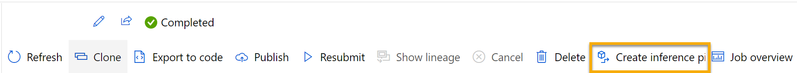
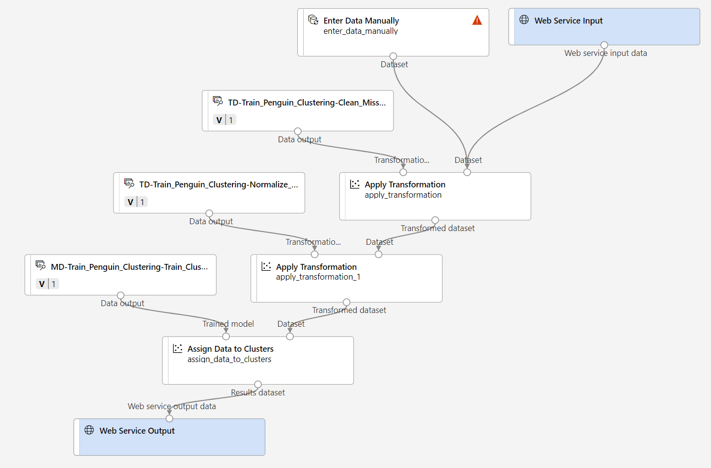

---
lab:
  title: Azure Machine Learning デザイナーを使用してクラスタリングを調べる
---

# <a name="explore-clustering-with-azure-machine-learning-designer"></a>Azure Machine Learning デザイナーを使用してクラスタリングを調べる

> **注** このラボを完了するには、管理者アクセス権が与えられている [Azure サブスクリプション](https://azure.microsoft.com/free?azure-portal=true)が必要です。

## <a name="create-an-azure-machine-learning-workspace"></a>Azure Machine Learning ワークスペースを作成する  

1. Microsoft 資格情報を使用して、[Azure portal](https://portal.azure.com?azure-portal=true) にサインインします。

1. **[リソースの作成]** を選択して *Machine Learning* を検索し、*Azure Machine Learning* プランを使用して新しい **Azure Machine Learning** リソースを作成します。 次の設定を使用します。
    - **[サブスクリプション]**: *お使いの Azure サブスクリプション*。
    - **リソース グループ**: *リソース グループを作成または選択します。*
    - **ワークスペース名**: *ワークスペースの一意の名前を入力します*。
    - **リージョン**: *地理的に最も近いリージョンを選びます*
    - **ストレージ アカウント**: *ワークスペース用に作成される既定の新しいストレージ アカウントです*。
    - **キー コンテナー**: *ワークスペース用に作成される既定の新しいキー コンテナーです*。
    - **Application Insights**: *ワークスペース用に作成される既定の新しい Application Insights リソースです*。
    - **[コンテナー レジストリ]**: なし (*コンテナーにモデルを初めてデプロイするときに、自動的に作成されます*)

1. **[Review + create](確認と作成)** を選択し、次に **[作成]** を選択します。 ワークスペースが作成されるまで待ってから (数分かかる場合があります)、デプロイされたリソースに移動します。

1. **[スタジオを起動する]** を選択し (または新しいブラウザー タブを開いて [https://ml.azure.com](https://ml.azure.com?azure-portal=true) に移動し)、Microsoft アカウントを使って Azure Machine Learning スタジオにサインインします。

1. Azure Machine Learning スタジオに、新しく作成したワークスペースが表示されます。 そうでない場合は、左側のメニューの **Microsoft** をクリックします。 次に、新しい左側のメニューから **[ワークスペース]** を選択します。ここで、サブスクリプションに関連付けられているすべてのワークスペースが一覧表示されます。 この演習用に作成したものから 1 つを選択します。 

> **注** このモジュールは、Azure Machine Learning ワークスペースを使用する多くのものの 1 つであり、「[Microsoft Azure AI Fundamentals: 機械学習用のビジュアル ツールについて調べる](https://docs.microsoft.com/learn/paths/create-no-code-predictive-models-azure-machine-learning/)」ラーニング パスの他のモジュールも含まれます。 独自の Azure サブスクリプションを使用している場合は、ワークスペースを 1 回作成し、それを他のモジュールで再利用することを検討できます。 ご利用のサブスクリプションに Azure Machine Learning ワークスペースが存在する限り、Azure サブスクリプションはデータ ストレージに対して少額を課金します。そのため、Azure Machine Learning ワークスペースが不要になった場合は、削除することをお勧めします。

## <a name="create-compute"></a>コンピューティングを作成する

1. [Azure Machine Learning スタジオ](https://ml.azure.com?azure-portal=true)で左上にある 3 行を選択して、インターフェイスのさまざまなページを表示します (画面のサイズを最大化する必要がある場合があります)。 左側のペインでこれらのページを使って、ワークスペース内のリソースを管理できます。 **[コンピューティング]** ページ ( **[管理]** の下) を表示します。

2. **[コンピューティング]** ページで **[コンピューティング クラスター]** タブを選び、次の設定で新しいコンピューティング クラスターを追加します。 これを使用して機械学習モデルをトレーニングします。
    - **場所**: "*ワークスペースと同じものを選択してください。場所が一覧にない場合は、最も近いものを選択してください*"
    - **仮想マシンのレベル**: 専用
    - **[仮想マシンの種類]**: CPU
    - **仮想マシンのサイズ**:
        - **[すべてのオプションから選択]** を選択します
        - **[Standard_DS11_v2]** を検索して選択します
    - **[次へ]** を選択します
    - **コンピューティング名**: *一意の名前を入力します*
    - **[ノードの最小数]**: 0
    - **[ノードの最大数]**: 2
    - **[スケール ダウンする前のアイドル時間 (秒)]**:120
    - **SSH アクセスの有効化**: 解除します
    - **[作成]** を選択します。

> **注** コンピューティング インスタンスとクラスターは、標準の Azure 仮想マシン イメージに基づいています。 このモジュールでは、コストとパフォーマンスの最適なバランスを実現するために *Standard_DS11_v2* イメージが推奨されます。 サブスクリプションに、このイメージを含まないクォータが存在する場合は、代替イメージを選択します。ただし、大きなイメージはコストを上昇させる可能性があり、小さなイメージはタスクを完了するには十分でない可能性があることに注意してください。 または、Azure 管理者にクォータを拡張するように依頼します。

コンピューティング クラスターの作成には時間がかかります。 待っている間に次のステップに進んでかまいません。

## <a name="create-a-pipeline-in-designer"></a>デザイナーでパイプラインを作成する

Azure Machine Learning デザイナーの使用を開始するには、最初にパイプラインを作成する必要があります。

1. [Azure Machine Learning スタジオ](https://ml.azure.com?azure-portal=true)で、画面の左上にある 3 本線のアイコンを選択して左側のペインを展開します。 **[デザイナー]** ページ (**[作成者]** の下) を表示し、プラス記号を選んで新しいパイプラインを作成します。

1. 画面の右上にある **[設定]** を選択します。 **[設定]** ペインが表示されない場合は、上部のパイプライン名の横にある車輪アイコンを選択します。

1. **[設定]** で、パイプラインを実行するコンピューティング先を指定する必要があります。 **[コンピューティングの種類の選択]** で、**[コンピューティング クラスター]** を選択します。 次に、 **[Azure ML コンピューティング クラスターの選択]** で、前に作成したコンピューティング クラスターを選択します。

1. **[設定]** の **[ドラフトの詳細]** で、ドラフトの名前 (**Pipeline-Created-on-* date***) を **Train Penguin Clustering** に変更します

1. **[設定]** ペインの右上の "閉じるアイコン" を選択して、ペインを閉じ、 **[保存]** を選択します。**

    ![Azure Machine Learning の [設定] ペインのスクリーンショット。](media/create-clustering-model/create-pipeline-help.png)

## <a name="create-a-dataset"></a>データセットを作成する

Azure Machine Learning では、モデルのトレーニングやその他の操作用のデータは通常、"*データセット*" と呼ばれるオブジェクトにカプセル化されます。 このモジュールでは、ペンギンの 3 つの種の観察が含まれるデータセットを使用します。

1. [Azure Machine Learning スタジオ](https://ml.azure.com?azure-portal=true)で、画面の左上にある 3 本線を選択して左側のペインを展開します。 **[データ]** ページ (**[アセット]** の下)を表示します。 [データ] ページには、Azure ML 内で使用する予定の特定のデータ ファイルまたはテーブルが含まれています。 このページからデータセットを作成することもできます。

1. **[データ]** ページの **[データ資産]** タブで、 **[作成]** を選択します。 次に、次の設定でデータ資産を構成します。
    * **データ型**:
        * **[名前]**: penguin-data
        * **[説明]**: ペンギンのデータ
        * **データセットの種類**:表形式
    * **データ ソース**: Web ファイルから
    * **Web URL**: 
        * **Web URL**: https://aka.ms/penguin-data
        * **データ検証のスキップ**: "選択しないでください"**
    * **設定**:
        * **[ファイル形式]**: 区切り記号付き
        * **[区切り記号]**: コンマ
        * **[エンコード]**: UTF-8
        * **[列ヘッダー]**: 最初のファイルにのみヘッダーを付ける
        * **[行のスキップ]**: なし
        * **データセットに複数行のデータを含める**: 選択しない**
    * **[スキーマ]**:
        * **[パス]** 以外のすべての列を含める
        * 自動的に検出された型を確認する
    * **確認**
        * **[作成]** を選択します。

1. データセットが作成されたら、それを開き、**[探索]** ページを表示して、データのサンプルを確認します。 このデータは、ペンギンの複数の観察における、嘴峰 (くちばし) の長さと深さ、翼の長さ、および体重の測定値を表します。 このデータセットでは、 *Adelie*、*Gentoo*、*Chinstrap*の 3 つの種のペンギンを表しています。

> **注** この演習で使用するペンギンのデータセットは、[Dr. Kristen Gorman](https://www.uaf.edu/cfos/people/faculty/detail/kristen-gorman.php) と、[Long Term Ecological Research Network](https://lternet.edu/) のメンバーである [Palmer Station、Antarctica LTER](https://pal.lternet.edu/) によって収集されて使用可能になっているデータのサブセットです。

### <a name="load-data-to-canvas"></a>データをキャンバスに読み込む

1. 左側のメニューで **[デザイナー]** を選んで、パイプラインに戻ります。 **[デザイナー]** ページで、 **[Train Penguin Clustering]** を選択します。

1. 左側のパイプライン名の横にある矢印アイコンを選択し、パネルを展開します (まだ開いていない場合)。 既定では、パネルで **[資産ライブラリ]** ペインが開きます。これは、パネルの上部にある本のアイコンで表されます。 アセットを検索するために、検索バーがあります。 **[データ]** と **[コンポーネント]** の 2 つのボタンに注目してください。

    

1. **[データ]** をクリックします。 **penguin-data** データセットを検索し、キャンバスに配置します。

1. キャンバス上で **[penguin-data]** データセットを右クリックし (Mac では Ctrl キーを押しながらクリック)、**[データのプレビュー]** をクリックします。

1. データの *Profile* スキーマを確認します。さまざまな列の分布がヒストグラムとして表示されることに注意してください。 次に、**CulmenLength** 列を選択します。 データセットは次のようになります。

    

1. データセットの次の特徴に注意してください。

    - データセットには、次の列が含まれています。
        - **CulmenLength**: ペンギンのくちばしの長さ (ミリメートル単位)。
        - **CulmenDepth**: ペンギンのくちばしの深さ (ミリメートル単位)。
        - **FlipperLength**: ペンギンの翼の長さ (ミリメートル単位)。
        - **BodyMass**: ペンギンの体重 (グラム単位)。
        - **Species**: 種インジケーター (0: "Adelie"、1: "Gentoo"、2: "Chinstrap")
    - **CulmenLength** 列には、2 つの欠損値が含まれます (**CulmenDepth**、**FlipperLength**、**BodyMass** 列にも 2 つの欠損値があります)。
    - 測定値はスケールが異なります (数十ミリメートルから数千グラムまで)。

1. データセットの視覚化を閉じて、パイプライン キャンバスでデータセットを確認できます。

## <a name="apply-transformations"></a>変換を適用する

1. 左側の **[アセット ライブラリ]** ペインで、 **[コンポーネント]** をクリックします。これには、データ変換とモデル トレーニングに使用できるさまざまなモジュールが含まれています。 検索バーを使用して、モジュールを簡単に見つけることもできます。

    

1. ペンギンの観察をクラスター化するには、測定のみを使用するので、種の列を無視します。 そのため、**[データセット内の列の選択]** モジュールを検索し、次のように、キャンバスの **penguin-data** モジュールの下に配置して、**penguin-data** モジュールの下部にある出力を **[データセット内の列の選択]** モジュールの上部にある入力に接続します。

    ![[Select Columns in Dataset] (データセット内の列の選択) モジュールに接続されている penguin-data データセットのスクリーンショット。](media/create-clustering-model/dataset-select-columns.png)

1. **[データセット内の列の選択]** モジュールをダブルクリックし、右側のペインで **[列の編集]** を選びます。 次に、**[列の選択]** ウィンドウで **[By name](名前を使用)** を選択し、次のように、**[+]** リンクを使用して、列名 **CulmenLength**、**CulmenDepth**、**FlipperLength**、**BodyMass** を選択します。

    

1. **[Select Columns in Dataset](データセット内の列の選択)** モジュールの設定を閉じて、デザイナー キャンバスに戻ります。

1. **[アセット ライブラリ]** で **[欠損データのクリーニング]** モジュールを検索し、次のように、キャンバスの **[データセット内の列の選択]** モジュールの下に配置して、それらを接続します。

    ![[Select Columns in Dataset] (データセット内の列の選択) モジュールを、[Clean Missing Data] (欠損データのクリーニング) モジュールに接続する方法のスクリーンショット。](media/create-clustering-model/clean-missing-data.png)

1. **[欠損データのクリーニング]** モジュールをダブルクリックし、右側の [設定] ペインで **[列の編集]** をクリックします。 次に、 **[クリーンする列]** ウィンドウで、次のように **[ルールを使用]** を選択して **[すべての列]** を含めます。

    ![[With rules] (ルールを使用) オプションを使用してすべての列を選択する方法のスクリーンショット。](media/create-clustering-model/normalize-columns.png)

1. **[欠損データのクリーニング]** モジュールがまだ選択された状態で、[設定] ペインで次の構成設定を設定します。
    - **[欠損値の最小比率]**: 0.0
    - **[欠損値の最大比率]**: 1.0
    - **[クリーニング モード]**: 行全体の削除

1. **[アセット ライブラリ]** で **[データの正規化]** モジュールを見つけて、キャンバスの **[欠損データのクリーニング]** モジュールの下に配置します。 次に、**[Clean Missing Data](欠損データのクリーニング)** モジュールからの一番左の出力を、**[Normalize Data](データの正規化)** モジュールの入力に接続します。

    ![[Clean Missing Data] (欠損データのクリーニング) モジュールが [Normalize Data] (データの正規化) モジュールに接続されているスクリーンショット。](media/create-clustering-model/dataset-normalize.png)

1. **[データの正規化]** モジュールをダブルクリックし、右側のペインで **[変換メソッド]** を **[MinMax]** に設定して、**[列の編集]** を選びます。 次に、 **[変換する列]** ウィンドウで、次のように **[ルールを使用]** を選択して **[すべての列]** を含めます。

    

1. **[データの正規化]** モジュールの設定を閉じて、デザイナー キャンバスに戻ります。

## <a name="run-the-pipeline"></a>パイプラインを実行する

データ変換を適用するには、パイプラインを実験として実行する必要があります。

1. **[送信]** を選び、コンピューティング クラスター上で **mslearn-penguin-training** という名前の**新しい実験**としてパイプラインを実行します。

1. 実行が終了するまで待ちます。 これには、5 分以上かかることがあります。

    ![デザイナー資産ライブラリと下部の完了したジョブおよび [ジョブの詳細] ボタンのスクリーンショット。](media/create-clustering-model/completed-job.png)

    左側のパネルが **[送信済みジョブ]** ペインに変わったことに注目します。 実行がいつ完了したかは、ジョブの状態が **[完了]** に変わることでわかります。

## <a name="view-the-transformed-data"></a>変換されたデータを表示する

1. 実行が完了すると、データセットはモデル トレーニング用に準備できています。 **[ジョブの詳細]** をクリックします。 次のようなモジュールを表示する別のタブが表示されます。

    

1. 新しいタブで、 **[データの正規化]** モジュールを右クリックして **[データのプレビュー]** を選んでから、 **[変換されたデータセット]** を選んで結果を表示します。

1. データを表示します。**Species** 列が削除されていること、欠損値がないこと、4 つの特徴すべての値が共通のスケールに正規化されていることに注意してください。

1. 正規化されたデータ結果の視覚化を閉じます。 前の [パイプライン] タブに戻ります。

データセットから使用する特徴を選択して準備したので、それらを使用してクラスタリング モデルをトレーニングできる状態になりました。

データ変換を使用してデータを準備したら、それを使用して機械学習モデルをトレーニングできます。

## <a name="add-training-modules"></a>トレーニング モジュールを追加する

次に示すように、以下の手順を実行して **Train Penguin Clustering** パイプラインを拡張します。

![K-Means Clustering アルゴリズム コンポーネントと [Assign Data to Modules] (モジュールにデータを割り当てる) コンポーネントのスクリーンショット。](media/create-clustering-model/k-means.png)

次の手順に従います。必要なモジュールを追加して構成するときに、上記の参照用イメージを使用します。

1. まだ開いていない場合は、**Train Penguin Clustering** パイプラインを開きます。

1. 左側の **[アセット ライブラリ]** ペインで、 **[データの分割]** モジュールを見つけてキャンバスの **[データの正規化]** モジュールの下に配置します。 次に、**[Normalize Data](データの正規化)** モジュールの左側の出力を、**[Split Data](データの分割)** モジュールの入力に接続します。

    >**ヒント** モジュールを簡単に見つけるには、検索バーを使います。 

1. **[Split Data](データの分割)** モジュールを選択し、その設定を次のように構成します。
    * **[Splitting mode](分割モード)**: Split Rows (行を分割)
    * **最初の出力データセット内の行の割合**:0.7
    * **ランダム化分割**: True
    * **[ランダム シード]**: 123
    * **[Stratified split](層化分割)**: False

1. **[アセット ライブラリ]** で、**[クラスタリング モデルのトレーニング]** モジュールを検索し、キャンバスの **[データの分割]** モジュールの下に配置します。 次に、 **[データの分割]** モジュールの "*結果データセット 1*" (左側) の出力を **[クラスタリング モデルのトレーニング]** モジュールの "*データセット*" (右側) の入力に接続します。

1. クラスタリング モデルでは、元のデータセットから選択したすべての特徴を使用して、データ項目にクラスターを割り当てる必要があります。 **[クラスタリング モデルのトレーニング]** モジュールをダブルクリックし、右側のペインで **[列の編集]** を選択します。 **[ルールを使用]** オプションを使用し、次のようにすべての列を含めます。

    

1. トレーニング中のモデルは、特徴を使用してデータをクラスターにグループ化します。そのため、"*クラスタリング*" アルゴリズムを使用してモデルをトレーニングする必要があります。 **[アセット ライブラリ]** で **[K-Means クラスタリング]** モジュールを見つけてキャンバスにドラッグし、**penguin-data** データセットの左側で、**[クラスタリング モデルのトレーニング]** モジュールの上に配置します。 次に、その出力を、**[Train Clustering Model](クラスタリング モデルのトレーニング)** モジュールの **[Untrained model](未トレーニング モデル)** (左側) の入力に接続します。

1. *K-Means* アルゴリズムでは、指定した数 (***K*** で示される値) のクラスターに項目がグループ化されます。**[K-Means クラスタリング]** モジュールを選択し、右側のペインので、**[重心の数]** パラメーターを **3** に設定します。

    > **注** ペンギンの測定値のようなデータの観察は、多次元ベクトルと考えることができます。 K-Means アルゴリズムは次のように機能します。
    > 1. *n* 次元空間内の "*重心*" と呼ばれるランダムに選択されたポイントとして *K* 座標を初期化します (*n* は特徴ベクトル内のディメンションの数です)。
    > 2. 特徴ベクトルを同じ空間内の点としてプロットし、各ポイントを最も近い重心に割り当てます。
    > 3. 重心をそれに割り当てられたポイントの中央に移動します ("*平均*" 距離に基づいて)。
    > 4. 移動後に、ポイントを最も近い重心に再度割り当てます。
    > 5. クラスターの割り当てが安定するか、指定された回数の反復が完了するまで、手順 3 と 4 を繰り返します。

   データの 70% を使用してクラスタリング モデルをトレーニングした後、モデルを使用して残りの 30% のデータをクラスターに割り当てることにより、それをテストすることができます。

1. **[アセット ライブラリ]** で、**[クラスターへのデータの割り当て]** モジュールを見つけ、キャンバスの **[クラスター モデルのトレーニング]** モジュールの下に配置します。 次に、**[Train Clustering Model](クラスタリング モデルのトレーニング)** モジュールの**トレーニング済みモデル** (左側) の出力を **[Assign Data to Clusters](クラスターへのデータの割り当て)** モジュールの**トレーニング済みモデル** (左側) の入力に接続し、**[Split Data](データの分割)** モジュールの**結果データセット 2** (右側) の出力を **[Assign Data to Clusters](データをクラスターに割り当てる)** モジュールの**データセット** (右側) の入力に接続します。

## <a name="run-the-training-pipeline"></a>トレーニング パイプラインを実行する

これで、トレーニング パイプラインを実行してモデルをトレーニングする準備ができました。

1. パイプラインが次のようになっていることを確認します。

    

1. **[送信]** を選択し、コンピューティング クラスター上で **mslearn-penguin-training** という名前の既存の実験を使用してパイプラインを実行します。

1. 実験の実行が完了するまで待ちます。 これには、5 分以上かかることがあります。

1. 実験の実行が完了したら、 **[ジョブの詳細]** を選択します。 新しいタブで、 **[クラスターへのデータの割り当て]** モジュールを右クリックし、 **[データのプレビュー]** を選択し、 **[結果データセット]** を選択して結果を表示します。

1. 下にスクロールして、各行が割り当てられているクラスター (0、1、または 2) が含まれる **[割り当て]** 列を確認します。 また、この行を表すポイントから各クラスターの中心までの距離を示す新しい列もあります。ポイントから最も近いクラスターが、それが割り当てられているものです。

1. **[Assign Data to Clusters](クラスターへのデータの割り当て)** 視覚エフェクトを閉じます。 [パイプライン] タブに戻ります。

モデルではペンギンの観察に対するクラスターが予測されますが、その予測の信頼性はどの程度でしょうか。 これを評価するには、モデルを評価する必要があります。

クラスタリング モデルの評価は、クラスターの割り当てに対して事前にわかっている *true* の値がないという事実により困難になります。 適切なクラスタリング モデルは、各クラスター内の項目間の分離レベルが良好なモデルであり、その分離の測定に役立つメトリックが必要です。

## <a name="add-an-evaluate-model-module"></a>[Evaluate Mode](モデル評価) モジュールを追加する

1. まだ開いていない場合は、前のユニットで作成した **Train Penguin Clustering** パイプラインを開きます。

1. **[アセット ライブラリ]** で、キャンバスの **[クラスターへのデータの割り当て]** モジュールを見つけ、キャンバスの **[モデルの評価]** モジュールの下に配置します。 **[クラスターへのデータの割り当て]** モジュールの出力を、**[モデルの評価]** モジュールの **[スコア付けされたデータセット]** (左) 入力に接続します。

1. パイプラインが次のようになっていることを確認します。

    ![[Assign Data to Clusters] (クラスターへのデータの割り当て) モジュールに [Evaluate Model] (モデル評価) モジュールを追加する方法のスクリーンショット。](media/create-clustering-model/evaluate-cluster.png)

1. **[送信]** を選択し、既存の実験 **mslearn-penguin-training** を使用してパイプラインを実行します。

1. 実験の実行が完了するまで待ちます。

1. 実験の実行が完了したら、 **[ジョブの詳細]** を選択します。 **[モデルの評価]** モジュールを右クリックし、**[データのプレビュー]** を選択し、**[評価結果]** を選択します。 各行のメトリックを確認します。
    - **Average Distance to Other Center (他の中心への平均距離)**
    - **Average Distance to Cluster Center (クラスターの中心への平均距離)**
    - **Number of Points (ポイント数)**
    - **Maximal Distance to Cluster Center (クラスターの中心までの最大距離)**

1. **[モデルの評価結果の視覚化]** タブを閉じます。

これで、動作するクラスタリング モデルが完成したので、それを使用して、"*推論パイプライン*" のクラスターに新しいデータを割り当てることができます。

クラスタリング モデルをトレーニングするためのパイプラインを作成して実行した後は、"*推論パイプライン*" を作成できます。 推論パイプラインは、新しいデータの観測値をクラスターに割り当てるためにモデルを使用します。 このモデルは、アプリケーションで使用するために発行できる予測サービスの基礎を形成します。

## <a name="create-an-inference-pipeline"></a>推論パイプラインを作成する

1. Azure Machine Learning スタジオで、画面の左上にある 3 本線を選択し、左側のウィンドウを展開します。 **[ジョブ]** (**[アセット]** の下) をクリックして、実行したすべてのジョブを表示します。 実験 **mslearn-penguin-training** を選択し、**Train Penguin Clustering** パイプラインを選択します。 

1. キャンバスの上にあるメニューを見つけて、**[Create inference pipeline] (推論パイプラインの作成)** をクリックします。 メニューで **[Create inference pipeline] (推論パイプラインの作成)** を見つけるには、画面を完全に展開し、画面の右上隅にある 3 つのドット アイコン **[...]** をクリックする必要がある場合があります。  

     

1. **[Create inference pipeline](推論パイプラインの作成)** ドロップダウン リストで、**[Real-time inference pipeline](リアルタイム推論パイプライン)** をクリックします。 数秒後に、**Train Penguin Clustering-real time inference** (ペンギン クラスタリングのトレーニング - リアルタイム推論) という名前の新しいバージョンのパイプラインが開きます。

1. 右上のメニューで、**[設定]** に移動します。 **[ドラフトの詳細]** で、新しいパイプラインの名前を **Predict Penguin Clusters** (ペンギン クラスターを予測する) に変更し、新しいパイプラインを確認します。 トレーニング パイプラインの変換とクラスタリング モデルは、このパイプラインの一部です。 トレーニング済みのモデルは、新しいデータのスコア付けに使用されます。 パイプラインには、結果を返す Web サービス出力も含まれています。 

    推論パイプラインに対して次の変更を行います。

    

    - 新しいデータを送信するための **[Web サービス入力]** コンポーネントを追加します。
    - **penguin-data** データセットを、**Species** 列が含まれない **[Enter Data Manually] (データの手動入力)** モジュールに置き換えます。
    - 冗長になった **[Select Columns in Dataset](データセット内の列の選択)** モジュールを削除します。
    - **[Web Service Input](Web サービス入力)** モジュールと **[Enter Data Manually](データの手動入力)** モジュール (クラスター化するデータの入力を表します) を、最初の **[Apply Transformation](変換の適用)** モジュールに接続します。

    パイプラインを変更する際の参考として上記の図と情報を使用して、以下の残りの手順に従います。

1. パイプラインには、カスタム データ セットから作成されたモデルの **[Web サービス入力]** コンポーネントは自動的には含まれません。 アセット ライブラリから **[Web サービス入力]** コンポーネントを検索し、パイプラインの上部に配置します。 **[Web サービス入力]** コンポーネントの出力を、キャンバス上に既に存在する **[変換の適用]** コンポーネントの右側の入力に接続します。  

1. 推論パイプラインでは、新しいデータが元のトレーニング データのスキーマと一致することを前提としているので、トレーニング パイプラインからの **penguin-data** データセットが含まれます。 ただし、この入力データには、モデルでは使用されないペンギンの種の列が含まれます。 **penguin-data** データセットと **[データセット内の列の選択]** モジュールの両方を削除して、**[アセット ライブラリ]** セクションの **[データの手動入力]** モジュールに置き換えます。 次に、**[Enter Data Manually](データの手動入力)** モジュールの設定を変更して、次の CSV 入力が使用されるようにします。これには、3 つの新しいペンギンの観察 (ヘッダーを含む) の特徴値が含まれています。

    ```CSV
    CulmenLength,CulmenDepth,FlipperLength,BodyMass
    39.1,18.7,181,3750
    49.1,14.8,220,5150
    46.6,17.8,193,3800
    ```

1. **[Web Service Input](Web サービス入力)** モジュールと **[Enter Data Manually](データの手動入力)** モジュールからの出力を、最初の **[Apply Transformation](変換の適用)** モジュールのデータセット (右側) 入力に接続します。

1. **[Evaluate Mode](モデル評価)** モジュールを削除します。

1. パイプラインが以下の図のようになっていることを確認します。

    

1. コンピューティング クラスター上でパイプラインを **mslearn-penguin-inference** という名前の新しい実験として送信します。 実験の実行には時間がかかる場合があります。

1. パイプラインが完了したら、 **[ジョブの詳細]** を選択します。 新しいタブで、 **[クラスターへのデータの割り当て]** モジュールを右クリックし、 **[データのプレビュー]** を選択し、 **[結果のデータセット]** を選び、入力データの 3 つのペンギンの観察に対して予測されたクラスターの割り当てとメトリックを確認します。

推論パイプラインにより、特徴に基づいてペンギンの観察がクラスターに割り当てられます。 これで、クライアント アプリケーションで使用できるように、パイプラインを発行する準備ができました。

>**注** この演習では、Azure コンテナー インスタンス (ACI) に Web サービスをデプロイします。 この種類のコンピューティングは、動的に作成され、開発とテストに役立ちます。 運用環境では、"*推論クラスター*" を作成する必要があります。これにより、スケーラビリティとセキュリティを向上させる Azure Kubernetes Service (AKS) クラスターが提供されます。

## <a name="deploy-a-service"></a>サービスをデプロイする

1. 前のユニットで作成した **Predict Penguin Clusters** 推論パイプラインを表示します。

1. 左側のペインで **[ジョブの詳細]** を選択します。 これにより、別のタブが開きます。

    

1. 新しいタブで **[デプロイ]** を選択します。

    ![Predict Auto Price (自動車の価格の予測) 推論パイプラインの [デプロイ] ボタンのスクリーンショット。](media/create-clustering-model/deploy-screenshot.png)

1. 次の設定を使って、新しいリアルタイム エンドポイントをデプロイします。
    -  **[名前]**: predict-penguin-clusters
    -  **[説明]**: ペンギンをクラスター化します。
    - **[コンピューティングの種類]**: Azure コンテナー インスタンス

1. Web サービスがデプロイされるまで待ちます。これには数分かかることがあります。 

1. デプロイの状態を表示するには、画面の左上にある 3 本線を選択して左側のペインを展開します。 **[エンドポイント]** ページ ( **[資産]** の下) を表示し、**predict-penguin-clusters** を選択します。 デプロイが完了すると、 **[デプロイの状態]** が **[正常]** に変わります。

## <a name="test-the-service"></a>サービスをテストする

1. **[エンドポイント]** ページで、**predict-penguin-clusters** リアルタイム エンドポイントを開き、 **[テスト]** タブを選択します。

    ![左側のペインの [エンドポイント] オプションの場所のスクリーンショット。](media/create-clustering-model/endpoints-screenshot.png)

1. これを使用して、新しいデータでモデルをテストします。 **[データを入力してリアルタイム エンドポイントをテストする]** の下の現在のデータを削除します。 次のデータをコピーしてデータ セクションに貼り付けます。 

    ```JSON
    {
        "Inputs": {
            "input1": [
                {
                    "CulmenLength": 49.1,
                    "CulmenDepth": 4.8,
                    "FlipperLength": 1220,
                    "BodyMass": 5150
                }
            ]
        },
        "GlobalParameters":  {}
    }
    ```

    > **注** 上の JSON では、ペンギンの特徴を定義し、クラスターの割り当てを予測するために作成した **predict-penguin-clusters** サービスを使用します。

1. **[Test]** を選択します。 画面の右側に、出力 **'Assignments'** が表示されます。 割り当てられたクラスターが、クラスターの中心までの距離が最も短いクラスターであることがわかります。

    ![サンプルのテスト結果が示された [テスト] ペインのスクリーンショット。](media/create-clustering-model/test-interface.png)

**[使用する]** タブの資格情報を使用してクライアント アプリケーションに接続する準備ができているサービスをテストしました。ここでラボを終了します。 デプロイしたサービスを引き続き試してみることをお勧めします。

## <a name="clean-up"></a>クリーンアップ

作成した Web サービスは "*Azure コンテナー インスタンス*" にホストされます。 それ以上実験する予定がない場合は、不要な Azure の使用が発生するのを避けるために、エンドポイントを削除する必要があります。 また、再び必要になるまでコンピューティング インスタンスを停止する必要もあります。

1. [Azure Machine Learning スタジオ](https://ml.azure.com?azure-portal=true)の **[エンドポイント]** タブで、**predict-penguin-clusters** エンドポイントを選択します。 次に、**[削除]** (&#128465;) を選択し、エンドポイントを削除することを確認します。

1. **[コンピューティング]** ページの **[コンピューティング クラスター]** タブで、コンピューティング クラスターを選んでから、 **[削除]** を選びます。

>**注**: コンピューティングを停止すると、サブスクリプションがコンピューティング リソースに対して課金されなくなります。 ただし、サブスクリプションに Azure Machine Learning ワークスペースが存在する限り、データ ストレージに対して少額が課金されます。 Azure Machine Learning の探索を完了したら、Azure Machine Learning ワークスペースとそれに関連付けられたリソースを削除できます。 ただし、このシリーズの他のいずれかのラボを完了する予定がある場合は、作成し直す必要があります。
>
> ワークスペースを削除するには:
>
> 1. [Azure portal](https://portal.azure.com?azure-portal=true) の **[リソース グループ]** ページで、Azure Machine Learning ワークスペースの作成時に指定したリソース グループを開きます。
> 1. **[リソース グループの削除]** をクリックし、リソース グループ名を入力して削除することを確認し、**[削除]** を選択します。
