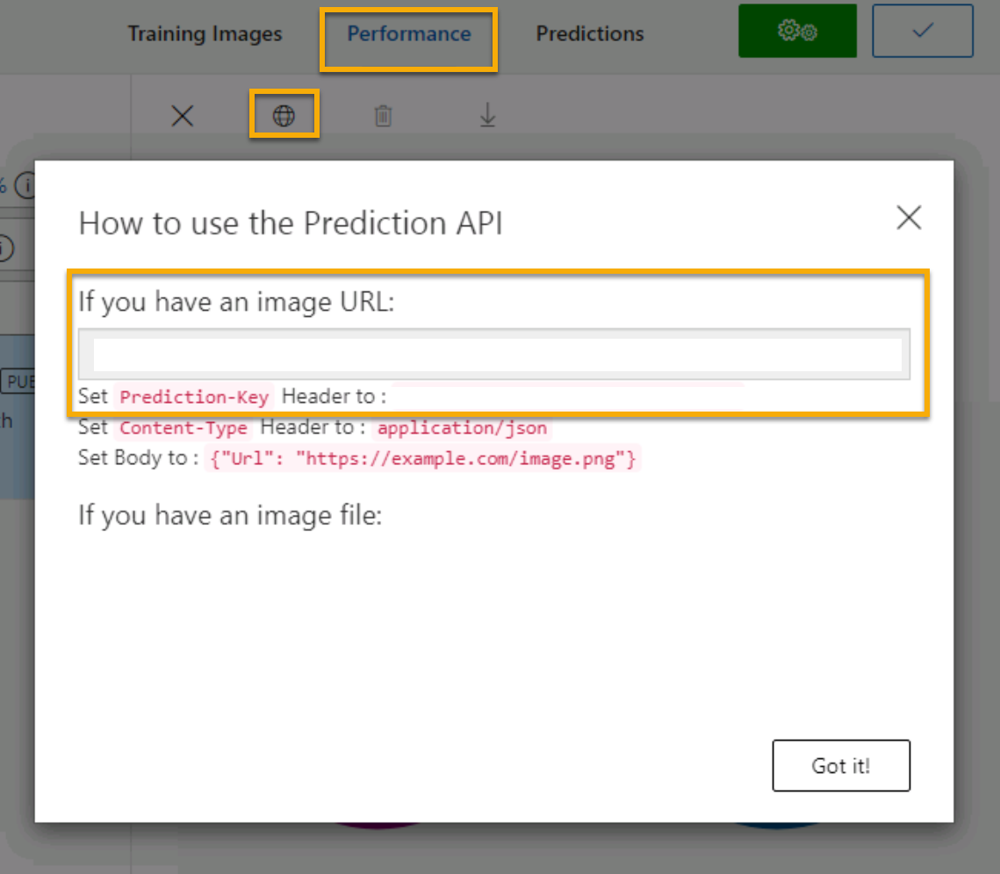

---
lab:
  title: 画像分類について調べる
  module: Module 3 - Computer Vision
---

# <a name="explore-image-classification"></a>画像分類について調べる

> **注** このラボを完了するには、管理者アクセス権が与えられている [Azure サブスクリプション](https://azure.microsoft.com/free?azure-portal=true)が必要です。

*Computer Vision* コグニティブ サービスには、画像の操作に便利な事前構築済みモデルが用意されていますが、多くの場合、コンピューター ビジョン向けに独自のモデルをトレーニングする必要があります。 たとえば、Northwind Traders という小売企業が、精算時にカメラで撮影した画像に基づいて、顧客が購入する食料雑貨の品目を特定する自動精算システムの作成を希望しているとします。 そのためには、画像を分類して購入対象の品目を特定できる分類モデルをトレーニングする必要があります。

Azure では、***Custom Vision*** コグニティブ サービスを使用し、既存の画像に基づいて画像分類モデルをトレーニングすることができます。 画像分類ソリューションを作成するための 2 つの要素があります。 まず、既存の画像を使用して異なるクラスを認識するようにモデルをトレーニングする必要があります。 その後、モデルがトレーニングされたら、アプリケーションで使用できるサービスとして公開する必要があります。

Custom Vision サービスの機能をテストするために、Cloud Shell で実行される単純なコマンドライン アプリケーションを使用します。 Web サイトや電話アプリなど、実際のソリューションにも同じ原則と機能が適用されます。

## <a name="create-a-cognitive-services-resource"></a>*Cognitive Services* リソースを作成する

Custom Vision サービスは、**Custom Vision** リソースまたは **Cognitive Services** リソースを作成することで使用できます。

>**注** すべてのリソースをすべてのリージョンで利用できるわけではありません。 Custom Vision と Cognitive Services のどちらのリソースを作成しても、[特定のリージョン](https://azure.microsoft.com/global-infrastructure/services/?products=cognitive-services)で作成されたリソースのみを使用して、Custom Vision サービスにアクセスできます。 わかりやすくするために、以下の構成手順ではリージョンが事前に選択されています。

Azure サブスクリプションで **Cognitive Services** リソースを作成します。

1. 別のブラウザー タブで Azure portal ([https://portal.azure.com](https://portal.azure.com?azure-portal=true)) を開き、Microsoft アカウントでサインインします。

1. **[&#65291;リソースの作成]** ボタンをクリックして、「*Cognitive Services*」を検索し、次の設定を使用して **Cognitive Services** リソースを作成します。
    - **[サブスクリプション]**: *お使いの Azure サブスクリプション*。
    - **[リソース グループ]**: *一意の名前のリソース グループを選択するか、作成します*。
    - **リージョン:** 米国東部
    - **[名前]**: *一意の名前を入力します*。
    - **価格レベル**: Standard S0
    - **このボックスをオンにすることで、私は以下のすべての契約条件を読んで理解したことを認めます**: 選択されています。

1. リソースを確認して作成し、デプロイが完了するまで待ちます。 次に、デプロイされたリソースに移動します。

1. Cognitive Services リソースの **[キーとエンドポイント]** ページを表示します。 クライアント アプリケーションから接続するには、エンドポイントとキーが必要です。

## <a name="create-a-custom-vision-project"></a>Custom Vision プロジェクトを作成する

物体検出モデルをトレーニングするには、トレーニング リソースに基づいて Custom Vision プロジェクトを作成する必要があります。 これを行うには、Custom Vision ポータルを使用します。

1. https://aka.ms/fruit-images からトレーニング画像をダウンロードして展開します。 これらの画像は zip 形式で圧縮されたフォルダー内に格納されており、展開すると、**apple**、**banana**、**orange** というサブフォルダーが含まれています。

1. 別のブラウザー タブで、[https://customvision.ai](https://customvision.ai?azure-portal=true) の Custom Vision ポータルを開きます。 ダイアログが表示されたら、ご利用の Azure サブスクリプションに関連付けられている Microsoft アカウントを使用してサインインして、サービス利用規約に同意します。

1. Custom Vision ポータルで、次の設定を使って新しいプロジェクトを作成します。

    - **名前**: 食料雑貨類の精算
    - **説明**: 食料雑貨類の画像分類
    - **リソース**: "以前に作成した Custom Vision リソース"**
    - **プロジェクトの種類**: 分類
    - **分類の種類**: マルチクラス (画像ごとに 1 つのタグ)
    - **ドメイン**: 食品

1. **[画像を追加]** をクリックして、事前に抽出した **apple** フォルダー内のすべてのファイルを選択します。 次のように *apple* というタグを指定して、画像ファイルをアップロードします。

    

1. 前の手順を繰り返し、**banana** フォルダー内の画像には *banana* タグを、**orange** フォルダー内の画像には *orange* タグを付けてアップロードします。

1. Custom Vision プロジェクトでアップロードした画像を探します。次のように各クラスの画像が 15 個あるはずです。

    

1. Custom Vision プロジェクトで、画像の上にある **[トレーニング]** をクリックして、タグ付けされた画像を使って分類モデルをトレーニングします。 **クイック トレーニング** オプションを選び、トレーニングの反復が完了するまで待ちます (1 分ほどかかる場合があります)。

1. モデルの反復をトレーニングしたら、*Precision*、*Recall*、*AP* のパフォーマンス メトリックを確認します。これらは分類モデルの予測精度を測るものであり、すべて高くするようにします。

## <a name="test-the-model"></a>モデルをテストする

アプリケーション向けにこのモデルの反復を公開する前に、テストするようにします。

1. パフォーマンス メトリックの上にある **[クイック テスト]** をクリックします。

1. **[画像の URL]** ボックスに「`https://aka.ms/apple-image`」と入力し、&#10132 をクリックします。

1. モデルによって返される予測を確認します。次のように *apple* の確率スコアが最も高くなるはずです。

    

1. その後、**[クイック テスト]** ウィンドウを閉じます。

## <a name="publish-the-image-classification-model"></a>画像分類モデルを発行する

これでトレーニング済みのモデルを公開し、クライアント アプリケーションから使用できるようになりました。

1. **&#128504; [公開]** をクリックし、トレーニング済みのモデルを次の設定で公開します。
    - **モデル名**: 食料雑貨類
    - **予測リソース**: "以前に作成した予測リソース"**。

1. 公開後、*[予測 URL]* (&#127760;) アイコンをクリックし、公開されたモデルを使用するために必要な情報を表示します。 後で、画像の URL から予測を取得するために適切な URL および予測とキーの値が必要になるため、このダイアログ ボックスを開いたままにして次のタスクに進みます。 

## <a name="run-cloud-shell"></a>Cloud Shell の実行

Custom Vision サービスの機能をテストするために、Azure の Cloud Shell で実行される単純なコマンドライン アプリケーションを使用します。

1. Azure portal で、ページの上部の検索ボックスの右側にある **[>_]** (*Cloud Shell*) ボタンを選択します。 これにより、ポータルの下部に Cloud Shell ペインが開きます。 

    

1. Cloud Shell を初めて開くと、使用するシェルの種類 (*Bash* または *PowerShell*) を選択するように求められる場合があります。 **[PowerShell]** を選択します。 このオプションが表示されない場合は、このステップをスキップします。  

1. Cloud Shell のストレージを作成するように求めるメッセージが表示された場合は、サブスクリプションが指定されていることを確認して、**[ストレージの作成]** を選択します。 その後、ストレージが作成されるのを 1 分程度待ちます。

    [![[確認] をクリックしてストレージを作成します。](media/create-image-classification-system/powershell-portal-guide-2.png)](media/create-image-classification-system/powershell-portal-guide-2.png#lightbox)

1. Cloud Shell ペインの左上に表示されるシェルの種類が *PowerShell* に切り替えられたことを確認します。 *Bash* の場合は、ドロップダウン メニューを使用して *PowerShell* に切り替えます。

    

1. PowerShell が起動するまで待ちます。 Azure portal に次の画面が表示されます。  

    

## <a name="configure-and-run-a-client-application"></a>クライアント アプリケーションを構成して実行する

Cloud Shell 環境の準備ができたので、Custom Vision サービスを使用して画像を分析する単純なアプリケーションを実行できます。

1. コマンド シェルで、次のコマンドを入力してサンプル アプリケーションをダウンロードし、ai-900 というフォルダーに保存します。 

    ```PowerShell
    git clone https://github.com/MicrosoftLearning/AI-900-AIFundamentals ai-900
    ```

    >**ヒント** 別のラボで既にこのコマンドを使用して *ai-900* リポジトリを複製した場合は、この手順をスキップできます。

1. ファイルが **ai-900** という名前のフォルダーにダウンロードされます。 次に、Cloud Shell ストレージ内のすべてのファイルを表示して、それらを使用します。 シェルに次のコマンドを入力します。

    ```PowerShell
    code .
    ```

    これにより、次の図のようなエディターが開きます。 

    

1. 左側の **[ファイル]** ペインで、**[ai-900]** を展開して、**[classify-image.ps1]** を選びます。 このファイルには、次に示すように、Custom Vision モデルを使用して画像を分析するコードが含まれています。

     

1. コードの詳細についてはあまり心配しないでください。重要なのは、画像の URL を使用するときに、Custom Vision モデルの予測 URL とキーが必要であることです。 

   Custom Vision プロジェクトのダイアログボックスから *予測 URL* を取得します。 

   >**注** 画像分類モデルを発行した後で、"予測 URL" を確認したことを思い出してください。** *予測 URL* を見つけるには、プロジェクトの **[パフォーマンス]** タブに移動し、**[予測 URL]** をクリックします (画面が圧縮されている場合は、地球のアイコンが表示されることがあります)。 ダイアログ ボックスが表示されます。 **画像の URL** がある場合は、その URL をコピーします。 それをコード エディターに貼り付け、**YOUR_PREDICTION_URL** を置き換えます。

    同じダイアログ ボックスを使用して、"予測キー" を取得します。** *[Set Prediction-Key Header to] (Prediction-Key ヘッダーを次の値に設定する)* の後に表示される予測キーをコピーします。 それをコード エディターに貼り付け、**YOUR_PREDICTION_KEY** プレースホルダーの値を置き換えます。

    

    予測 URL と予測キーの値を貼り付けた後、最初の 2 行のコードはこのようになるはずです。

    ```PowerShell
    $predictionUrl="https..."
    $predictionKey ="1a2b3c4d5e6f7g8h9i0j...."
    ```

1. エディター ペインの右上の **[...]** ボタンを使用してメニューを開き、**[保存]** を選択して変更を保存します。 次に、メニューを再度開き、**[エディターを閉じる]** を選択します。

    サンプル クライアント アプリケーションを使って、複数の画像をリンゴ、バナナ、オレンジのカテゴリに分類します。

1. 次の画像を分類します。

    

    PowerShell ウィンドウで、次のコマンドを入力してコードを実行します。

    ```PowerShell
    cd ai-900
    ./classify-image.ps1 1
    ```

1. 予測を確認します。これは **apple** であるはずです。

1. それでは、別の画像を試してみましょう。

    

    次のコマンドを実行します。

    ```PowerShell
    ./classify-image.ps1 2
    ```

1. モデルによってこの画像が **banana** と分類されることを確認します。

1. 最後に、3 つ目のテスト画像を試してみましょう。

    

    次のコマンドを実行します。

    ```PowerShell
    ./classify-image.ps1 3
    ```

1. モデルによってこの画像が **orange** と分類することを確認します。

## <a name="learn-more"></a>詳細情報

このシンプルなアプリでは、Custom Vision サービスの一部の機能しか示されていません。 このサービスで実行できる操作の詳細については、[Custom Vision のページ](https://azure.microsoft.com/services/cognitive-services/custom-vision-service/)を参照してください。
