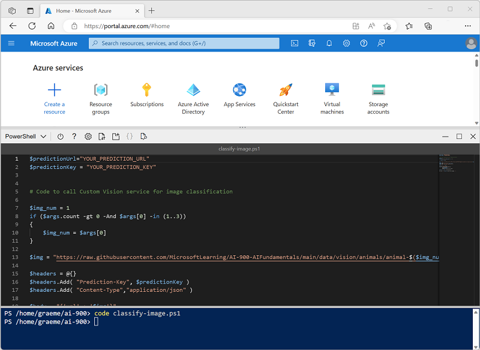

---
lab:
  title: 画像分類について調べる
---

# 画像分類について調べる

*Computer Vision* コグニティブ サービスには、画像の操作に便利な事前構築済みモデルが用意されていますが、多くの場合、コンピューター ビジョン向けに独自のモデルをトレーニングする必要があります。 たとえば、野生動物保護団体が、動体検知カメラを使用して動物の目撃情報を追跡したいと考えているとします。 それからカメラによってキャプチャされた画像を使用して、特定の地域に特定の種が存在することを確認し、絶滅危惧種の保全活動を支援することができます。 これを実現するために、この組織では、キャプチャされた写真のさまざまな種類の動物を識別するようにトレーニングされた "画像分類" モデルを利用します。**

Azure では、***Custom Vision*** コグニティブ サービスを使用し、既存の画像に基づいて画像分類モデルをトレーニングすることができます。 画像分類ソリューションを作成するための 2 つの要素があります。 まず、既存の画像を使用して異なるクラスを認識するようにモデルをトレーニングする必要があります。 その後、モデルがトレーニングされたら、アプリケーションで使用できるサービスとして公開する必要があります。

Custom Vision サービスの機能をテストするために、Cloud Shell で実行される単純なコマンドライン アプリケーションを使用します。 Web サイトやモバイル アプリなど、実際のソリューションにも同じ原則と機能が適用されます。

## 開始する前に

このラボを完了するには、管理者アクセス権が与えられている [Azure サブスクリプション](https://azure.microsoft.com/free?azure-portal=true)が必要です。

## *Cognitive Services* リソースを作成する

Custom Vision サービスは、**Custom Vision** リソースまたは **Cognitive Services** リソースを作成することで使用できます。

>**注** すべてのリソースをすべてのリージョンで利用できるわけではありません。 Custom Vision と Cognitive Services のどちらのリソースを作成しても、[特定のリージョン](https://azure.microsoft.com/global-infrastructure/services/?products=cognitive-services)で作成されたリソースのみを使用して、Custom Vision サービスにアクセスできます。 わかりやすくするために、以下の構成手順ではリージョンが事前に選択されています。

Azure サブスクリプションで **Cognitive Services** リソースを作成します。

1. Azure portal ([https://portal.azure.com](https://portal.azure.com?azure-portal=true)) を開き、Microsoft アカウントでサインインします。

1. **[&#65291;リソースの作成]** ボタンをクリックして、「*Cognitive Services*」を検索し、次の設定を使用して **Cognitive Services** リソースを作成します。
    - **[サブスクリプション]**: *お使いの Azure サブスクリプション*。
    - **[リソース グループ]**: *一意の名前のリソース グループを選択するか、作成します*。
    - **リージョン:** 米国東部
    - **[名前]**: *一意の名前を入力します*。
    - **価格レベル**: Standard S0
    - **このボックスをオンにすることで、私は以下のすべての契約条件を読んで理解したことを認めます**: 選択されています。

1. リソースを確認して作成し、デプロイが完了するまで待ちます。 次に、デプロイされたリソースに移動します。

1. Cognitive Services リソースの **[キーとエンドポイント]** ページを表示します。 クライアント アプリケーションから接続するには、エンドポイントとキーが必要です。

## Custom Vision プロジェクトを作成する

物体検出モデルをトレーニングするには、トレーニング リソースに基づいて Custom Vision プロジェクトを作成する必要があります。 これを行うには、Custom Vision ポータルを使用します。

1. [https://aka.ms/animal-images](https://aka.ms/animal-images) からトレーニング画像をダウンロードして展開します。 これらの画像は zip 形式で圧縮されたフォルダー内に格納されており、展開すると、**elephant**、**giraffe**、**lion** というサブフォルダーが含まれています。

1. 新しいブラウザー タブを開き、[https://customvision.ai](https://customvision.ai?azure-portal=true) の Custom Vision ポータルに移動します。 ダイアログが表示されたら、ご利用の Azure サブスクリプションに関連付けられている Microsoft アカウントを使用してサインインして、サービス利用規約に同意します。

1. Custom Vision ポータルで、次の設定を使って新しいプロジェクトを作成します。

    - **名前**: 動物の識別
    - **説明**: 動物の画像分類
    - **リソース**: "以前に作成した Cognitive Services または Custom Vision リソース"**
    - **プロジェクトの種類**: 分類
    - **分類の種類**: マルチクラス (画像ごとに 1 つのタグ)
    - **ドメイン**: 一般 \[A2]

1. **[画像を追加]** をクリックして、事前に抽出した **elephant** フォルダー内のすべてのファイルを選択します。 次のように *elephant* というタグを指定して、画像ファイルをアップロードします。

    

1. **[画像の追加]** ([+]) ボタンを使用して、*giraffe* タグ付きの **giraffe** フォルダー内の画像と、*lion* タグ付きの **lion** フォルダー内の画像をアップロードします。

1. Custom Vision プロジェクトでアップロードした画像を探します。次のように各クラスの画像が 17 個あるはずです。

    

1. Custom Vision プロジェクトで、画像の上にある **[トレーニング]** をクリックして、タグ付けされた画像を使って分類モデルをトレーニングします。 **クイック トレーニング** オプションを選び、トレーニングの反復が完了するまで待ちます。

    > **ヒント**: トレーニングには数分かかることがあります。 待っている間に、「[ユキヒョウの自撮りと AI が絶滅から種を救う方法](https://news.microsoft.com/transform/snow-leopard-selfies-ai-save-species/)」を参照します。これは、コンピューター ビジョンを使用して野生の絶滅危惧動物を追跡する実際のプロジェクトを説明しています。

1. モデルの反復をトレーニングしたら、*Precision*、*Recall*、*AP* のパフォーマンス メトリックを確認します。これらは分類モデルの予測精度を測るものであり、すべて高くするようにします。

## モデルをテストする

アプリケーション向けにこのモデルの反復を公開する前に、テストするようにします。

1. パフォーマンス メトリックの上にある **[クイック テスト]** をクリックします。

1. **[画像の URL]** ボックスに「`https://aka.ms/giraffe`」と入力し、 **[画像のクイック テスト] (&#10132;)** ボタンをクリックします。

1. モデルによって返される予測を確認します。次のように *giraffe* の確率スコアが最も高くなるはずです。

    

1. その後、**[クイック テスト]** ウィンドウを閉じます。

## 画像分類モデルを発行する

これでトレーニング済みのモデルを公開し、クライアント アプリケーションから使用できるようになりました。

1. **&#128504; [公開]** をクリックし、トレーニング済みのモデルを次の設定で公開します。
    - **モデル名**: 動物
    - **予測リソース**: "以前に作成した Cognitive Services または Custom Vision 予測リソース"。**

1. 公開後、*[予測 URL]* (&#127760;) アイコンをクリックし、公開されたモデルを使用するために必要な情報を表示します。

    

後で、画像の URL から予測を取得するために適切な URL および予測とキーの値が必要になるため、このダイアログ ボックスを開いたままにして次のタスクに進みます。

## クライアント アプリケーションを準備する

Custom Vision サービスの機能をテストするために、Azure の Cloud Shell で実行される単純なコマンドライン アプリケーションを使用します。

1. Azure portal を含むブラウザー タブに戻り、ページ上部の検索ボックスの右にある **[Cloud Shell]** ( **[>_]** ) ボタンを選択します。 これにより、ポータルの下部に [Cloud Shell] ペインが開きます。

    Cloud Shell を初めて開くと、使用するシェルの種類 (*Bash* または *PowerShell*) を選択するように求められる場合があります。 そこで、 **[PowerShell]** を選択します。

    Cloud Shell のストレージを作成するように求めるメッセージが表示された場合は、サブスクリプションが指定されていることを確認して、 **[ストレージの作成]** を選択します。 その後、ストレージが作成されるのを 1 分程度待ちます。

    Cloud Shell の準備ができると、次のようになります。
    
    

    > **ヒント**: [Cloud Shell] ペインの左上に表示されるシェルの種類が *[PowerShell]* になっていることを確認してください。 *Bash* の場合は、ドロップダウン メニューを使用して *PowerShell* に切り替えます。

    ペインの上部にある区分線をドラッグして Cloud Shell のサイズを変更したり、ペインの右上にある **&#8212;** 、 **&#9723;** 、**X** アイコンを使用して、ペインを最小化または最大化したり、閉じたりすることができます。 Azure Cloud Shell の使い方について詳しくは、[Azure Cloud Shell のドキュメント](https://docs.microsoft.com/azure/cloud-shell/overview)をご覧ください。

2. コマンド シェルで、次のコマンドを入力してこの演習のファイルをダウンロードし、 **[ai-900]** という名前のフォルダーに保存します (既にそのフォルダーが存在する場合は、先に削除してください)

    ```PowerShell
    rm -r ai-900 -f
    git clone https://github.com/MicrosoftLearning/AI-900-AIFundamentals ai-900
    ```

3. ファイルがダウンロードされたら、次のコマンドを入力して **[ai-900]** ディレクトリに移動し、この演習のコード ファイルを編集します。

    ```PowerShell
    cd ai-900
    code classify-image.ps1
    ```

    これにより、次の画像のようなエディターが開きます。

     

     > **ヒント**: Cloud Shell のコマンド ラインとコード エディターの間の区切りバーを使用して、ペインのサイズを変更できます。

4. コードの詳細についてはあまり気にしないでください。 重要なのは、Custom Vision モデルの予測 URL とキーを指定するコードから始まるということです。 残りのコードで自分のモデルが使用されるように、これらを更新する必要があります。

    Custom Vision プロジェクトのブラウザー タブで開いたままになっているダイアログ ボックスから、"予測 URL" と "予測キー" を取得します。** ** **"画像 URL がある場合" は、使用するバージョンが必要です。** **

    これらの値を使用して、コード ファイル内の **YOUR_PREDICTION_URL** と **YOUR_PREDICTION_KEY** のプレースホルダーを置き換えます。

    予測 URL と予測キーの値を貼り付けた後、最初の 2 行のコードはこのようになるはずです。

    ```PowerShell
    $predictionUrl="https..."
    $predictionKey ="1a2b3c4d5e6f7g8h9i0j...."
    ```

5. コード内の変数に変更を加えたら、**Ctrl + S** キーを押してファイルを保存します。 次に、**Ctrl + Q** キーを押してコード エディターを閉じます。

## クライアント アプリケーションをテストする

これで、サンプル クライアント アプリケーションを使用して、写っている動物に基づいて画像を分類できます。

1. PowerShell ウィンドウで、次のコマンドを入力してコードを実行します。

    ```PowerShell
    ./classify-image.ps1 1
    ```

    このコードでは、自分のモデルを使用して次の画像を分類します。

    

1. 予測を確認します。これは **giraffe** であるはずです。

1. それでは、別の画像を試してみましょう。 次のコマンドを実行します。

    ```PowerShell
    ./classify-image.ps1 2
    ```

    今回は、次の画像が分類されます。

    

1. モデルによってこの画像が **elephant** と分類されることを確認します。

1. もう 1 つ試してみましょう。 次のコマンドを実行します。

    ```PowerShell
    ./classify-image.ps1 3
    ```

    最終的な画像は次のようになります。

    

1. モデルによってこの画像が **lion** と分類されることを確認します。

うまくいけば、画像分類モデルによって 3 つの画像がすべて正しく分類されます。

## 詳細情報

この演習では、Custom Vision サービスの一部の機能しか示されていません。 このサービスで実行できる操作の詳細については、[Custom Vision のページ](https://azure.microsoft.com/services/cognitive-services/custom-vision-service/)を参照してください。
