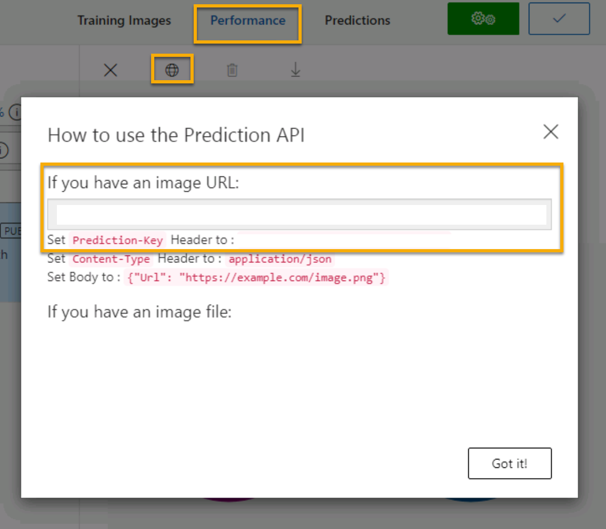

---
lab:
  title: 物体検出について調べる
---

# <a name="explore-object-detection"></a>物体検出について調べる

> **注** このラボを完了するには、管理者アクセス権が与えられている [Azure サブスクリプション](https://azure.microsoft.com/free?azure-portal=true)が必要です。

''*物体検出*'' は、機械学習モデルをトレーニングして画像内の物体の個々のインスタンスを分類し、その場所をマークする ''*境界ボックス*'' を示すコンピューター ビジョンの一種です。 ''*画像分類*'' (モデルが、"これは何の画像か?" という質問に答える) から、"この画像内の物体は何で、どこにあるのか?" をモデルに質問ができるソリューションの構築までの進行であると考えることができます。

たとえば、ある食料雑貨店では物体検出モデルを使用し、カメラを使ってコンベヤ ベルトをスキャンする自動精算システムを実装することができます。また、各品目をベルトに乗せて個別にスキャンする必要もなく、特定の品目を識別できます。

Microsoft Azure の **Custom Vision** コグニティブ サービスでは、カスタム物体検出モデルを作成および公開するためのクラウドベースのソリューションが提供されます。 Azure では、Custom Vision サービスを使用して、既存の画像に基づいて画像分類モデルをトレーニングすることができます。 画像分類ソリューションを作成するための 2 つの要素があります。 まず、既存の画像を使用して異なるクラスを認識するようにモデルをトレーニングする必要があります。 その後、モデルがトレーニングされたら、アプリケーションで使用できるサービスとして公開する必要があります。

Custom Vision サービスの機能をテストして画像内の物体を検出するには、Cloud Shell で実行される単純なコマンドライン アプリケーションを使用します。 Web サイトや電話アプリなど、実際のソリューションにも同じ原則と機能が適用されます。

## <a name="create-a-cognitive-services-resource"></a>*Cognitive Services* リソースを作成する

Custom Vision サービスは、**Custom Vision** リソースまたは **Cognitive Services** リソースを作成することで使用できます。

> **注** すべてのリソースをすべてのリージョンで利用できるわけではありません。 Custom Vision と Cognitive Services のどちらのリソースを作成しても、[特定のリージョン](https://azure.microsoft.com/global-infrastructure/services/?products=cognitive-services)で作成されたリソースのみを使用して、Custom Vision サービスにアクセスできます。 わかりやすくするために、以下の構成手順ではリージョンが事前に選択されています。

Azure サブスクリプションで **Cognitive Services** リソースを作成します。

1. 別のブラウザー タブで Azure portal ([https://portal.azure.com](https://portal.azure.com?azure-portal=true)) を開き、Microsoft アカウントでサインインします。

1. **[&#65291;リソースの作成]** ボタンをクリックして、「*Cognitive Services*」を検索し、次の設定を使用して **Cognitive Services** リソースを作成します。
    - **[サブスクリプション]**: *お使いの Azure サブスクリプション*。
    - **[リソース グループ]**: *一意の名前のリソース グループを選択するか、作成します*。
    - **リージョン:** 米国東部
    - **[名前]**: *一意の名前を入力します*。
    - **価格レベル**: Standard S0
    - **このボックスをオンにすることで、私は以下のすべての契約条件を読んで理解したことを認めます**: 選択されています。

1. リソースを確認して作成し、デプロイが完了するまで待ちます。 次に、デプロイされたリソースに移動します。

1. Cognitive Services リソースの **[キーとエンドポイント]** ページを表示します。 クライアント アプリケーションから接続するには、エンドポイントとキーが必要です。

## <a name="create-a-custom-vision-project"></a>Custom Vision プロジェクトを作成する

物体検出モデルをトレーニングするには、トレーニング リソースに基づいて Custom Vision プロジェクトを作成する必要があります。 これを行うには、Custom Vision ポータルを使用します。

1. 新しいブラウザー タブで Custom Vision ポータル ([https://customvision.ai](https://customvision.ai?azure-portal=true)) を開き、ご利用の Azure サブスクリプションに関連付けられている Microsoft アカウントを使用してサインインします。

1. 次の設定で新しいプロジェクトを作成します。
    - **名前**: 食料品店の検出
    - **説明**: 食料品店の物体検出。
    - **リソース**: ''以前に作成したリソース''**
    - **プロジェクトの種類**: 物体検出
    - **ドメイン**: 全般

1. プロジェクトが作成され、ブラウザーで開かれるまで待ちます。

## <a name="add-and-tag-images"></a>画像を追加してタグを付ける

物体検出モデルをトレーニングするには、モデルで識別するクラスが含まれている画像をアップロードし、各物体インスタンスの境界ボックスを示すためにタグを付ける必要があります。

1. https://aka.ms/fruit-objects からトレーニング画像をダウンロードして展開します。 抽出されたフォルダーには、一連の果物の画像が含まれています。

1. Custom Vision ポータル ([https://customvision.ai](https://customvision.ai?azure-portal=true)) で、物体検出プロジェクト ''_食料品店の検出_'' で作業していることを確認します。 その後、**[画像の追加]** を選択し、抽出されたフォルダー内のすべての画像をアップロードします。

    ![[画像の追加] をクリックしてダウンロードされた画像をアップロードします。](media/create-object-detection-solution/fruit-upload.jpg)

1. 画像がアップロードされた後、最初のものを選択して開きます。

1. 以下の画像のように、自動的に検出された領域が表示されるまで、画像内の任意の物体の上にマウス ポインターを置きます。 その後、物体を選択し、必要に応じて、それを囲む領域のサイズを変更します。

    

    単に物体の周りをドラッグして領域を作成することもできます。

1. 領域で物体が囲まれたら、次に示すように、適切な物体の種類 (*apple*、*banana*、または *orange*) で新しいタグを追加します。

    

1. 画像内の互いの物体を選択してタグを付け、必要に応じて領域のサイズを変更し、新しいタグを追加します。

    

1. 右側の **[>]** リンクを使用して、次の画像に移動し、その物体にタグを付けます。 その後、単に画像のコレクション全体で引き続き作業を行い、apple、banana、および orange にそれぞれタグを付けます。

1. 最後の画像のタグ付けが終了したら、**[Image Detail](画像の詳細)** エディターを閉じ、**[画像のトレーニング]** ページの **[タグ]** で **[タグ付け]** を選択して、タグ付けされたすべての画像を表示します。

    

## <a name="train-and-test-a-model"></a>モデルをトレーニングしてテストする

これでプロジェクト内の画像にタグを付けたので、モデルをトレーニングする準備ができました。

1. Custom Vision プロジェクトで、**[トレーニング]** をクリックして、タグ付けされた画像を使用して物体検出モデルをトレーニングします。 **[クイック トレーニング]** オプションを選択します。

1. トレーニングが完了するまで待ってから (10 分ほどかかる場合があります)、''*精度*''、''*再現率*''、および *平均適合率 (mAP)* パフォーマンス メトリックを確認します。これらは、物体検出モデルの予測の適合度を測定するものであり、すべて高いはずです。

1. ページの右上にある **[クイック テスト]** をクリックしてから、**[画像の URL]** ボックスに、「`https://aka.ms/apple-orange`」と入力し、生成された予測を表示します。 その後、**[クイック テスト]** ウィンドウを閉じます。

## <a name="publish-the-object-detection-model"></a>物体検出モデルを公開する

これでトレーニング済みのモデルを公開し、クライアント アプリケーションから使用できるようになりました。

1. **&#128504; [公開]** をクリックし、トレーニング済みのモデルを次の設定で公開します。
    - **モデル名**: detect-produce
    - **予測リソース**: ''*以前に作成したリソース*''。

1. 公開後、*[予測 URL]* (&#127760;) アイコンをクリックし、公開されたモデルを使用するために必要な情報を表示します。 後で、画像の URL から予測を取得するために適切な URL および予測とキーの値が必要になるため、このダイアログ ボックスを開いたままにして次のタスクに進みます。

## <a name="run-cloud-shell"></a>Cloud Shell の実行

Custom Vision サービスの機能をテストするために、Azure の Cloud Shell で実行される単純なコマンドライン アプリケーションを使用します。

1. Azure portal で、ページの上部の検索ボックスの右側にある **[>_]** (*Cloud Shell*) ボタンを選択します。 これにより、ポータルの下部に Cloud Shell ペインが開きます。 

    

1. Cloud Shell を初めて開くと、使用するシェルの種類 (*Bash* または *PowerShell*) を選択するように求められる場合があります。 **[PowerShell]** を選択します。 このオプションが表示されない場合は、このステップをスキップします。  

1. Cloud Shell のストレージを作成するように求めるメッセージが表示された場合は、サブスクリプションが指定されていることを確認して、**[ストレージの作成]** を選択します。 その後、ストレージが作成されるのを 1 分程度待ちます。

    

1. [Cloud Shell] ペインの左上に表示されるシェルの種類が *PowerShell* に切り替えられたことを確認します。 *Bash* の場合は、ドロップダウン メニューを使用して *PowerShell* に切り替えます。

     

1. PowerShell が起動するまで待ちます。 Azure portal に次の画面が表示されます。  

     

## <a name="configure-and-run-a-client-application"></a>クライアント アプリケーションを構成して実行する

これでカスタム モデルを作成したので、Custom Vision サービスを使用して画像内の物体を検出する単純なクライアント アプリケーションを実行できます。

1. コマンド シェルで、次のコマンドを入力してサンプル アプリケーションをダウンロードし、ai-900 というフォルダーに保存します。

    ```PowerShell
    git clone https://github.com/MicrosoftLearning/AI-900-AIFundamentals ai-900
    ```

    >**注** 別のラボで既にこのコマンドを使用して *ai-900* リポジトリを複製した場合は、この手順をスキップできます。

1. ファイルが **ai-900** という名前のフォルダーにダウンロードされます。 次に、Cloud Shell ストレージ内のすべてのファイルを表示して、それらを使用します。 シェルに次のコマンドを入力します。

    ```PowerShell
    code .
    ```

    これにより、次の図のようなエディターが開きます。 

    

1. 左側の **[ファイル]** ペインで、**[ai-900]** を展開し、**[detect-objects.ps1]** を選択します。 このファイルには、次に示すように、Custom Vision サービスを使用して画像を検出するコードが含まれています。

    

1. コードの詳細についてはあまり心配しないでください。重要なのは、画像の URL を使用するときに、Custom Vision モデルの予測 URL とキーが必要であることです。 

    Custom Vision プロジェクトのダイアログボックスから *予測 URL* を取得します。 

    >**注** 画像分類モデルを発行した後で、"予測 URL" を確認したことを思い出してください。** *予測 URL* を見つけるには、プロジェクトの **[パフォーマンス]** タブに移動し、**[予測 URL]** をクリックします (画面が圧縮されている場合は、地球のアイコンが表示されることがあります)。 ダイアログ ボックスが表示されます。 **画像の URL** がある場合は、その URL をコピーします。 それをコード エディターに貼り付け、**YOUR_PREDICTION_URL** を置き換えます。 

    同じダイアログ ボックスを使用して、"予測キー" を取得します。** *[Set Prediction-Key Header to] (Prediction-Key ヘッダーを次の値に設定する)* の後に表示される予測キーをコピーします。 それをコード エディターに貼り付け、**YOUR_PREDICTION_KEY** プレースホルダーの値を置き換えます。 

    

    予測 URL と予測キーの値を貼り付けた後、最初の 2 行のコードはこのようになるはずです。

    ```PowerShell
    $predictionUrl="https..."
    $predictionKey ="1a2b3c4d5e6f7g8h9i0j...."
    ```

1. エディター ペインの右上の **[...]** ボタンを使用してメニューを開き、**[保存]** を選択して変更を保存します。 次に、メニューを再度開き、**[エディターを閉じる]** を選択します。

    サンプル クライアント アプリケーションを使用して、この画像内の物体を検出します。

    

1. PowerShell ウィンドウで、次のコマンドを入力してコードを実行します。

    ```PowerShell
    cd ai-900
    ./detect-objects.ps1 
    ```

1. 予測を確認します。これは *apple orange banana* であるはずです。

## <a name="learn-more"></a>詳細情報

このシンプルなアプリでは、Custom Vision サービスの一部の機能しか示されていません。 このサービスで実行できる操作の詳細については、[Custom Vision のページ](https://azure.microsoft.com/services/cognitive-services/custom-vision-service/)を参照してください。
