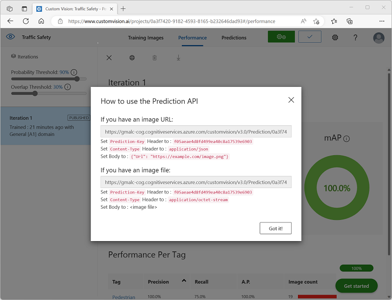

---
lab:
  title: 物体検出について調べる
---

# 物体検出について調べる

> **注** このラボを完了するには、管理者アクセス権が与えられている [Azure サブスクリプション](https://azure.microsoft.com/free?azure-portal=true)が必要です。

''*物体検出*'' は、機械学習モデルをトレーニングして画像内の物体の個々のインスタンスを分類し、その場所をマークする ''*境界ボックス*'' を示すコンピューター ビジョンの一種です。 ''*画像分類*'' (モデルが、"これは何の画像か?" という質問に答える) から、"この画像内の物体は何で、どこにあるのか?" をモデルに質問ができるソリューションの構築までの進行であると考えることができます。

たとえば、道路の安全への取り組みによって、交差点で最も脆弱な道路利用者が歩行者と自転車であると特定できるでしょう。 交差点の監視にカメラを使用することで、道路利用者の画像を分析して歩行者と自転車を検出し、その数を監視したり、さらには信号の動作を変更したりすることもできます。

Microsoft Azure の **Custom Vision** サービスでは、カスタム物体検出モデルを作成および公開するためのクラウドベースのソリューションが提供されます。 Azure では、Custom Vision サービスを使用して、既存の画像に基づいて物体検出モデルをトレーニングすることができます。 物体検出ソリューションを作成するための 2 つの要素があります。 まず、ラベル付き画像を使用して物体の場所とクラスを検出するモデルをトレーニングする必要があります。 その後、モデルがトレーニングされたら、アプリケーションで使用できるサービスとして公開する必要があります。

Custom Vision サービスの機能をテストして画像内の物体を検出するには、Cloud Shell で実行される単純なコマンドライン アプリケーションを使用します。 Web サイトやモバイル アプリなど、実際のソリューションにも同じ原則と機能が適用されます。

## "Azure AI サービス" リソースを作成する**

Custom Vision サービスは、**Custom Vision** リソースまたは **Azure AI サービス** リソースを作成することで使用できます。

> **注** すべてのリソースをすべてのリージョンで利用できるわけではありません。 Custom Vision と Azure AI サービスのどちらのリソースを作成しても、[特定のリージョン](https://azure.microsoft.com/global-infrastructure/services/?products=cognitive-services)で作成されたリソースのみを使用して、Custom Vision サービスにアクセスできます。 わかりやすくするために、以下の構成手順ではリージョンが事前に選択されています。

Azure サブスクリプションで **Azure AI サービス** リソースを作成してください。

1. 別のブラウザー タブで Azure portal ([https://portal.azure.com](https://portal.azure.com?azure-portal=true)) を開き、Microsoft アカウントでサインインします。

1. **[&#65291;リソースの作成]** ボタンをクリックし、「Azure AI サービス」を検索してください。** **[Azure AI** **サービスの作成]** プランを選択してください。 Azure AI サービス リソースを作成するためのページに移動します。 これを以下の設定で構成します。
    - **[サブスクリプション]**: *お使いの Azure サブスクリプション*。
    - **[リソース グループ]**: *一意の名前のリソース グループを選択するか、作成します*。
    - **リージョン:** 米国東部
    - **[名前]**: *一意の名前を入力します*。
    - **価格レベル**: Standard S0
    - **このボックスをオンにすることで、私は以下のすべての契約条件を読んで理解したことを認めます**: 選択されています。

1. リソースを確認して作成し、デプロイが完了するまで待ちます。 次に、デプロイされたリソースに移動します。

1. Azure AI サービス リソースの **[キーとエンドポイント]** ページを表示します。 クライアント アプリケーションから接続するには、エンドポイントとキーが必要です。

## Custom Vision プロジェクトを作成する

物体検出モデルをトレーニングするには、トレーニング リソースに基づいて Custom Vision プロジェクトを作成する必要があります。 これを行うには、Custom Vision ポータルを使用します。

1. 新しいブラウザー タブで Custom Vision ポータル ([https://customvision.ai](https://customvision.ai?azure-portal=true)) を開き、ご利用の Azure サブスクリプションに関連付けられている Microsoft アカウントを使用してサインインします。

1. 次の設定で新しいプロジェクトを作成します。
    - **名前**: 交通安全
    - **説明**: 道路の安全のための物体検出。
    - **リソース**: ''以前に作成したリソース''**
    - **プロジェクトの種類**: 物体検出
    - **ドメイン**: 一般 \[A1]

1. プロジェクトが作成され、ブラウザーで開かれるまで待ちます。

## 画像を追加してタグを付ける

物体検出モデルをトレーニングするには、モデルで識別するクラスが含まれている画像をアップロードし、各物体インスタンスの境界ボックスを示すためにタグを付ける必要があります。

1. [https://aka.ms/traffic-images](https://aka.ms/traffic-images) からトレーニング画像をダウンロードして展開します。 抽出されたフォルダーには、自転車と歩行者の画像のコレクションが含まれています。

1. Custom Vision ポータルの **[交通安全]** の物体検出プロジェクトで、 **[画像の追加]** を選択し、抽出したフォルダーにすべての画像をアップロードします。

    ![Custom Vision Studio の [画像のアップロード] ダイアログ ボックスのスクリーンショット。](media/create-object-detection-solution/upload-images.png)

1. 画像がアップロードされた後、最初のものを選択して開きます。

1. 自動的に検出された領域が表示されるまで、画像内の任意の物体 (自転車または歩行者) の上にマウス ポインターを置きます。 その後、物体を選択し、必要に応じて、それを囲む領域のサイズを変更します。 単に物体の周りをドラッグして領域を作成することもできます。

    四角形の領域内に物体が正確に選択されている場合は、その物体に適したタグ ("自転車" または "歩行者") を入力し、 **[領域のタグ付け]** ( **+** ) ボタンを使用してタグをプロジェクトに追加します。** **

    ![[画像の詳細] ダイアログ ボックスのタグ付けされた領域を持つ画像のスクリーンショット。](media/create-object-detection-solution/tag-image.png)

1. 右側の **[次へ]** **(>)** リンクを使用して、次の画像に移動し、その物体にタグを付けます。 その後、画像のコレクション全体で引き続き作業を行い、自転車と歩行者にそれぞれタグを付けます。

    画像にタグを付けるときは、次の点に注意してください。

    - 一部の画像には、型が異なる可能性がある複数の物体が含まれています。 重なっている場合でも、それぞれにタグを付けます。
    - タグを一度入力すると、新しい物体にタグを付けるときに一覧からタグを選択できます。
    - 画像を前後に移動すると、タグを調整できます。

    ![[画像の詳細] ダイアログ ボックスのタグ付けされた領域を持つ画像のスクリーンショット。](media/create-object-detection-solution/multiple-objects.png)

1. 最後の画像のタグ付けが終了したら、**[Image Detail](画像の詳細)** エディターを閉じ、**Training Images** ページの **[タグ]** で **[タグ付け]** を選択して、タグ付けされたすべての画像を表示します。

    

## モデルをトレーニングしてテストする

これでプロジェクト内の画像にタグを付けたので、モデルをトレーニングする準備ができました。

1. Custom Vision プロジェクトで、**[トレーニング]** をクリックして、タグ付けされた画像を使用して物体検出モデルをトレーニングします。 **[クイック トレーニング]** オプションを選択します。

    > **ヒント**: トレーニングには数分かかる場合があります。 待っている間に、[スマートシティのビデオ分析](https://www.microsoft.com/research/video/video-analytics-for-smart-cities/)をご覧ください。道路の安全性向上への取り組みにコンピューター ビジョンを使用する実際のプロジェクトについて説明しています。

2. トレーニングが完了したら、''精度''、''再現率''、および *mAP* のパフォーマンス メトリックを確認してください。これらは、物体検出モデルの予測の適合度を測定するものであり、いずれもある程度高い数値である必要があります。** **

3. 左側の **[確率しきい値]** を 50% から 90% に増やして、パフォーマンス メトリックへの影響を確認してください。 この設定により、各タグ評価が予測としてカウントされるために満たす、または超える必要がある確率値が決定されます。

    

4. ページの右上にある **[クイック テスト]** をクリックしてから、 **[画像の URL]** ボックスに、「`https://aka.ms/pedestrian-cyclist`」と入力し、結果を表示します。

    右側のペインの **[予測]** の下に、検出された物体ごとのタグと確率が表示されます。 物体をそれぞれ選択して、画像内で強調表示されていることを確認します。

    予測された物体がすべて正しいとは限りません。結局のところ、自転車と歩行者は多くの一般的な特徴を共有しています。 モデルが最も自信を持っている予測には、最も高い確率値が設定されます。 確率が低い物体を排除するには、 **[しきい値]** スライダーを使用します。 正しい予測のみが含まれるポイント (おそらく 85 から 90%) が見つかるはずです。

    

5. その後、**[クイック テスト]** ウィンドウを閉じます。

## 物体検出モデルを公開する

これでトレーニング済みのモデルを公開し、クライアント アプリケーションから使用できるようになりました。

1. **&#128504; [公開]** をクリックし、トレーニング済みのモデルを次の設定で公開します。
    - **モデル名**: 交通安全
    - **予測リソース**: ''*以前に作成したリソース*''。

1. 公開後、*[予測 URL]* (&#127760;) アイコンをクリックし、公開されたモデルを使用するために必要な情報を表示します。

    

後で、画像の URL から予測を取得するために適切な URL および予測とキーの値が必要になるため、このダイアログ ボックスを開いたままにして次のタスクに進みます。

## クライアント アプリケーションを準備する

Custom Vision サービスの機能をテストするために、Azure の Cloud Shell で実行される単純なコマンドライン アプリケーションを使用します。

1. Azure portal を含むブラウザー タブに戻り、ページ上部の検索ボックスの右にある **[Cloud Shell]** ( **[>_]** ) ボタンを選択します。 これにより、ポータルの下部に [Cloud Shell] ペインが開きます。

    Cloud Shell を初めて開くと、使用するシェルの種類 (*Bash* または *PowerShell*) を選択するように求められる場合があります。 そこで、 **[PowerShell]** を選択します。

    Cloud Shell のストレージを作成するように求めるメッセージが表示された場合は、サブスクリプションが指定されていることを確認して、 **[ストレージの作成]** を選択します。 その後、ストレージが作成されるのを 1 分程度待ちます。

    Cloud Shell の準備ができると、次のようになります。
    
    

    > **ヒント**: [Cloud Shell] ペインの左上に表示されるシェルの種類が *[PowerShell]* になっていることを確認してください。 *Bash* の場合は、ドロップダウン メニューを使用して *PowerShell* に切り替えます。

    ペインの上部にある区分線をドラッグして Cloud Shell のサイズを変更したり、ペインの右上にある **&#8212;** 、 **&#9723;** 、**X** アイコンを使用して、ペインを最小化または最大化したり、閉じたりすることができます。 Azure Cloud Shell の使い方について詳しくは、[Azure Cloud Shell のドキュメント](https://docs.microsoft.com/azure/cloud-shell/overview)をご覧ください。

2. コマンド シェルで、次のコマンドを入力してこの演習のファイルをダウンロードし、 **[ai-900]** という名前のフォルダーに保存します (既にそのフォルダーが存在する場合は、先に削除してください)

    ```PowerShell
    rm -r ai-900 -f
    git clone https://github.com/MicrosoftLearning/AI-900-AIFundamentals ai-900
    ```

3. ファイルがダウンロードされたら、次のコマンドを入力して **[ai-900]** ディレクトリに移動し、この演習のコード ファイルを編集します。

    ```PowerShell
    cd ai-900
    code detect-objects.ps1
    ```

    これにより、次の画像のようなエディターが開きます。

     

     > **ヒント**: Cloud Shell のコマンド ラインとコード エディターの間の区切りバーを使用して、ペインのサイズを変更できます。

4. コードの詳細についてはあまり気にしないでください。 重要なのは、Custom Vision モデルの予測 URL とキーを指定するコードから始まるということです。 残りのコードで自分のモデルが使用されるように、これらを更新する必要があります。

    Custom Vision プロジェクトのブラウザー タブで開いたままになっているダイアログ ボックスから、"予測 URL" と "予測キー" を取得します。** ** "画像 URL がある場合" は、使用するバージョンが必要です。**

    これらの値を使用して、コード ファイル内の **YOUR_PREDICTION_URL** と **YOUR_PREDICTION_KEY** のプレース ホルダーを置き換えます。

    予測 URL と予測キーの値を貼り付けた後、最初の 2 行のコードはこのようになるはずです。

    ```PowerShell
    $predictionUrl="https..."
    $predictionKey ="1a2b3c4d5e6f7g8h9i0j...."
    ```

5. コード内の変数に変更を加えたら、**Ctrl + S** キーを押してファイルを保存します。 次に、**Ctrl + Q** キーを押してコード エディターを閉じます。

## クライアント アプリケーションをテストする

これで、サンプルのクライアント アプリケーションを使用して、画像内の自転車と歩行者を検出できるようになりました。

1. PowerShell ウィンドウで、次のコマンドを入力してコードを実行します。

    ```PowerShell
    ./detect-objects.ps1 1
    ```

    このコードでは、自分のモデルを使用して、次の画像の物体が検出されます。

    

1. 予測を確認しましょう。90% 以上の確率で検出された物体と、その場所を囲む境界ボックスの座標が一覧表示されます。

1. それでは、別の画像を試してみましょう。 次のコマンドを実行します。

    ```PowerShell
    ./detect-objects.ps1 2
    ```

    今回は、次の画像が分析されます。

    

自分の物体検出モデルで、テスト画像内の歩行者と自転車をうまく検出できたでしょうか。

