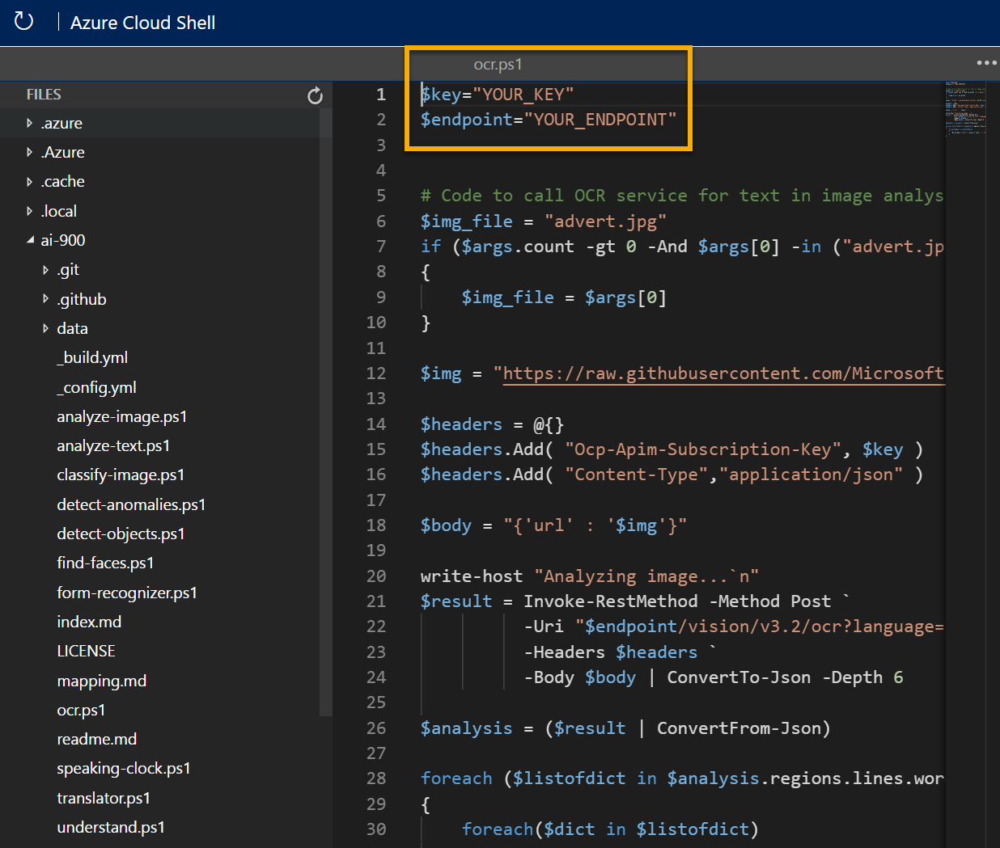

---
lab:
  title: 光学式文字認識について調べる
---

# 光学式文字認識について調べる

> **注** このラボを完了するには、管理者アクセス権が与えられている [Azure サブスクリプション](https://azure.microsoft.com/free?azure-portal=true)が必要です。

コンピューターのビジョンに関する一般的な課題は、画像内のテキストを検出して解釈することです。 この種の処理は、*光学式文字認識* (OCR) と呼ばれることがよくあります。 Microsoft の Read API は、OCR 機能へのアクセスを提供します。 

Read API の機能をテストするために、Cloud Shell で実行されるシンプルなコマンドライン アプリケーションを使用します。 Web サイトや電話アプリなど、実際のソリューションにも同じ原則と機能が適用されます。

## Azure AI Vision サービスを使用してイメージでテキストを読み取る

**Azure AI Vision** サービスは、次のような OCR タスクのサポートを提供します。

- より容量の大きいドキュメント用に最適化された **Read** API。 この API は非同期で使用され、印刷テキストと手書きテキストの両方に使用できます。

## "Azure AI サービス" リソースを作成する**

Azure AI Vision サービスを使用するには、**Computer Vision** リソースまたは **Azure AI サービス** リソースを作成してください。

まだ作成していない場合は、Azure サブスクリプションで **Azure AI サービス** リソースを作成します。

1. 別のブラウザー タブで Azure portal ([https://portal.azure.com](https://portal.azure.com?azure-portal=true)) を開き、Microsoft アカウントでサインインします。

1. **[&#65291;リソースの作成]** ボタンをクリックし、「Azure AI サービス」を検索してください。** **[Azure AI** **サービスの作成]** プランを選択してください。 Azure AI サービス リソースを作成するためのページに移動します。 これを以下の設定で構成します。
    - **[サブスクリプション]**: *お使いの Azure サブスクリプション*。
    - **[リソース グループ]**: *一意の名前のリソース グループを選択するか、作成します*。
    - **リージョン**: 使用できるリージョンを選択します**
    - **[名前]**: *一意の名前を入力します*。
    - **価格レベル**: Standard S0
    - **このボックスをオンにすることで、私は以下のすべての契約条件を読んで理解したことを認めます**: 選択されています。

1. リソースを確認して作成し、デプロイが完了するまで待ちます。 次に、デプロイされたリソースに移動します。

1. Azure AI サービス リソースの **[キーとエンドポイント]** ページを表示します。 クライアント アプリケーションから接続するには、エンドポイントとキーが必要です。

## Cloud Shell の実行

Custom Vision サービスの機能をテストするために、Azure の Cloud Shell で実行される単純なコマンドライン アプリケーションを使用します。

1. Azure portal で、ページの上部の検索ボックスの右側にある **[>_]** (*Cloud Shell*) ボタンを選択します。 これにより、ポータルの下部に Cloud Shell ペインが開きます。 

    

1. Cloud Shell を初めて開くと、使用するシェルの種類 (*Bash* または *PowerShell*) を選択するように求められる場合があります。 **[PowerShell]** を選択します。 このオプションが表示されない場合は、このステップをスキップします。  

1. Cloud Shell のストレージを作成するように求めるメッセージが表示された場合は、サブスクリプションが指定されていることを確認して、**[ストレージの作成]** を選択します。 その後、ストレージが作成されるのを 1 分程度待ちます。

    

1. Cloud Shell ペインの左上に表示されるシェルの種類が *PowerShell* に切り替えられたことを確認します。 *Bash* の場合は、ドロップダウン メニューを使用して *PowerShell* に切り替えます。

     

1. PowerShell が起動するまで待ちます。 Azure portal に次の画面が表示されます。  

     

## クライアント アプリケーションを構成して実行する

カスタム モデルが作成されたので、OCR サービスを使用する簡単なクライアント アプリケーションを実行できます。

1. コマンド シェルで、次のコマンドを入力してサンプル アプリケーションをダウンロードし、ai-900 というフォルダーに保存します。

    ```PowerShell
    git clone https://github.com/MicrosoftLearning/AI-900-AIFundamentals ai-900
    ```

    >**ヒント** 別のラボで既にこのコマンドを使用して *ai-900* リポジトリを複製した場合は、この手順をスキップできます。

1. ファイルが **ai-900** という名前のフォルダーにダウンロードされます。 次に、Cloud Shell ストレージ内のすべてのファイルを表示して、それらを使用します。 シェルに次のコマンドを入力します。

    ```PowerShell
    code .
    ```

    これにより、次の図のようなエディターが開きます。 

    

1. 左側の **[ファイル]** ペインで、**[ai-900]** を展開して、**[ocr.ps1]** を選択します。 このファイルには、次に示すように、Computer Vision サービスを使用して画像内のテキストを検出して分析するコードが含まれています。

    

1. コードの詳細についてあまり心配しないでください。重要なのは、エンドポイント URL と Azure AI サービス リソースのいずれかのキーが必要であることです。 Azure portal のリソースの **[キーとエンドポイント]** ページからこれらをコピーして、コード エディターに貼り付け、**YOUR_KEY** と **YOUR_ENDPOINT** プレースホルダーの値をそれぞれ置き換えます。

    > **ヒント** **[キーとエンドポイント]** および **[エディター]** ペインを操作するときに、区分線を使用して画面領域を調整しなければならないことがあります。

    キーとエンドポイントの値を貼り付けると、コードの最初の 2 行は次のようになります。

    ```PowerShell
    $key="1a2b3c4d5e6f7g8h9i0j...."    
    $endpoint="https..."
    ```

1. エディター ペインの右上の **[...]** ボタンを使用してメニューを開き、**[保存]** を選択して変更を保存します。 次に、メニューを再度開き、**[エディターを閉じる]** を選択します。 キーとエンドポイントを設定したので、Azure AI サービス リソースを使用して画像からテキストを抽出できます。

    **Read** API を使用してみましょう。 ここでは、いくつかのテキストが含まれている、架空の Northwind Traders 小売会社の広告画像を使用します。

    サンプル クライアント アプリケーションは、次の画像を分析します。

    

1. PowerShell ペインで、次のコマンドを入力して、コードを実行してテキストを読み取ります。

    ```PowerShell
    cd ai-900
    ./ocr.ps1 advert.jpg
    ```

1. 画像で見つかった詳細を確認します。 画像内で見つかったテキストは、領域、行、単語の階層構造に編成され、コードはこれらを読み取って結果を取得します。

    次に示すように、テキストの位置は左上の座標と*境界ボックス*の幅と高さによって示されます。

    

1. それでは、別の画像を試してみましょう。

    

    2 番目の画像を分析するには、次のコマンドを入力します。

    ```PowerShell
    ./ocr.ps1 letter.jpg
    ```

1. 2 番目の画像の分析結果を確認します。 また、テキストと、テキストと境界ボックスも返される必要があります。

## 詳細情報

このシンプルなアプリでは、Computer Vision サービスの一部の OCR 機能しか示されていません。 このサービスで実行できる操作の詳細については、[OCR のページ](https://docs.microsoft.com/azure/cognitive-services/computer-vision/overview-ocr)を参照してください。
