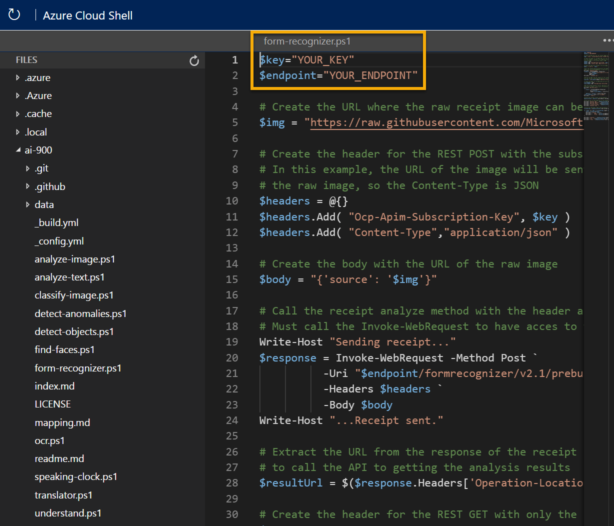

---
lab:
  title: フォーム認識について調べる
---

# フォーム認識について調べる

> **注** このラボを完了するには、管理者アクセス権が与えられている [Azure サブスクリプション](https://azure.microsoft.com/free?azure-portal=true)が必要です。

コンピューター ビジョンの人工知能 (AI) 分野では、光学式文字認識 (OCR) は、印刷または手書きのドキュメントを読み取るために広く使用されています。 多くの場合、テキストはドキュメントから、さらなる処理や分析に使用できる形式に抽出されるだけです。

より高度な OCR シナリオは、注文書や請求書などのフォームからの情報の抽出であり、フォームのフィールドの意味を解釈する必要があります。 **Form Recognizer** サービスは、この種の AI 問題に特化して設計されています。

Form Recognizer は、トレーニング済みの機械学習モデルを使用して、請求書や領収書などの画像からテキストを抽出します。 他のコンピューター ビジョン モデルでもテキストをキャプチャできますが、Form Recognizer では、キーと値のペアなど、テキストの構造とテーブル内の情報もキャプチャされます。 このため、フォームのエントリを手動でデータベースに入力する代わりに、元のファイルのテキスト間の関係を自動的にキャプチャできます。 

Form Recognizer サービスの機能をテストするために、Cloud Shell で実行する単純なコマンドライン アプリケーションを使用します。 Web サイトや電話アプリなど、実際のソリューションにも同じ原則と機能が適用されます。

## *Cognitive Services* リソースを作成する

Form Recognizer サービスを使用するには、**Form Recognizer** リソースまたは **Cognitive Services** リソースを作成します。

まだ作成していない場合は、Azure サブスクリプションで **Cognitive Services** リソースを作成します。

1. 別のブラウザー タブで Azure portal ([https://portal.azure.com](https://portal.azure.com?azure-portal=true)) を開き、Microsoft アカウントでサインインします。

1. **[&#65291;リソースの作成]** ボタンをクリックして、「*Cognitive Services*」を検索し、次の設定を使用して **Cognitive Services** リソースを作成します。
    - **[サブスクリプション]**: *お使いの Azure サブスクリプション*。
    - **[リソース グループ]**: *一意の名前のリソース グループを選択するか、作成します*。
    - **リージョン**: 使用できるリージョンを選択します**
    - **[名前]**: *一意の名前を入力します*。
    - **価格レベル**: Standard S0
    - **このボックスをオンにすることで、私は以下のすべての契約条件を読んで理解したことを認めます**: 選択されています。

1. リソースを確認して作成し、デプロイが完了するまで待ちます。 次に、デプロイされたリソースに移動します。

1. Cognitive Services リソースの **[キーとエンドポイント]** ページを表示します。 クライアント アプリケーションから接続するには、エンドポイントとキーが必要です。

## Cloud Shell の実行

Form Recognizer サービスの機能をテストするために、Auzre の Cloud Shell で実行する単純なコマンドライン アプリケーションを使用します。 

1. Azure portal で、ページの上部の検索ボックスの右側にある **[>_]** (*Cloud Shell*) ボタンを選択します。 これにより、ポータルの下部に Cloud Shell ペインが開きます。 

    

1. Cloud Shell を初めて開くと、使用するシェルの種類 (*Bash* または *PowerShell*) を選択するように求められる場合があります。 **[PowerShell]** を選択します。 このオプションが表示されない場合は、このステップをスキップします。  

1. Cloud Shell のストレージを作成するように求めるメッセージが表示された場合は、サブスクリプションが指定されていることを確認して、**[ストレージの作成]** を選択します。 その後、ストレージが作成されるのを 1 分程度待ちます。

    

1. Cloud Shell ペインの左上に表示されるシェルの種類が *PowerShell* に切り替えられたことを確認します。 *Bash* の場合は、ドロップダウン メニューを使用して *PowerShell* に切り替えます。

     

1. PowerShell が起動するまで待ちます。 Azure portal に次の画面が表示されます。  

     

## クライアント アプリケーションを構成して実行する

カスタム モデルが作成されたので、Form Recognizer を使用する簡単なクライアント アプリケーションを実行できます。

1. コマンド シェルで、次のコマンドを入力してサンプル アプリケーションをダウンロードし、ai-900 というフォルダーに保存します。

    ```PowerShell
    git clone https://github.com/MicrosoftLearning/AI-900-AIFundamentals ai-900
    ```

    >**ヒント** 別のラボで既にこのコマンドを使用して *ai-900* リポジトリを複製した場合は、この手順をスキップできます。

1. ファイルが **ai-900** という名前のフォルダーにダウンロードされます。 次に、Cloud Shell ストレージ内のすべてのファイルを表示して、それらを使用します。 シェルに次のコマンドを入力します。

    ```PowerShell
    code .
    ```

    これにより、次の図のようなエディターが開きます。 

    

1. 左側の **[ファイル]** ペインで、**[ai-900]** を展開して、**[form-recognizer.ps1]** を選択します。 このファイルには、次に示すように、Form Recognizer サービスを使用して領収書のフィールドを分析するコードが含まれています。

    

1. コードの詳細についてあまり心配しないでください。重要なのは、エンドポイント URL と Cognitive Services リソースのいずれかのキーが必要であることです。 Azure portal のリソースの **[キーとエンドポイント]** ページからこれらをコピーして、コード エディターに貼り付け、**YOUR_KEY** と **YOUR_ENDPOINT** プレースホルダーの値をそれぞれ置き換えます。

    > **ヒント** **[キーとエンドポイント]** および **[エディター]** ペインを操作するときに、区分線を使用して画面領域を調整しなければならないことがあります。

    キーとエンドポイントの値を貼り付けると、コードの最初の 2 行は次のようになります。

    ```PowerShell
    $key="1a2b3c4d5e6f7g8h9i0j...."    
    $endpoint="https..."
    ```

1. エディター ペインの右上の **[...]** ボタンを使用してメニューを開き、**[保存]** を選択して変更を保存します。 次に、メニューを再度開き、**[エディターを閉じる]** を選択します。 キーとエンドポイントを設定したので、リソースを使用して領収書のフィールドを分析できます。 この例では、Form Recognizer の組み込みモデルを使用して、架空の Northwind Traders 小売会社の領収書を分析します。

    サンプル クライアント アプリケーションは、次の画像を分析します。

    

1. PowerShell ペインで、次のコマンドを入力して、コードを実行してテキストを読み取ります。

    ```PowerShell
    cd ai-900
    ./form-recognizer.ps1
    ```

1. 返された結果を確認します。 Form Recognizer がフォーム内のデータを解釈し、マーチャントの住所と電話番号、トランザクションの日付と時刻、および品目、小計、税金、合計金額を正しく識別できることを確認します。

## 詳細情報

このシンプルなアプリは、Computer Vision サービスの Form Recognizer 機能の一部を示すだけです。 このサービスで実行できる操作の詳細については、[Form Recognizer のページ](https://docs.microsoft.com/azure/applied-ai-services/form-recognizer/overview)を参照してください。
