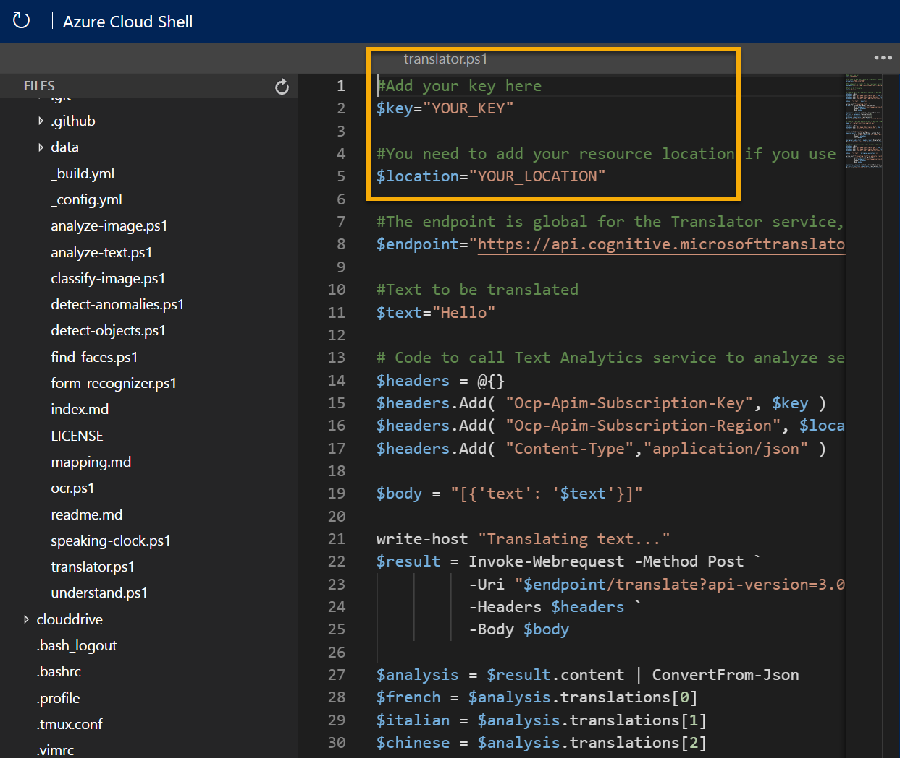

---
lab:
  title: 翻訳を調べる
  module: Module 4 - Natural Language Processing (NLP)
---

# <a name="explore-translation"></a>翻訳を調べる

> **注** このラボを完了するには、管理者アクセス権が与えられている [Azure サブスクリプション](https://azure.microsoft.com/free?azure-portal=true)が必要です。

人類の文明の発展を可能にした原動力の 1 つは、互いにコミュニケーションする能力です。 人間のほとんどの営みでは、コミュニケーションが重要になります。

人工知能 (AI) を使用すると、言語間でテキストや音声を翻訳することでコミュニケーションが簡単になり、国や文化を超えたコミュニケーションでの障壁を取り除くために役立ちます。

Translator サービスの機能をテストするために、Cloud Shell で実行される単純なコマンドライン アプリケーションを使用します。 Web サイトや電話アプリなど、実際のソリューションにも同じ原則と機能が適用されます。

## <a name="create-a-cognitive-services-resource"></a>*Cognitive Services* リソースを作成する

Translator サービスを使用するには、**Translator** リソースまたは **Cognitive Services** リソースを作成します。

まだ作成していない場合は、Azure サブスクリプションに **Cognitive Services** リソースを作成します。

1. 別のブラウザー タブで Azure portal ([https://portal.azure.com](https://portal.azure.com?azure-portal=true)) を開き、Microsoft アカウントでサインインします。

1. **[&#65291;リソースの作成]** ボタンをクリックして、「*Cognitive Services*」を検索し、次の設定を使用して **Cognitive Services** リソースを作成します。
    - **[サブスクリプション]**: *お使いの Azure サブスクリプション*。
    - **[リソース グループ]**: *一意の名前のリソース グループを選択するか、作成します*。
    - **リージョン**: 使用できるリージョンを選択します**
    - **[名前]**: *一意の名前を入力します*。
    - **価格レベル**: Standard S0
    - **このボックスをオンにすることで、私は以下のすべての契約条件を読んで理解したことを認めます**: 選択されています。

1. リソースを確認して作成し、デプロイが完了するまで待ちます。 次に、デプロイされたリソースに移動します。

1. Cognitive Services リソースの **[キーとエンドポイント]** ページを表示します。 クライアント アプリケーションから接続するには、キーと場所が必要です。

### <a name="get-the-key-and-location-for-your-cognitive-services-resource"></a>Cognitive Services のリソースのキーと場所を取得する

1. デプロイが完了するまで待ちます。 次に、Cognitive Services リソースに移動し、**[概要]** ページで、サービスのキーを管理するためのリンクを選択します。 クライアント アプリケーションから Cognitive Services リソースに接続するには、キーと場所が必要です。

1. リソースの **[キーとエンドポイント]** ページを表示します。 クライアント アプリケーションから接続するには、**[場所/リージョン]** と **[キー]** が必要です。

> **注** Translator サービスを使用するために、Cognitive Service エンドポイントを使用する必要はありません。 Translator サービスのみのためのグローバル エンドポイントが提供されています。 

## <a name="run-cloud-shell"></a>Cloud Shell の実行

翻訳サービスの機能をテストするために、Azure の Cloud Shell で実行される単純なコマンドライン アプリケーションを使用します。 

1. Azure portal で、ページの上部の検索ボックスの右側にある **[>_]** (*Cloud Shell*) ボタンを選択します。 これにより、ポータルの下部に Cloud Shell ペインが開きます。

    

1. Cloud Shell を初めて開くと、使用するシェルの種類 (*Bash* または *PowerShell*) を選択するように求められる場合があります。 **[PowerShell]** を選択します。 このオプションが表示されない場合は、このステップをスキップします。  

1. Cloud Shell のストレージを作成するように求めるメッセージが表示された場合は、サブスクリプションが指定されていることを確認して、**[ストレージの作成]** を選択します。 その後、ストレージが作成されるのを 1 分程度待ちます。

    

1. [Cloud Shell] ペインの左上に表示されるシェルの種類が *PowerShell* に切り替えられたことを確認します。 *Bash* の場合は、ドロップダウン メニューを使用して *PowerShell* に切り替えます。 

     

1. PowerShell が起動するまで待ちます。 Azure portal に次の画面が表示されます。  

    

## <a name="configure-and-run-a-client-application"></a>クライアント アプリケーションを構成して実行する

カスタム モデルがあるので、翻訳サービスを使用する簡単なクライアント アプリケーションを実行できます。

1. コマンド シェルで、次のコマンドを入力してサンプル アプリケーションをダウンロードし、ai-900 というフォルダーに保存します。

    ```PowerShell
    git clone https://github.com/MicrosoftLearning/AI-900-AIFundamentals ai-900
    ```

    >**ヒント** 別のラボで既にこのコマンドを使用して *ai-900* リポジトリを複製した場合は、この手順をスキップできます。

1. ファイルが **ai-900** という名前のフォルダーにダウンロードされます。 次に、Cloud Shell ストレージ内のすべてのファイルを表示して、それらを使用します。 シェルに次のコマンドを入力します。 

     ```PowerShell
    code .
    ```

    これにより、次の図のようなエディターが開きます。 

    

1. 左側の **[ファイル]** ペインで、**[ai-900]** を展開して、**[translator.ps1]** を選択します。 このファイルには、Translator サービスを使用するコードが含まれています。

    

1. コードの詳細についてあまり心配しないでください。重要なのは、Cognitive Services リソースのリージョン/場所といずれかのキーが必要であることです。 Azure portal のリソースの **[キーとエンドポイント]** ページからこれらをコピーして、コード エディターに貼り付け、**YOUR_KEY** と **YOUR_LOCATION** プレースホルダーの値をそれぞれ置き換えます。

    キーと場所の値を貼り付けると、コードの先頭の数行は次のようになります。

    ```PowerShell
    $key="1a2b3c4d5e6f7g8h9i0j...."
    $location="somelocation"
    ```

1. エディター ペインの右上で、**[...]** ボタンを使用してメニューを開き、**[保存]** を選択して変更を保存します。 次に、メニューを再度開き、**[エディターを閉じる]** を選択します。

    サンプル クライアント アプリケーションでは、Translator サービスを使用して次のタスクを実行します。
    - 英語のテキストをフランス語、イタリア語、中国語に翻訳する。
    - 英語のオーディオをフランス語のテキストに翻訳する

    以下のビデオ プレーヤーを使用して、アプリケーションが処理する入力オーディオを聞いてください。

    <div class="embeddedvideo"><iframe src="https://www.microsoft.com/videoplayer/embed/RWORN0" frameborder="0" allowfullscreen="true" data-linktype="external"></iframe></div>


    > **注** 実際のアプリケーションでは、マイクから入力を受け取り、応答をスピーカーに送ることができますが、このシンプルな例では、オーディオ ファイルに事前に記録された入力を使用します。

1. Cloud Shell ペインで、次のコマンドを入力してコードを実行します。

    ```PowerShell
    cd ai-900
    ./translator.ps1
    ```

1. 出力結果を確認します。 英語のテキストがフランス語、イタリア語、中国語に翻訳されましたか?  英語のオーディオ "hello" がフランス語のテキストに変換されましたか?

## <a name="learn-more"></a>詳細情報

この簡単なアプリでは、Translator サービスの一部の機能のみを示しています。 このサービスで実行できる操作の詳細については、[Translator のページ](https://docs.microsoft.com/azure/cognitive-services/translator/translator-overview)を参照してください。