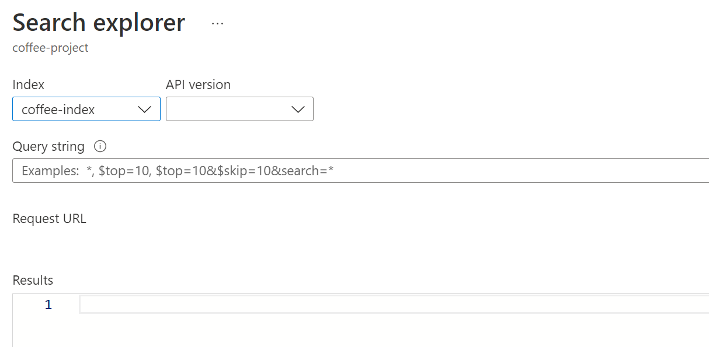

---
lab:
  title: ナレッジ マイニングについて調べる
---

# ナレッジ マイニングについて調べる

> **注** このラボを完了するには、管理者アクセス権が与えられている [Azure サブスクリプション](https://azure.microsoft.com/free?azure-portal=true)が必要です。

たとえば、全国的なコーヒー チェーンである Fourth Coffee に勤務しているとします。 カスタマー エクスペリエンスに関する分析情報を簡単に検索できるようにするナレッジ マイニング ソリューションの構築を支援するように求められています。 顧客のレビューから抽出されたデータを使用して、Azure Cognitive Search インデックスを作成することにしました。  

このラボでは、次のことを行います。

- Azure リソースを作成する
- データ ソースからデータを抽出する
- AI スキルでデータをエンリッチする
- Azure portal で Azure のインデクサーを使用する
- 検索インデックスのクエリを実行する
- ナレッジ ストアに保存された結果を確認する

## 必要な Azure リソース

Fourth Coffee 用に作成するソリューションでは、ご利用の Azure サブスクリプションに次のリソースが必要です。

- **Azure Cognitive Search リソース**。インデックス作成とクエリ実行を管理します。
- **Azure AI サービス** リソース。AI によって生成された分析情報を使用してデータ ソースのデータをエンリッチするために、検索ソリューションで使用できるスキルを AI サービスに提供します。

    > **注** Azure Cognitive Search と Azure AI サービスのリソースは同じ場所にある必要があります。

- BLOB コンテナーを含む**ストレージ アカウント**。未加工のドキュメントや、テーブル、オブジェクト、またはファイルのその他のコレクションが格納されます。

### *Azure Cognitive Search* リソースを作成する

1. [Azure Portal](https://portal.azure.com/learn.docs.microsoft.com?azure-portal=true) にサインインします。

1. **[+ リソースの作成]** ボタンをクリックして、「*Azure Cognitive Search*」を検索し、次の設定を使用して **Azure Cognitive Search** リソースを作成します。

    - **[サブスクリプション]**: *お使いの Azure サブスクリプション*。
    - **[リソース グループ]**: *一意の名前のリソース グループを選択するか、作成します*。
    - **サービス名**: ''一意の名前''**
    - **場所**: "使用できる任意のリージョンを選択します"**
    - **価格レベル**: Basic

1. **[レビューと作成]** を選択し、"**検証が完了しました**" という応答が表示されたら、**[作成]** を選択します。

1. デプロイが完了したら、**[リソースに移動]** を選択します。 Azure Cognitive Search の概要ページでは、インデックスの追加、データのインポート、作成されたインデックスの検索を行うことができます。

### Azure AI サービス リソースを作成する

Azure Cognitive Search リソースと同じ場所にある **Azure AI サービス** リソースをプロビジョニングする必要があります。 検索ソリューションではこのリソースを使用して、AI によって生成された分析情報でデータストア内のデータをエンリッチします。

1. Azure portal のホーム ページに戻ってください。 **[&#65291;リソースの作成]** ボタンをクリックし、「Azure AI サービス」を検索してください。** **[Azure AI** **サービスの作成]** プランを選択してください。 Azure AI サービス リソースを作成するためのページに移動します。 これを以下の設定で構成します。
    - **[サブスクリプション]**: *お使いの Azure サブスクリプション*。
    - **リソース グループ**: ''Azure Cognitive Search リソースと同じリソース グループ''**。
    - **リージョン**: ''*Azure Cognitive Search リソースと同じ場所*''。
    - **名前**: ''一意の名前''**。
    - **価格レベル**: Standard S0
    - **このボックスをオンにすることにより、以下のすべてのご契約条件を読み、同意したものとみなされます**: 選択済み

1. **[Review + create](レビュー + 作成)** を選択します。 "**検証に成功しました**" という 応答が表示されたら、**[作成]** を選択します。

1. デプロイが完了するまで待ち、デプロイの詳細を表示します。

### ストレージ アカウントの作成

1. Azure portal のホーム ページに戻り、**[+ リソースの作成]** ボタンを選択します。

1. 「*ストレージ アカウント*」を検索し、次の設定を使用して**ストレージ アカウント** リソースを作成します。 
    - **[サブスクリプション]**: *お使いの Azure サブスクリプション*。
    - **リソース グループ**: "Azure Cognitive Search および Azure AI サービス リソースと同じリソース グループ"。**
    - **ストレージ アカウント名**: ''*一意の名前*''。
    - **場所**: "*利用可能な場所を選択します*"。
    - **パフォーマンス**: 標準
    - **冗長**: ローカル冗長ストレージ (LRS)

1. **[確認]** をクリックし、次に **[作成]** をクリックします。 デプロイが完了するまで待ち、デプロイされたリソースに移動します。

1. 作成した Azure Storage アカウントの左側のメニュー ペインで、 **[コンテナー]** ( **[設定]** の下にある) を選びます。
1. *[BLOB 匿名アクセスを許可する]* の設定を **[有効]** に変更し、 **[保存]** を選択します。

## Azure Storage にドキュメントをアップロードする

1. 左側のメニュー ウィンドウで、**[コンテナー]** を選択します。

    

1. **[+ コンテナー]** を選択します。 右側のペインが開きます。

1. 以下の設定を入力して、 **[作成]** をクリックします。
    - **名前**: coffee-reviews  
    - **パブリック アクセス レベル**: コンテナー (コンテナーと BLOB の匿名読み取りアクセス)
    - **詳細**: ''変更なし''**

1. 新しいブラウザー タブで、 https://aka.ms/km-documents から zip 形式のドキュメントをダウンロードし、ファイルを *reviews* フォルダーに抽出します。

1. Azure portal で、*coffee-reviews* コンテナーを選択します。 コンテナーで、 **[アップロード]** を選択します。

    

1. **[BLOB のアップロード]** ペインで、 **[ファイルの選択]** を選びます。

1. [エクスプローラー] ウィンドウで、*reviews* フォルダー内の**すべて**のファイルを選択し、**[開く]** を選択してから、**[アップロード]** を選択します。

    

1. アップロードが完了したら、**[BLOB のアップロード]** ペインを閉じることができます。 これで、ドキュメントは *coffee-reviews* ストレージ コンテナーに存在することになります。

## ドキュメントのインデックスを作成する

ストレージにドキュメントを格納したら、Azure Cognitive Search を使用して、そのドキュメントから分析情報を抽出することができます。 Azure portal で*データのインポート ウィザード*が提供されます。 このウィザードを使用すると、サポートされているデータ ソースのインデックスとインデクサーを自動的に作成できます。 そのウィザードを使ってインデックスを作成し、検索ドキュメントをストレージから Azure Cognitive Search インデックスにインポートします。

1. Azure portal で、Azure Cognitive Search リソースを参照します。 **[概要]** ページで、**[データのインポート]** を選択します。

    

1. **[データへの接続]** ページの **[データ ソース]** リストで、**[Azure Blob Storage]** を選択します。 次の値でデータ ストアの詳細を入力します。
    - **データ ソース**: Azure BLOB ストレージ
    - **データ ソース名**: coffee-customer-data
    - **抽出するデータ**: コンテンツとメタデータ
    - **解析モード**: 既定
    - **接続文字列:** ***[既存の接続を選択します]** を選びます。 ストレージ アカウントを選択し、**coffee-reviews** コンテナーを選択してから、**[選択]** をクリックします。
    - **マネージド ID 認証:** なし
    - **コンテナー名**: ''*この設定は、既存の接続を選択した後に自動的に設定されます*''。
    - **BLOB フォルダー**: ''これは空白のままにします''**。
    - **説明**: Fourth Coffee ショップのレビュー。

1. **[次へ: コグニティブ スキルの追加 (省略可能)]** を選択します。

1. **[Cognitive Services をアタッチする]** セクションで、ご利用の Azure AI サービス リソースを選択してください。  

1. **[エンリッチメントの追加]** セクションで、次のことを行います。
    - **[スキルセット名]** を **coffee-skillset** に変更します。
    - **[OCR を有効にし、すべてのテキストを merged_content フィールドにマージする]** チェックボックスをオンにします。
        > **注** すべてのエンリッチされたフィールド オプションを表示するには、 **[OCR を有効にする]** を選択することが重要です。
    - **ソース データ フィールド**が **merged_content** に設定されていることを確かめます。
    - **[エンリッチメントの粒度レベル]** を **[ページ (5000 文字チャンク)]** に変更します。
    - *[増分エンリッチメントを有効にする]* は選択しないでください
    - 次のエンリッチされたフィールドを選択します。

        | コグニティブ スキル | パラメーター | フィールド名 |
        | --------------- | ---------- | ---------- |
        | 場所の名前を抽出 | | locations |
        | キー フレーズ抽出 | | keyphrases |
        | センチメントの検出 | | センチメント |
        | 画像からタグを生成する | | imageTags |
        | 画像からキャプションを生成する | | imageCaption |

1. **[ナレッジ ストアにエンリッチメントを保存する]** で、次を選択します。
    - 画像プロジェクション
    - Documents
    - ページ
    - キー フレーズ
    - エンティティ
    - 画像詳細
    - 画像参照

    > **注** **ストレージ アカウントの接続文字列**を求める警告が表示されます。
    >
    > ![[既存の接続を選択します] が選択された [ストレージ アカウント接続] 画面の警告を示すスクリーンショット。](media/create-cognitive-search-solution/6a-azure-cognitive-search-enrichments-warning.png)
    >
    > 1. **[既存の接続を選択します]** を選択します。 先ほど作成したストレージ アカウントを選びます。
    > 1. **[+ コンテナー]** をクリックし、プライバシー レベルが **[プライベート]** に設定された **knowledge-store** という新しいコンテナーを作成し、 **[作成]** を選択します。
    > 1. **knowledge-store** コンテナーを選択し、画面の下部にある **[選択]** をクリックします。

1. **[Azure BLOB のプロジェクション: ドキュメント]** を選択します。 *knowledge-store* コンテナーが自動的に設定された *[コンテナー名]* の設定が表示されます。 コンテナー名は変更しないでください。

1. **[次へ: 対象インデックスをカスタマイズします]** を選択します。 **[インデックス名]** を **coffee-index** に変更します。

1. **[キー]** が **metadata_storage_path** に設定されていることを確かめます。 **[Suggester 名]** は空白のままにし、**[検索モード]** は自動設定されたままにします。

1. インデックス フィールドの既定の設定を確認します。 既定で既に選択されているすべてのフィールドに対して **[フィルター可能]** を選択します。

    ![インデックス名が入力され、既定のインデックス フィールドに対して [フィルター可能] が選択されている、インデックスのカスタマイズ ペインを示すスクリーンショット。](media/create-cognitive-search-solution/6a-azure-cognitive-search-customize-index.png)

1. **[次へ: インデクサーの作成]** を選択します。

1. **[インデクサー名]** を **coffee-indexer** に変更します。

1. **[スケジュール]** は **[1 回]** に設定されているままにします。

1. **[詳細設定]** オプションを展開します。 エンコード キーを使用するとインデックスの効率が向上するため、**[Base-64 エンコード キー]** オプションが選択されていることを確認します。

1. **[送信]** を選択して、データ ソース、スキルセット、インデックス、およびインデクサーを作成します。 インデクサーは自動的に実行され、インデックス作成パイプラインが実行されます。これにより、次のことが行われます。
    - データ ソースからドキュメント メタデータ フィールドとコンテンツを抽出します。
    - コグニティブ スキルのスキルセットを実行して、追加のエンリッチされたフィールドを生成します。
    - 抽出されたフィールドをインデックスにマップする。

1. Azure Cognitive Search リソースの **[概要]** ページの下半分で、 **[インデクサー]** タブを選択します。このタブに、新しく作成された **coffee-indexer** が表示されます。 しばらく待ち、 **[状態]** に成功が示されるまで **[&orarr; 最新の情報に更新]** を選択します。

1. インデクサー名を選択すると、詳細が表示されます。

    

## インデックスのクエリを実行する

Search エクスプローラーを使ってクエリを記述し、テストします。 Search エクスプローラーは Azure portal に組み込まれているツールであり、検索インデックスの品質を簡単に確認することができます。 Search エクスプローラーを使用してクエリを記述し、結果を JSON で確認できます。

1. Search サービスの *[概要]* ページで、画面の上部にある **[Search エクスプローラー]** を選択します。

   

1. 選択されたインデックスがどのように、作成した *coffee-index* になるかに注目してください。

    

    **[クエリ文字列]** フィールドに「`search=*&$count=true`」と入力し、**[検索]** を選択します。 検索クエリでは、**@odata.count** フィールド内のすべてのドキュメントの数を含む、検索インデックス内のすべてのドキュメントが返されます。 Search インデックスでは、検索結果を含む JSON ドキュメントが返されるはずです。

    > **注** **[ポータルで検索するには、インデックス CORS 設定でポータルの配信元を許可してください]** というメッセージが表示されたら、 **[ポータルの許可]** を選択し、 **[検索]** を選択します。

1. 次は場所でフィルター処理してみましょう。 **[クエリ文字列]** フィールドに「`search=locations:'Chicago'`」と入力し、**[検索]** を選択します。 クエリではインデックス内のすべてのドキュメントが検索され、シカゴの場所を含むレビューがフィルター処理されます。

1. 次はセンチメントでフィルター処理してみましょう。 **[クエリ文字列]** フィールドに「`search=sentiment:'negative'`」と入力し、**[検索]** を選択します。 クエリではインデックス内のすべてのドキュメントが検索され、否定的なセンチメントのレビューがフィルター処理されます。

   > **注** 結果が `@search.score` によってどのように並べ替えられているかをご確認ください。 これは、結果が特定のクエリとどの程度一致しているかを示すために、検索エンジンによって割り当てられたスコアです。

1. 解決したい問題の 1 つは、特定のレビューがある可能性がある理由です。 否定的なレビューに関連付けられているキー フレーズを見てみましょう。 レビューの原因は何だと思いますか?

## ナレッジ ストアを確認する

ナレッジ ストアの機能の動作を見てみましょう。 ''*データのインポート ウィザード*'' を実行したときに、ナレッジ ストアも作成しました。 ナレッジ ストア内には、AI スキルによって抽出されたエンリッチされたデータが、プロジェクションとテーブルの形式で保持されているのがわかります。

1. Azure portal で、Azure ストレージ アカウントに戻ります。

1. 左側のメニュー ウィンドウで、**[コンテナー]** を選択します。 **knowledge-store** コンテナーを選択します。

    

1. 任意の項目を選んでから、**objectprojection.json** ファイルをクリックします。

    

1. **[編集]** を選択して、Azure データ ストアのドキュメントの 1 つに対して生成された JSON を表示します。

    

1. 画面の左上にあるストレージ BLOB 階層リンクを選択して、ストレージ アカウントの [コンテナー] に戻ります。**

    

1. [コンテナー] で *coffee-skillset-image-projection* を選択します。** 任意の項目を選択します。

    

1. 任意の *.jpg* ファイルを選択します。 **[編集]** を選択して、ドキュメントに格納されている画像を表示します。 ドキュメントのすべての画像が、この方法でどのように格納されているかに注目してください。

    

1. 画面の左上にあるストレージ BLOB 階層リンクを選択して、ストレージ アカウントの [コンテナー] に戻ります。**

1. 左側のパネルで **[ストレージ ブラウザー]** を選択し、 **[テーブル]** を選択します。 インデックス内の各エンティティにテーブルがあります。 テーブル *coffeeSkillsetKeyPhrases* を選択します。

    ナレッジ ストアでレビューのコンテンツから取り込めたキー フレーズを確認します。 フィールドの多くはキーなので、リレーショナル データベースのようなテーブルをリンクできます。 最後のフィールドには、スキルセットによって抽出されたキー フレーズが表示されます。

## 詳細情報

この単純な検索では、Azure Cognitive Search サービスの機能の一部のみにインデックスが作成されます。 このサービスでできることについて詳しくは、[Azure Cognitive Search サービスに関するページ](/azure/search/search-what-is-azure-search)を参照してください。
